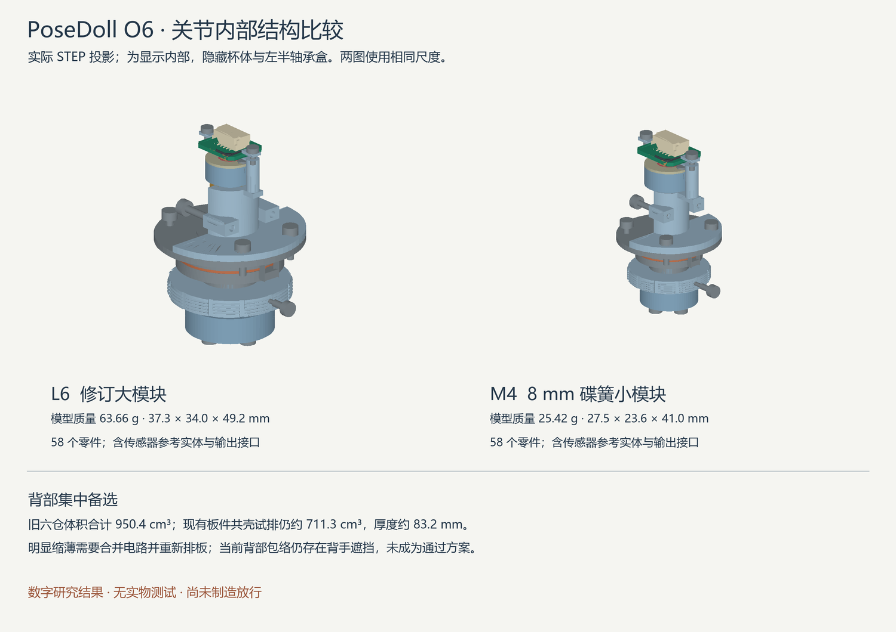

# Rev O6：关节、双臂布置与背部集中备选

本轮继续以 480 mm 人体参考和静态姿势采集为主线。取消 1.2 kg 硬门槛；91 cm 备用版保留。用户已明确允许在分散模块妨碍活动时采用背部集中方案，旧文档的“不得外凸背包”不再作为绝对限制。传感器磁铁与测角头仍在关节处；“集中背部”指采集、通信和配电模块。

**本轮得到两个可复算的单关节研究模型及背部集中比较。完整双臂和整机仍未通过；没有实物测试或制造放行。** 实际执行结果见 [动态汇总](../verification/revO6/runs/o6_20260924_r1/results.json)。

## 机械改动

- 前装式制动杯配可拆钢端板；前背片与端板、后背片与压力座分别合成单件，减少松动接口。
- 导槽在母螺纹前结束，保留连续的后段参考螺纹。L6 螺纹包络最小壁厚约 1.57 mm；导槽与薄片捕获槽还有更薄部位，不能用该数值代替整个杯体强度。
- 四片受约束的导向薄片缩小后背片反转空程。捕获依赖已装入的滑动座；检查六向平移及几个磨损位置，不证明任意弹性脱出路径不存在。
- 短双 D 锥面输出接口包括中心保持螺钉、垫圈、四孔法兰。L6 后伸由 O5 的 34 mm 减至 23.4 mm，节省 10.6 mm；真实锥面、公差、预紧和连接梁仍未定型。
- L6 支承跨度试验值由 14 mm 减至 8.2 mm。按旧 0.04 mm 合计间隙/同轴度预算，几何倾斜项由约 0.164° 增至 0.280°。这不是实测编码器误差，也不是精度通过项。
- M4 采用 4 mm 轴和为 8 mm 碟簧重建的导向、杯体、输出接口。磁铁、AS5048 参考 PCBA 及连接器未缩放。增加小规格是为处理实际干涉，未重新强制推行整机减重。

| 当前原生模型 | 零件数 | 模型质量 | 外包络约值 | 磨损/压缩组合 |
|---|---:|---:|---|---:|
| L6 修订 | 58 | 63.66 g | 37.3 × 34.0 × 49.2 mm | 52 |
| M4 试验 | 58 | 25.42 g | 27.5 × 23.6 × 41.0 mm | 32 |

质量按实体体积与材料密度计算，含模型中的传感器及输出接口，不含完整连接梁、整机壳体、线束和其它未建零件；不是成品实称。

L6 保留原 12 mm SCHNORR 参考弹簧。M4 首个模型采用锐尔立 A 系列 8 × 4.2 × 0.4 mm、目录工作点 210 N 的候选；它不直接替换旧 12 mm 弹簧。此前 12.5 mm 国产碟簧与旧导向孔干涉的否决仍有效。目录工作点不是最大预紧力，批次曲线、公差与寿命未验证。[锐尔立目录](https://www.raleigh-spring.cn/discspring/)

## 新发现的 CAD 证据缺陷

旧 ruled-face 螺旋在本机 CadQuery/OCC 上可能显示实体有效，但切除出现负交集或移除体积大于整个刀具。M4 某次约 1639.308 mm³ 的杯体在“切除”后增至 1765.253 mm³；L6 的同类运算也不守恒。因此，早期名义零干涉和装配通过项不能继续采信。

O6 改用 Frenet 管道扫掠，加入螺旋体积估算、交集上下界以及切除/合并守恒检查，布尔运算明确使用 0.00001 mm 数值容差。**数值容差不是加工公差。** 当前两个模型重新生成、重新验证，没有沿用错误模型的通过项。

[旧版本失效记录](../verification/revO6/runs/o6_20260924_r1/SUPERSEDED.json) 与诊断保留。当前模型只使用 joint_L6_validated 和 joint_M4_validated；joint_short、最初几个 M4 版本及其派生布局只供回溯。旧 O3/O5 封存未改写，也不能因此自动升级为通过。

## 单关节验证范围

验证了 58 件的装配覆盖、径向轴承盒、滑动座前装、后盖旋入及弹簧压缩、5° 步长单轴旋转和磨损/压缩组合。L6 的轴承盒横向螺钉先装，M4 的杯体轴向螺钉先装；错误顺序的失败记录保留。

后导向名义自由角约为 L6 0.1626–0.1628°、M4 0.1292–0.1294°；驱动键与制动盘另做正反方向几何搜索。这不是整关节实测回差，不能把各项简单相加后宣称验收；两面摩擦、载荷、变形、锥面与装配公差均会影响实际表现。

两种空心销式工具已有实体和单关节后方直线接近检查。调预紧前须支撑节段并拆去输出接口和止退螺钉；未覆盖相邻机构、手部空间、工具转动全路径或工具强度。

真实最大弹簧力、前端板螺钉反力和剥牙、锥面贴合、摩擦材料粘接、承载滑动卡滞、生产倒角/毛刺及极限公差仍未关闭。离散磨损补偿可能使部分弹簧压缩略超过目录工作点，必须按实际力曲线和限位重新定调节范围。

## 双臂和载荷

单臂筛选后，增加左右共 18 个模块的同时搜索：12 组机械偏置，每组 100 次确定性随机起点。随后每个离散状态均检查全部 153 对模块。粗包络评分是启发式，不能充当实体相交体积或全局最优证明。

实际完成 100 个状态：Manny 50 个中 22 个失败，Quinn 50 个中 24 个失败；每状态覆盖全部 153 对模块。当前仍有必要动作的关节实体碰撞，**完整双臂未通过**。双侧优化消除了部分肘、腕朝中线堆叠的问题；肩部多轴模块和抱臂仍有缺口。移动采集板不能直接解决关节本体碰撞。

机械试验 profile 明确记录内部枢轴和安装偏置，不作为 UE 生产校准。还缺实际连接梁、完整 PCBA、颈胸机构、壳体与连续曲率线束；某姿态模块间无碰撞不代表完整单臂通过。

载荷按每件实际 COM 和父/子刚体计算，并显式加入未建连接梁、手部、壳体与线束的工程质量分配。加入躯干倾斜后，锁骨前后轴不能继续按竖直轴零重力矩选型。低摩擦假设下仍有保持力缺口，报告同时列出操作力，没有统一增加所有关节预紧。它是悬空单臂分析，不覆盖以手撑地、外物载荷或完整人偶支撑反力。

## 背部集中备选 B

用现有六块区域板的实际板尺寸、元件庭院和原插头预留试排共用壳体。保留 12 mm 弯线敏感性时，一个紧凑排布约 **83 × 103 × 83.2 mm，711.3 cm³**；旧六仓合计 950.4 cm³，不含电源仓和支架。重复壳体有所减少，但仍很厚。

这些板未布线，部分配合头/元件高度未确认，六个无线模块的完整 RF 空间也未满足。711.3 cm³ 不是合格成品体积。粗运动筛查仍有背手遮挡。另列的 66 × 76 × 22 mm 只是中央板重排目标，没有实际 PCB，不能用于报通过或报减重。

按真实父子刚体关系得到的跨轴线数如下，范围仅为六芯原始传感器线和 J50，不含无关干线：

| 左臂截面 | 原始线全回背部 | A：14 芯 J50 | C：4 芯 J50 |
|---|---:|---:|---:|
| 肩俯仰 | 36 | 26 | 16 |
| 肩外展 | 30 | 20 | 10 |
| 上臂旋转 | 24 | 14 | 4 |
| 肘屈伸 | 18 | 18 | 18 |

九路端口总计 54 芯，不表示每根肩轴都经过 54 芯。要缩小背部方案，必须同时重排电路和回线，不能只挪 PCB。

随后补做了背部空间扫描：630 个宽、高、厚、安装高度组合，61 个目标姿态，从中立位按不超过 5° 步长插值，每个角色 837 个路径状态。20 个方盒只通过了明示半径的人体胶囊包络筛查；其中薄型目标为 54 × 48 × 22 mm，位置在胸部局部 z=30～78 mm。

**该薄型目标被真实关节检查否决。** 六板共仓盒和上述薄盒分别放入当前双臂布置，各检查 100 个状态，两者均在全部 100 个状态与至少一个真实模块相撞，主要涉及锁骨机构。此结论只否决这两个盒子及位置与当前布局的组合，不证明所有背部方案都不可行。它说明背部方案必须与肩锁骨机构共同布局，不能把人体包络通过项当作板件已经放得下。新检查见 [背部空间及真实模块报告](../verification/revO6/runs/o6_20260924_r1/backspace/)。

## DC1：薄背部控制器的串行链路数字实验

原厂资料描述 AS5048A 菊花链及后一传输返回上一命令结果的流水线。本轮新增隔离的 DC1 数字实验：五个诊断/角度/零位寄存器加最后 NOP，保留 O5 诊断判定。**未接入固件、G0 或 UE，未生成中央 PCB。** 原厂“四线 SPI”加供电和地至少六芯，返回线及分叉/连接器仍须实际设计。[原厂手册索引](https://look.ams-osram.com/m/d6b55afbdfe4b3d0/original/AS5048_UG000223_1-00.pdf)

官方索引可读，直接手册下载本次返回 404；未用第三方镜像替代原厂依据。近端/远端顺序仍须台架验证。

数字实验覆盖 1/3/6/7/9 芯片、2080 个单比特翻转、长度错误、全零和全一。明确保留三类不能据此排除的反例：有效帧整体重放、有效响应列重复、偶数位错误。41 个有效角度字不能证明 41 个物理测量节点存在。

41 轴每链六次传输，仅增加假设 CS 开销时，50 kHz 约 78.828 ms、100 kHz 约 39.468 ms。它们是计算值，不是驱动或电气实测。25 kHz 超过当前 100 ms 软件扫描预算，本实验未改写 A 的约束。静态用途允许今后调整节奏，但仍须保留样本年龄、完整性与故障语义。

DC1 的 capture_eligible 固定为 False，缺少链序/断链识别、线束信号完整性、供电及保护实测时不能替换 A。若将六区域控制器合并为一个 MCU，必须重新说明共同故障域，不能继续引用七个物理 CAN 节点的结论。

## 供电与供应商

保留 AS5048 和当前接口基线。M4 是本轮实际采用中国供应商尺寸的数字候选。MT6701 + CJT O5CN 板继续隔离：新读取的官方中文 Rev1.9 图示与低空闲时钟解释更一致，但 CRC 初值/参考向量、EP、真实精度与波形尚未关闭。[MT6701 官方资料](https://www.novosns.com/en/datasheet/MT6701QT-AAD/MT6701_Rev.1.8.pdf)

峰值预算计入传感器、MCU、收发器无负载电流及端接负载，约 145 mA 是条件分配，不是验证后的最大电流。0.305 m、60°C、150 mA 算得约 3.055 V；200 mA 仅约 3.028 V，仍不满足 3.05 V 工程余量目标。JST 路径采用每压接 10 mΩ 仅作敏感性分析，不能用 CJT 数据保证 JST。降频减少平均功耗，不能省去峰值、启动或短路检查。

## 未关闭工作

1. 数字机械：多轴共同承力结构及连接梁、完整 PCBA/颈胸/壳体/线束联合装配；不得缩小动作清单来制造通过。
2. 背部备选：先与肩锁骨机构共同确定可用空间，同时解决 DC1 的故障/链序验证，再做原生中央板和真实线束。当前两个目标盒与实际模块相撞，不能用于宣称背部设计合格。
3. 需要实物或供应商资料：弹簧曲线、公差、摩擦/磨损/粘接、轴承/锥面精度、压接、信号波形、功耗保护及静态保持。

未 commit、未 push；O5/O5CN 封存及 UE 用户配置保持原字节。复算与审查入口见 [O6 审查请求](REVIEW_REQUEST_REVO6.zh-CN.md)。

