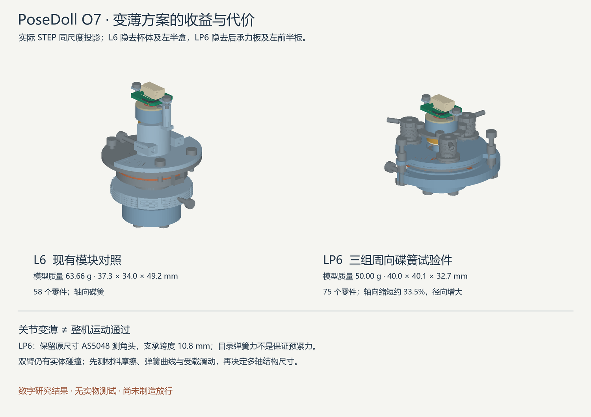

# Rev O7：扁平关节、背部空间与实物测试边界

本轮保留480 mm人体参考、静态姿势采集、91 cm备用方案和取消1.2 kg硬门槛的决定。现有UE插件和A固件未改变；O5/O5CN/O6封存及UE用户配置已复核。

**LP6 单关节名义装配与寿命几何已通过限定检查，薄背盒得到可用的空间目标；完整双臂仍失败。现在建议先测摩擦材料和碟簧，再决定多轴机构尺寸与预紧范围。没有实物测试或制造放行。**

## 已落实的改动

| 项目 | O6 L6 对照 | O7 LP6 研究候选 |
|---|---:|---:|
| 轴向包络，含传感板/输出接口 | 49.24 mm | 32.74 mm，缩短约33.5% |
| 径向外包络 | 37.3×34.0 mm | 40.0×40.1 mm，增大 |
| 模型质量 | 63.66 g | 50.00 g，减少约21.5% |
| 零件数 | 58 | 75 |
| 两支承中心距 | 8.2 mm | 10.8 mm |

以上是实体体积/密度和包络计算，不是整机实称，也没有包含实际多轴连接梁、全身外壳、全部电路与线束。LP6没有因变薄而自动升格为最终选型。

LP6把两片串联的小碟簧分布到三个周向位置；前后承力板与外围拉紧件传递预紧反力，测角轴另有轴承/轴向基准。原尺寸AS5048参考PCBA与磁铁保留。输出法兰与轴做成一体；后轴承座轴向装入，轴环、前支承和轴承保持板分体装配。三组碟簧的真实力不均、承力板挠曲及导向卡滞尚未证明。

板托增加中央直径11.3 mm装配通道，同时横向加宽支承面。对真实PCB实体计算，两侧各保留约2.70 mm²名义接触面积；不是删除板托来获得空隙，也不是夹紧强度通过。绕开板托装入后轴承、在凸台上方合拢保持板等顺序已进入路径检查。受限工具、生产紧固件牙型和任意维修路径仍未验收。

采用锐尔立B系列8×4.2×0.3 mm作为LP6试验碟簧尺寸。每对串联的目录工作点118 N，三个理想相同站点合计354 N；这不是最大预紧力或整关节额定值。[锐尔立目录](https://www.raleigh-spring.cn/discspring/)

## 修正了什么检查问题

1. O6的磨损补偿向上取整，L6的52个状态中51个、M4的32个状态中29个会略超过名义目录压缩点。O7改成不超过该名义点的向下取整，并分别重跑52/32个实体状态。它可能降低保持力，且不能代替实际公差/力曲线或硬件限位。
2. 小径螺纹出现新的OCC反例：先开底孔再切螺旋时，实体有效、同源布尔守恒也能通过，却几乎没有切掉应有材料。独立六整圈积分应去除9.2303 mm³，坏顺序只去除约0.000004 mm³；改为先切螺旋再开底孔，实际去除9.2408 mm³，材料见证点也被切除。新增独立体积和见证点回归，不靠`isValid()`判断完成加工。
3. 保留全部O6动作。原样本中有18个角色/姿态条目超出原profile范围，现明确标为额外应力测试。原对称抱臂使两前臂中心线几乎相交；新增一高一低的非对称抱臂候选，并继续用真实模块检查，没有把旧碰撞改写成通过。
4. 手动抬臂力现在包含重力：所需操作扭矩包含制动阻力和逆重力分量。旧“摩擦扭矩÷手持力臂”只能描述摩擦部分。

## 实际完成的数字检查

- LP6当前75个零件：名义无体积干涉；69个分步装配检查覆盖全部零件；73个单轴转角位置，步长5°。
- 37个磨损/压缩/单站少压一档的几何组合无干涉；每片弹簧都没有超过名义目录压缩量。**压力板力平衡没有因此得到证明。**
- 轴环、传感器杯和摩擦片共30个六向平移尝试都有实体阻挡；这不是拔脱强度或任意脱出路径证明。
- 几何反向自由角区间：驱动键约0.062°，压力板导向约0.065°，每个摩擦片耳槽约0.075°。不能直接相加当作整机回差，也不是编码器精度。
- 双臂18模块、每姿态153对：102个状态仍有45个失败（Manny21、Quinn24）。在保留的旧100个状态中43个失败，O6为46个；新增加的两个非对称抱臂状态也失败。收益有限，不能把独立LP6复制到所有关节就宣称整机可用。

完整原始结果和输入哈希见[汇总](../verification/revO7/runs/o7_20260924_r1/results.json)。当前只使用 `LP6_current` 与 `bilateral_current`；前六次试验及失败原因见[历史标记](../verification/revO7/runs/o7_20260924_r1/SUPERSEDED.json)。

## 背部集中方案取得的进展

在630个空盒目标中，用当前试验机构与人体节段共同筛选，再对候选做实际零件检查。**48×48×12 mm、胸部局部坐标 `[-40,-24,0]～[-28,24,48] mm` 的空盒目标，通过了两个人体参考、102个目标，共1,700个中立到目标的采样状态检查，关节角步长不超过5°，满足0.5 mm检查门槛。** 未证明任意多轴协调路径或受载运动。

这给薄型背部中央板提供了空间目标，但它**没有装入任何完整中央PCBA、插头、壳体、固定梁、线束或RF预留**。其它未建的颈胸/腰机构也可能占用该空间。它不能与旧六板共壳711.3 cm³直接比较并称为硬件缩小到27.648 cm³，更不能证明整机动作通过。

O6的DC1仍是不可进入生产采集的隔离实验。集中采集架构还需要实际信号、链序/断链识别、共同故障域、供电与保护证据，才能进入中央板定型。

## 为什么下一步先需要实物

当前悬空臂预算约454.5 g，含明确列出的152 g未建附件分配，不是成品臂实称。按当前逐件重心和动作，LP6最苛刻保持预算约0.463 N·m；M4约0.304 N·m。按均匀磨损半径和目录力点估算，最低有效摩擦系数分别约0.065和0.145；它们只是设计条件。

未填充PEEK原厂页面的摩擦数据来自特定试验条件，不能证明本项目在薄片、停留、表面处理和反复反转下满足这些条件。[原厂数据](https://www.ensingerplastics.com/en-us/shapes/peek-tecapeek-natural)

以暂定20 N、60 mm力臂作手感初筛，摩擦从0.08变化到0.22时，LP6不能在同一固定预紧力下同时保证最小保持力和最大摆姿力。实际摩擦范围若较窄则可能存在窗口。继续仅用一个假定系数缩小关节，无法回答这个关键问题。20 N和0.3°停留漂移是台架初筛提案，并非用户已确认的最终验收标准。

[小样台架任务书](../bench/revO7/README.zh-CN.md) 已提供：两种尺寸的四个试片STEP/尺寸表、弹簧曲线和摩擦记录模板、当前载荷导出的筛选条件、原始日志哈希校验与23项数据入口反例测试。空模板仍明确返回 `AWAITING_HARDWARE`。

建议先完成这一小样阶段，再用实测结果决定各轴预紧、是否保留M4锁骨轴以及多轴支架的真实尺寸。完整单关节生产图、承力/公差验收和整机联合动作仍有工作；本轮没有把这些部分写成已完成。
