<a id="start"></a>

# O22 人偶拼装教程

对应 A1 mini 打印盘 A01–A10。按 **盘号 → 零件号 → 关节 → 电路端口** 查找，覆盖 25 个关节与中央板安装。左右一律按人偶自身区分。

本教程使用已保存的 O22 设计和 A1 mini 排盘，不改变结构。186 件 = 185 件装机件 + 1 件焊接量规；另有可选 T01 两件传感器小样。O11 的配合和摩擦已由你实测通过；O22 新传感板、线束及整机测量仍需首件实测，以下 CAD 图不是已完成实物装配的照片。

<a id="prepare"></a>

## 00 · 开始前先分袋、准备五金与电路

1. 每盘冷却取件后，按排盘编号图把零件装袋，标签写完整的“盘 A05-19 / N004 / 左锁骨前后”。N003、N004、P013 等打印编号可重复，盘内序号才唯一；它们不是传感器的电路端口。
2. 清除支撑和毛刺，尤其是垫片座、螺母窝、PCB 导轨、磁铁侧槽与摩擦轴面；使用你已验证的 O11 工艺，不扩大精配合孔来迁就错规格五金。
3. 工具：与螺钉头匹配的内六角批头（轴肩螺钉为 3 mm）、游标卡尺、镊子、小尖嘴钳、剪钳、万用表、标签笔、软垫。胶分别用于磁铁防转和电子线束柔性固线，按材料说明完全固化。
4. 先把电子加工包交给供应方：48 块已焊线的传感板（46 使用 + 2 完整备件）、1 块中央成品板、1 块 XIAO、压接并逐路标号的线束。由供应方完成贴片、板端焊接、端子压接及导通检测；你负责装配和插接。
5. 机械部分按 S01–S25 顺序装，传感板可以在每个关节完成后装入，但先不接电。推荐左臂做首个完整线束样段，通过后再按同样方法做右侧；不要封背盒后才开始排线。
6. 在软垫上托住骨架操作，不让未装完的关节承受整机重量。先调整摩擦，再覆盖轴肩的磁铁座盖；先放内部螺母和反力垫，再关闭环或端轴外壳。

<a id="plates"></a>

## 01 · 从打印盘找到装配步骤

“首次领用”统计每件只取一次；在后续关节步骤出现的长骨是已经装上的连接件。可点击盘图放大编号，也可以直接打开对应步骤。

<a id="plate-A01"></a>

### 打印盘 A01 · 头颈与背盒盖

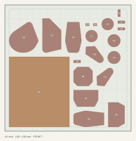

涉及步骤：[S03](#S03)、[S26](#S26)

| 盘内编号 / 打印号 | 零件 | 首次领用 / 后续连接 |
| --- | --- | --- |
| A01-01 / X081 | o22/背盒盖 | [S26](#S26) |
| A01-02 / X050 | 骨架／头颈 | [S03](#S03) |
| A01-03 / P035 | 头颈/下环 | [S03](#S03) |
| A01-04 / P033 | 头颈/下叉 | [S03](#S03) |
| A01-05 / P034 | 头颈/上叉 | [S03](#S03) |
| A01-06 / X045 | 头颈/P_活动半壳 | [S03](#S03) |
| A01-07 / X049 | 头颈/D_活动半壳 | [S03](#S03) |
| A01-08 / P036 | 头颈/上环盖 | [S03](#S03) |
| A01-09 / X005 | 头颈/下叉_传感板托夹 | [S03](#S03) |
| A01-10 / X006 | 头颈/上叉_传感板托夹 | [S03](#S03) |
| A01-11 / P040 | 头颈/P_磁铁端盖 | [S03](#S03) |
| A01-12 / P045 | 头颈/D_磁铁端盖 | [S03](#S03) |
| A01-13 / N003 | 头颈/下叉_侧装磁铁座盖 | [S03](#S03) |
| A01-14 / N003 | 头颈/上叉_侧装磁铁座盖 | [S03](#S03) |
| A01-15 / X043 | 头颈/P_板夹_-14 | [S03](#S03) |
| A01-16 / X044 | 头颈/P_板夹_+14 | [S03](#S03) |
| A01-17 / X047 | 头颈/D_板夹_-14 | [S03](#S03) |
| A01-18 / X048 | 头颈/D_板夹_+14 | [S03](#S03) |
| A01-19 / P039 | 头颈/P_径向摩擦块 | [S03](#S03) |
| A01-20 / P044 | 头颈/D_径向摩擦块 | [S03](#S03) |

<a id="plate-A02"></a>

### 打印盘 A02 · 躯干 1/2

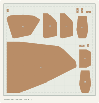

涉及步骤：[S01](#S01)、[S02](#S02)、[S03](#S03)、[S04](#S04)、[S11](#S11)、[S26](#S26)

| 盘内编号 / 打印号 | 零件 | 首次领用 / 后续连接 |
| --- | --- | --- |
| A02-01 / X046 | 骨架／胸部 | [S02](#S02)；还用于 S03、S04、S11、S26 |
| A02-02 / X042 | 骨架／腰部 | [S01](#S01)；还用于 S02 |
| A02-03 / P002 | 腰部/下环 | [S01](#S01) |
| A02-04 / P018 | 胸部/下环 | [S02](#S02) |
| A02-05 / P001 | 腰部/下叉 | [S01](#S01) |
| A02-06 / P017 | 胸部/下叉 | [S02](#S02) |
| A02-07 / X041 | 胸部/P_活动半壳 | [S02](#S02) |
| A02-08 / X040 | 胸部/P_板夹_+14 | [S02](#S02) |
| A02-09 / X039 | 胸部/P_板夹_-14 | [S02](#S02) |
| A02-10 / X036 | 腰部/P_板夹_+14 | [S01](#S01) |
| A02-11 / X035 | 腰部/P_板夹_-14 | [S01](#S01) |
| A02-12 / P012 | 腰部/P_径向摩擦块 | [S01](#S01) |
| A02-13 / P028 | 胸部/P_径向摩擦块 | [S02](#S02) |

<a id="plate-A03"></a>

### 打印盘 A03 · 躯干 2/2

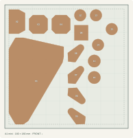

涉及步骤：[S01](#S01)、[S02](#S02)、[S18](#S18)、[S22](#S22)、[S26](#S26)

| 盘内编号 / 打印号 | 零件 | 首次领用 / 后续连接 |
| --- | --- | --- |
| A03-01 / X038 | 骨架／骨盆 | [S01](#S01)；还用于 S18、S22 |
| A03-02 / X037 | 腰部/P_活动半壳 | [S01](#S01) |
| A03-03 / P003 | 腰部/上环盖 | [S01](#S01) |
| A03-04 / P019 | 胸部/上环盖 | [S02](#S02) |
| A03-05 / X004 | 胸部/上叉_传感板托夹 | [S02](#S02) |
| A03-06 / X001 | 腰部/下叉_传感板托夹 | [S01](#S01) |
| A03-07 / X003 | 胸部/下叉_传感板托夹 | [S02](#S02) |
| A03-08 / X002 | 腰部/上叉_传感板托夹 | [S01](#S01) |
| A03-09 / P242 | 工具／XIAO 焊接间距量规 | [S26](#S26) |
| A03-10 / P013 | 腰部/P_磁铁端盖 | [S01](#S01) |
| A03-11 / P029 | 胸部/P_磁铁端盖 | [S02](#S02) |
| A03-12 / N003 | 腰部/下叉_侧装磁铁座盖 | [S01](#S01) |
| A03-13 / N003 | 腰部/上叉_侧装磁铁座盖 | [S01](#S01) |
| A03-14 / N003 | 胸部/下叉_侧装磁铁座盖 | [S02](#S02) |
| A03-15 / N003 | 胸部/上叉_侧装磁铁座盖 | [S02](#S02) |

<a id="plate-A04"></a>

### 打印盘 A04 · 左臂 1/2

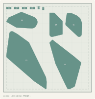

涉及步骤：[S04](#S04)、[S05](#S05)、[S06](#S06)、[S07](#S07)、[S08](#S08)

| 盘内编号 / 打印号 | 零件 | 首次领用 / 后续连接 |
| --- | --- | --- |
| A04-01 / X054 | 骨架／左锁骨 | [S05](#S05)；还用于 S06 |
| A04-02 / W005 | 骨架／左锁骨前后中间架 | [S04](#S04)；还用于 S05 |
| A04-03 / H004 | 骨架／左肘 | [S07](#S07)；还用于 S08 |
| A04-04 / P051 | 左肩／上臂/下环 | [S06](#S06) |
| A04-05 / X058 | 骨架／左肩／上臂 | [S06](#S06)；还用于 S07 |
| A04-06 / X051 | 左肩／上臂/P_板夹_-14 | [S06](#S06) |
| A04-07 / X056 | 左肩／上臂/D_板夹_+14 | [S06](#S06) |
| A04-08 / X055 | 左肩／上臂/D_板夹_-14 | [S06](#S06) |
| A04-09 / X052 | 左肩／上臂/P_板夹_+14 | [S06](#S06) |
| A04-10 / P061 | 左肩／上臂/P_径向摩擦块 | [S06](#S06) |
| A04-11 / P066 | 左肩／上臂/D_径向摩擦块 | [S06](#S06) |

<a id="plate-A05"></a>

### 打印盘 A05 · 左臂 2/2

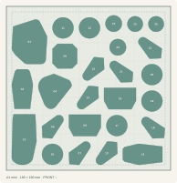

涉及步骤：[S04](#S04)、[S05](#S05)、[S06](#S06)、[S07](#S07)、[S08](#S08)、[S09](#S09)、[S10](#S10)

| 盘内编号 / 打印号 | 零件 | 首次领用 / 后续连接 |
| --- | --- | --- |
| A05-01 / H006 | 骨架／左腕屈伸中间架 | [S09](#S09)；还用于 S10 |
| A05-02 / P050 | 左肩／上臂/上叉 | [S06](#S06) |
| A05-03 / W004 | 骨架／左前臂 | [S08](#S08)；还用于 S09 |
| A05-04 / P191 | 骨架／左手腕 | [S10](#S10) |
| A05-05 / N004 | 左锁骨升降/侧装磁铁座盖 | [S05](#S05) |
| A05-06 / X008 | 左肩／上臂/上叉_传感板托夹 | [S06](#S06) |
| A05-07 / X007 | 左肩／上臂/下叉_传感板托夹 | [S06](#S06) |
| A05-08 / P052 | 左肩／上臂/上环盖 | [S06](#S06) |
| A05-09 / X053 | 左肩／上臂/P_活动半壳 | [S06](#S06) |
| A05-10 / X020 | 左锁骨升降/传感板托夹 | [S05](#S05) |
| A05-11 / N004 | 左手腕侧摆/侧装磁铁座盖 | [S10](#S10) |
| A05-12 / N004 | 左前臂扭转/侧装磁铁座盖 | [S08](#S08) |
| A05-13 / X022 | 左前臂扭转/传感板托夹 | [S08](#S08) |
| A05-14 / P049 | 左肩／上臂/下叉 | [S06](#S06) |
| A05-15 / X024 | 左手腕侧摆/传感板托夹 | [S10](#S10) |
| A05-16 / X057 | 左肩／上臂/D_活动半壳 | [S06](#S06) |
| A05-17 / N004 | 左手腕屈伸/侧装磁铁座盖 | [S09](#S09) |
| A05-18 / X021 | 左肘屈伸/传感板托夹 | [S07](#S07) |
| A05-19 / N004 | 左锁骨前后/侧装磁铁座盖 | [S04](#S04) |
| A05-20 / N004 | 左肘屈伸/侧装磁铁座盖 | [S07](#S07) |
| A05-21 / X023 | 左手腕屈伸/传感板托夹 | [S09](#S09) |
| A05-22 / X019 | 左锁骨前后/传感板托夹 | [S04](#S04) |
| A05-23 / P067 | 左肩／上臂/D_磁铁端盖 | [S06](#S06) |
| A05-24 / P062 | 左肩／上臂/P_磁铁端盖 | [S06](#S06) |
| A05-25 / N003 | 左肩／上臂/下叉_侧装磁铁座盖 | [S06](#S06) |
| A05-26 / N003 | 左肩／上臂/上叉_侧装磁铁座盖 | [S06](#S06) |

<a id="plate-A06"></a>

### 打印盘 A06 · 右臂 1/2

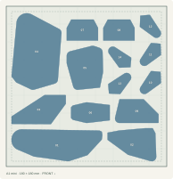

涉及步骤：[S11](#S11)、[S12](#S12)、[S13](#S13)、[S14](#S14)、[S15](#S15)、[S16](#S16)、[S17](#S17)

| 盘内编号 / 打印号 | 零件 | 首次领用 / 后续连接 |
| --- | --- | --- |
| A06-01 / H008 | 骨架／右锁骨前后中间架 | [S11](#S11)；还用于 S12 |
| A06-02 / W002 | 骨架／右前臂 | [S15](#S15)；还用于 S16 |
| A06-03 / H010 | 骨架／右肘 | [S14](#S14)；还用于 S15 |
| A06-04 / X062 | 骨架／右锁骨 | [S12](#S12)；还用于 S13 |
| A06-05 / X066 | 骨架／右肩／上臂 | [S13](#S13)；还用于 S14 |
| A06-06 / P071 | 右肩／上臂/下叉 | [S13](#S13) |
| A06-07 / X061 | 右肩／上臂/P_活动半壳 | [S13](#S13) |
| A06-08 / X065 | 右肩／上臂/D_活动半壳 | [S13](#S13) |
| A06-09 / P073 | 右肩／上臂/下环 | [S13](#S13) |
| A06-10 / X032 | 右手腕侧摆/传感板托夹 | [S17](#S17) |
| A06-11 / X030 | 右前臂扭转/传感板托夹 | [S15](#S15) |
| A06-12 / X028 | 右锁骨升降/传感板托夹 | [S12](#S12) |
| A06-13 / X009 | 右肩／上臂/下叉_传感板托夹 | [S13](#S13) |
| A06-14 / X031 | 右手腕屈伸/传感板托夹 | [S16](#S16) |

<a id="plate-A07"></a>

### 打印盘 A07 · 右臂 2/2

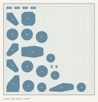

涉及步骤：[S11](#S11)、[S12](#S12)、[S13](#S13)、[S14](#S14)、[S15](#S15)、[S16](#S16)、[S17](#S17)

| 盘内编号 / 打印号 | 零件 | 首次领用 / 后续连接 |
| --- | --- | --- |
| A07-01 / H012 | 骨架／右腕屈伸中间架 | [S16](#S16)；还用于 S17 |
| A07-02 / X027 | 右锁骨前后/传感板托夹 | [S11](#S11) |
| A07-03 / X029 | 右肘屈伸/传感板托夹 | [S14](#S14) |
| A07-04 / N004 | 右前臂扭转/侧装磁铁座盖 | [S15](#S15) |
| A07-05 / X010 | 右肩／上臂/上叉_传感板托夹 | [S13](#S13) |
| A07-06 / N004 | 右肘屈伸/侧装磁铁座盖 | [S14](#S14) |
| A07-07 / P074 | 右肩／上臂/上环盖 | [S13](#S13) |
| A07-08 / N004 | 右锁骨前后/侧装磁铁座盖 | [S11](#S11) |
| A07-09 / P072 | 右肩／上臂/上叉 | [S13](#S13) |
| A07-10 / N004 | 右手腕屈伸/侧装磁铁座盖 | [S16](#S16) |
| A07-11 / N004 | 右锁骨升降/侧装磁铁座盖 | [S12](#S12) |
| A07-12 / N004 | 右手腕侧摆/侧装磁铁座盖 | [S17](#S17) |
| A07-13 / P084 | 右肩／上臂/P_磁铁端盖 | [S13](#S13) |
| A07-14 / P185 | 骨架／右手腕 | [S17](#S17) |
| A07-15 / P089 | 右肩／上臂/D_磁铁端盖 | [S13](#S13) |
| A07-16 / N003 | 右肩／上臂/下叉_侧装磁铁座盖 | [S13](#S13) |
| A07-17 / N003 | 右肩／上臂/上叉_侧装磁铁座盖 | [S13](#S13) |
| A07-18 / X063 | 右肩／上臂/D_板夹_-14 | [S13](#S13) |
| A07-19 / X059 | 右肩／上臂/P_板夹_-14 | [S13](#S13) |
| A07-20 / X064 | 右肩／上臂/D_板夹_+14 | [S13](#S13) |
| A07-21 / X060 | 右肩／上臂/P_板夹_+14 | [S13](#S13) |
| A07-22 / P083 | 右肩／上臂/P_径向摩擦块 | [S13](#S13) |
| A07-23 / P088 | 右肩／上臂/D_径向摩擦块 | [S13](#S13) |

<a id="plate-A08"></a>

### 打印盘 A08 · 左大腿与左腿关节小件

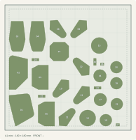

涉及步骤：[S18](#S18)、[S19](#S19)、[S20](#S20)、[S21](#S21)

| 盘内编号 / 打印号 | 零件 | 首次领用 / 后续连接 |
| --- | --- | --- |
| A08-01 / X073 | 骨架／左髋／大腿 | [S18](#S18)；还用于 S19 |
| A08-02 / P095 | 左髋／大腿/下环 | [S18](#S18) |
| A08-03 / P093 | 左髋／大腿/下叉 | [S18](#S18) |
| A08-04 / P094 | 左髋／大腿/上叉 | [S18](#S18) |
| A08-05 / X069 | 左髋／大腿/P_活动半壳 | [S18](#S18) |
| A08-06 / X072 | 左髋／大腿/D_活动半壳 | [S18](#S18) |
| A08-07 / P096 | 左髋／大腿/上环盖 | [S18](#S18) |
| A08-08 / X012 | 左髋／大腿/上叉_传感板托夹 | [S18](#S18) |
| A08-09 / X016 | 左踝／脚掌/上叉_传感板托夹 | [S20](#S20) |
| A08-10 / X025 | 左膝／小腿屈伸/传感板托夹 | [S19](#S19) |
| A08-11 / X015 | 左踝／脚掌/下叉_传感板托夹 | [S20](#S20) |
| A08-12 / X011 | 左髋／大腿/下叉_传感板托夹 | [S18](#S18) |
| A08-13 / X026 | 左脚趾屈伸/传感板托夹 | [S21](#S21) |
| A08-14 / N004 | 左膝／小腿屈伸/侧装磁铁座盖 | [S19](#S19) |
| A08-15 / N004 | 左脚趾屈伸/侧装磁铁座盖 | [S21](#S21) |
| A08-16 / P106 | 左髋／大腿/P_磁铁端盖 | [S18](#S18) |
| A08-17 / P111 | 左髋／大腿/D_磁铁端盖 | [S18](#S18) |
| A08-18 / N003 | 左髋／大腿/下叉_侧装磁铁座盖 | [S18](#S18) |
| A08-19 / N003 | 左髋／大腿/上叉_侧装磁铁座盖 | [S18](#S18) |
| A08-20 / N003 | 左踝／脚掌/下叉_侧装磁铁座盖 | [S20](#S20) |
| A08-21 / N003 | 左踝／脚掌/上叉_侧装磁铁座盖 | [S20](#S20) |
| A08-22 / X068 | 左髋／大腿/P_板夹_+14 | [S18](#S18) |
| A08-23 / X067 | 左髋／大腿/P_板夹_-14 | [S18](#S18) |
| A08-24 / X071 | 左髋／大腿/D_板夹_+14 | [S18](#S18) |
| A08-25 / X070 | 左髋／大腿/D_板夹_-14 | [S18](#S18) |
| A08-26 / P105 | 左髋／大腿/P_径向摩擦块 | [S18](#S18) |
| A08-27 / P110 | 左髋／大腿/D_径向摩擦块 | [S18](#S18) |

<a id="plate-A09"></a>

### 打印盘 A09 · 右大腿与右腿关节小件

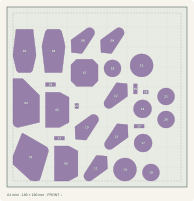

涉及步骤：[S22](#S22)、[S23](#S23)、[S24](#S24)、[S25](#S25)

| 盘内编号 / 打印号 | 零件 | 首次领用 / 后续连接 |
| --- | --- | --- |
| A09-01 / X080 | 骨架／右髋／大腿 | [S22](#S22)；还用于 S23 |
| A09-02 / P117 | 右髋／大腿/下环 | [S22](#S22) |
| A09-03 / P115 | 右髋／大腿/下叉 | [S22](#S22) |
| A09-04 / P116 | 右髋／大腿/上叉 | [S22](#S22) |
| A09-05 / X076 | 右髋／大腿/P_活动半壳 | [S22](#S22) |
| A09-06 / X079 | 右髋／大腿/D_活动半壳 | [S22](#S22) |
| A09-07 / P118 | 右髋／大腿/上环盖 | [S22](#S22) |
| A09-08 / X013 | 右髋／大腿/下叉_传感板托夹 | [S22](#S22) |
| A09-09 / X014 | 右髋／大腿/上叉_传感板托夹 | [S22](#S22) |
| A09-10 / X017 | 右踝／脚掌/下叉_传感板托夹 | [S24](#S24) |
| A09-11 / X018 | 右踝／脚掌/上叉_传感板托夹 | [S24](#S24) |
| A09-12 / X033 | 右膝／小腿屈伸/传感板托夹 | [S23](#S23) |
| A09-13 / X034 | 右脚趾屈伸/传感板托夹 | [S25](#S25) |
| A09-14 / N004 | 右膝／小腿屈伸/侧装磁铁座盖 | [S23](#S23) |
| A09-15 / N004 | 右脚趾屈伸/侧装磁铁座盖 | [S25](#S25) |
| A09-16 / P013 | 右髋／大腿/P_磁铁端盖 | [S22](#S22) |
| A09-17 / P126 | 右髋／大腿/D_磁铁端盖 | [S22](#S22) |
| A09-18 / N003 | 右髋／大腿/下叉_侧装磁铁座盖 | [S22](#S22) |
| A09-19 / N003 | 右髋／大腿/上叉_侧装磁铁座盖 | [S22](#S22) |
| A09-20 / N003 | 右踝／脚掌/下叉_侧装磁铁座盖 | [S24](#S24) |
| A09-21 / N003 | 右踝／脚掌/上叉_侧装磁铁座盖 | [S24](#S24) |
| A09-22 / X074 | 右髋／大腿/P_板夹_-14 | [S22](#S22) |
| A09-23 / X075 | 右髋／大腿/P_板夹_+14 | [S22](#S22) |
| A09-24 / X077 | 右髋／大腿/D_板夹_-14 | [S22](#S22) |
| A09-25 / X078 | 右髋／大腿/D_板夹_+14 | [S22](#S22) |
| A09-26 / P012 | 右髋／大腿/P_径向摩擦块 | [S22](#S22) |
| A09-27 / P125 | 右髋／大腿/D_径向摩擦块 | [S22](#S22) |

<a id="plate-A10"></a>

### 打印盘 A10 · 双侧小腿与脚掌骨架

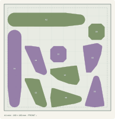

涉及步骤：[S19](#S19)、[S20](#S20)、[S21](#S21)、[S23](#S23)、[S24](#S24)、[S25](#S25)

| 盘内编号 / 打印号 | 零件 | 首次领用 / 后续连接 |
| --- | --- | --- |
| A10-01 / W006 | 骨架／右膝／小腿 | [S23](#S23)；还用于 S24 |
| A10-02 / W007 | 骨架／左膝／小腿 | [S19](#S19)；还用于 S20 |
| A10-03 / P130 | 左踝／脚掌/下环 | [S20](#S20) |
| A10-04 / P130 | 右踝／脚掌/下环 | [S24](#S24) |
| A10-05 / W003 | 骨架／左脚趾 | [S21](#S21) |
| A10-06 / W001 | 骨架／右脚趾 | [S25](#S25) |
| A10-07 / W016 | 骨架／左踝／脚掌 | [S20](#S20)；还用于 S21 |
| A10-08 / W017 | 骨架／右踝／脚掌 | [S24](#S24)；还用于 S25 |
| A10-09 / P131 | 左踝／脚掌/上环盖 | [S20](#S20) |
| A10-10 / P131 | 右踝／脚掌/上环盖 | [S24](#S24) |

T01 为传感器安装小样：T001 传感桥 + T002 磁铁桥，单独在台面上核验板厚、封装间隙与磁场。**不装在人偶上、不计入 186 件。** [小样与首件要求](../../bench/revO22/physical_tests/ACCEPTANCE.zh-CN.md)。

<a id="hardware"></a>

## 02 · 全部金属件与磁铁清单

下面是整机净用量。备件是采购损耗备份，**不是增加到关节里的冗余零件**；每步的五金清单已分配全部 958 件标准件（912 件金属紧固／摩擦件 + 46 颗磁铁）。电子连接器和排针另列，不混进这个总数。

| 规格 / SKU | 净用 | 可选备件 | 含备件采购数 | 装在哪里 |
| --- | --- | --- | --- | --- |
| A8不锈钢碟簧：8×4.2×0.4，自由高0.6 mm | 104 | 11 | 115 | 52 个轴肩支点，每点 2 片，相对安装；`A8_SS` |
| 径向两极磁铁 Φ6×2.5 mm；直径方向充磁，不能买轴向充磁 | 46 | 5 | 51 | 34 个侧装磁铁座盖 + 12 个 P/D 端轴，各 1 颗；`MAGNET_D6_T2P5_DIAMETRIC` |
| M1.6普通六角螺母（不要锁紧螺母替代外形） | 36 | 4 | 40 | 9 个十字核心合环，每处 4 枚；`NUT_M1P6` |
| M2普通六角螺母（不要锁紧螺母替代外形） | 164 | 17 | 181 | 侧装磁铁 68；端轴合壳 48；端轴磁铁盖 24；端轴板夹 24；`NUT_M2` |
| M3普通六角螺母（不要锁紧螺母替代外形） | 98 | 10 | 108 | 轴肩支点 52；传感板托夹 34；端轴摩擦调节 12；`NUT_M3` |
| M1.6×6 内六角圆柱头螺钉；按CAD头径/头高核对 | 36 | 4 | 40 | C14 / C15 合环，每核心 4 枚；`SCREW_M1P6_L6` |
| M2×20 内六角圆柱头螺钉；按CAD头径/头高核对 | 48 | 5 | 53 | 12 个 P/D 端轴合壳，每端 4 枚；`SCREW_M2_L20` |
| M2×4 内六角圆柱头螺钉；按CAD头径/头高核对 | 24 | 3 | 27 | 12 个 P/D 磁铁端盖，每端 2 枚；`SCREW_M2_L4` |
| M2×5 内六角圆柱头螺钉；按CAD头径/头高核对 | 68 | 7 | 75 | 34 个侧装磁铁座盖，每个 2 枚；`SCREW_M2_L5` |
| M2×8 内六角圆柱头螺钉；按CAD头径/头高核对 | 24 | 3 | 27 | 12 个 P/D 端轴 PCB 板夹，每端 2 枚；`SCREW_M2_L8` |
| M3×8 内六角圆柱头螺钉；按CAD头径/头高核对 | 46 | 5 | 51 | 34 个传感板托夹 + 12 个端轴摩擦调节，各 1 枚；`SCREW_M3_L8` |
| 轴肩螺钉 Φ4×8 / M3×0.5，螺纹长6 mm；头Φ7×3，内六角3 mm | 52 | 6 | 58 | 52 个轴肩摩擦支点，各 1 枚；`SHOULDER_D4_L8_M3_L6` |
| M3大平垫圈：外径9、厚0.8 mm，实物通孔验证 | 52 | 6 | 58 | 52 个支点的固定座内侧反力垫，各 1 片；`W_M3_D9_T0P8` |
| M4大平垫圈：外径12、厚1 mm，实物能自由套过Φ4光杆 | 104 | 11 | 115 | 52 个支点的旋转叉耳两侧，各 2 片；`W_M4_D12_T1` |
| M4普通平垫圈：外径9、厚0.8 mm，实物通孔验证 | 52 | 6 | 58 | 52 个支点的螺钉头下，各 1 片；`W_M4_D9_T0P8` |
| 塑料自攻 M2×6，头径≤4mm；新中央板安装 | 4 | 2 | 6 | 中央板四角，直接拧入打印柱；不用金属螺母；`SELF_TAP_M2_L6` |

螺钉长度按头下长度识别，分开存放 M2×4 / ×5 / ×8 / ×20。CAD 中 M1.6 螺钉头为 Φ3×1.6、内六角 1.5 mm、螺距 0.35 mm；M1.6 螺母对边 3.2、厚 1.3 mm。M2 螺母对边 4、厚 1.6 mm；M3 螺母对边 5.5、厚 2.4 mm。普通 M2 圆柱头包络为 Φ3.8×2，M3 为 Φ5.6×3；用现有验证件核对头部与沉孔。M3、M2、M1.6 都用普通六角螺母，不用带尼龙圈的锁紧螺母替换。磁铁必须直径方向充磁，不能买上下两面 N/S 的轴向充磁磁铁。

<a id="recipes"></a>

## 03 · 四种通用装法

每个步骤会直接写需要哪一种装法，并给出真实的盘号和五金数量。这里的顺序适用于现有设计；不同轴的朝向以该步骤的 CAD 模型为准。

<a id="G1"></a>

### G1 · 轴肩、垫片和碟簧

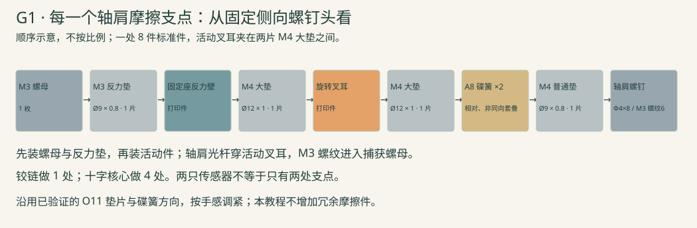

1. 先找到固定座的六角螺母窝和反力垫座。放入 1 枚 M3 普通螺母、1 片 M3 外径 9 × 厚 0.8 反力垫，让螺母与轴孔同心；反力垫贴固定座内侧。先确认螺钉能轻松对正，不歪牙。
2. 在固定座反力壁外放 1 片 M4 外径 12 × 厚 1 大垫，再放旋转叉耳，再放第 2 片同规格大垫；叉耳由两片大垫夹住。
3. 向外依次放相对安装的 2 片 A8 碟簧、1 片 M4 外径 9 × 厚 0.8 普通垫。两片碟簧不要同方向完全套叠；沿用已通过实物验证的 O11 叠法。
4. 从外侧穿入 Φ4×8 / M3 螺纹长 6 的轴肩螺钉。光杆穿过垫片和叉耳，M3 螺纹进入里面的螺母。边小幅摆动边拧紧到你需要的保持力，不能用普通 M3 全螺纹螺钉替代。
5. 确认动的是叉耳，固定座内螺母不跟转、垫片未夹歪。装好磁铁座盖后会遮住轴肩头，所以先把摩擦力调好，再装磁铁与传感板。

<a id="G2"></a>

### G2 · 两轴十字核心

1. 找 C14 下环、C15 上环盖与互相正交的 C01 / C02 两叉；有些叉已经和长骨一起打印，具体见每步的“一体件说明”。在环尚未封闭时，把 4 组 M3 螺母和 M3 反力垫放到对应捕获窝。
2. 先将两叉交叉放进开口环中，逐一对正四个支点孔。按 G1 安装四套轴肩摩擦结构，先保持能够转动和微调的位置，不先将一侧完全拧死。
3. 放入 4 枚 M1.6 螺母，合上 C15。四个角的螺钉头方向交错：同一对角线同向，两条对角线反向；按圆形头窝和六角螺母窝分辨，不能把 4 枚都从同一面穿入。用 4 枚 M1.6×6 交替、分次收紧。确认环的接缝贴合、叉耳和垫片仍在正确层次；不要靠螺钉硬拉未对齐的打印件。
4. 分别转动 C01 和 C02，再均匀调整四个轴肩螺钉。核心是四个支点、两个测量轴；背面的两个支点也必须装。
5. 在两个指定测量端装磁铁座盖和传感板托夹：每端 1 颗磁铁、2 枚 M2×5 + 2 枚 M2 螺母固定磁铁座盖，1 枚 M3×8 + 1 枚 M3 螺母固定板托夹。最后按 G4 确认芯片对准磁铁。

<a id="G3"></a>

### G3 · P / D 有限扭转端轴

1. P 表示靠近父骨架一端，D 表示靠近子骨架一端。固定半壳 case_minus 已并入骨架；另取 case_plus、radial_pad、magnet_cap 和正负两只 PCB 板夹。
2. 找到带 M3 调节凸台的半壳，在尚未合壳、插入叉轴之前预装调节用 M3 螺母。把径向摩擦块放进该处的槽，凹面贴着叉臂的圆轴；M3×8 调节螺钉只顶摩擦块外侧，不直接顶打印轴。
3. 将带限位环的叉臂轴从侧面放入固定半壳，环落入环形槽，止挡进入对应空间。盖上 case_plus，用 4 枚 M2×20 和 4 枚 M2 螺母固定。先检查圆轴能在允许范围转动，再调 M3×8 的松紧。
4. 按 G4 固定 1 颗径向磁铁，磁铁端盖用 2 枚 M2×4 + 2 枚 M2 螺母固定。这里不是 M2×5，也不是合壳用的 M2×20。
5. 把传感板放在轴端两只板夹之间，器件面朝磁铁，出线边朝预留出口。两只板夹共用 2 枚 M2×8 + 2 枚 M2 螺母固定。不能用螺钉压到芯片或拉弯电路板。
6. 端轴有机械限位，也有线束限制，不是无限旋转轴。手动低速检查当前可用范围，无拉线、卡夹后再收线。

<a id="G4"></a>

### G4 · 磁铁、传感板与局部应力释放

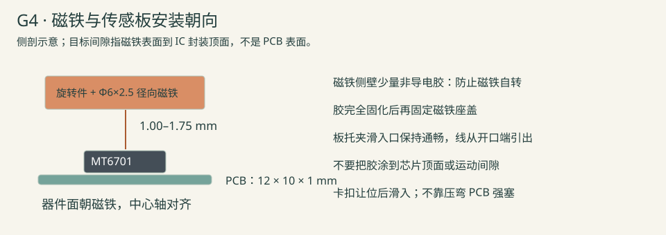

1. 领用工厂已焊好五线、做过导通检测并贴有端口标签的传感板。先核对板上元件面与出线端，不在装好的人偶上焊接。
2. 侧装 N003 / N004 磁铁座盖先从斜向开口滑入 Φ6×2.5 磁铁，在磁铁侧壁间隙用少量非导电胶防转，完全固化后安装两枚 M2×5。螺钉头能挡住磁铁滑出，但不能代替圆磁铁的防转粘接。P/D 端轴磁铁同样需要防止相对轴自转；保持端面清洁。
3. 卡扣式传感板托夹先脱离关节，在开口端轻让弹性卡舌，把 PCB 沿导轨平行滑入，让卡舌复位；线从开口端引出。不要从正面压芯片或弯曲 PCB 强塞。卡舌如有裂纹、永久变形，换该打印件。
4. 传感器 IC 顶面朝磁铁，磁铁旋转中心与 IC 中心相对；名义封装顶面间隙 1.00–1.75 mm。这个间隙不同于板面距离。实际磁场、偏心和测量误差仍由 O22 首件与标定记录确认。
5. 34 个托夹用 M3×8 + M3 螺母固定，12 个端轴用成对板夹固定。装完轻拉线束时不能带动 PCB，也不能让固线胶进入导轨或磁铁间隙。
6. 先做线束出口处应力释放，再在同一刚性骨段上用扎带固定；跨运动缝留 U 形活动段，不把相邻两骨段捆死。磁铁与座盖固化后视作一个替换单元。

<a id="G5"></a>

### G5 · 一体式铰链的特殊顺序

1. 父骨架端部已经包含完整固定座，子骨架端部已经包含旋转叉耳。不再寻找旧版 base_service_half，也不用旧版固定座合壳螺钉。
2. 在旋转叉耳装入前，从固定座侧面的检修开口，沿槽送入 M3 螺母和 M3 反力垫，让它们分别落在六角窝和圆形座。这里“侧面”是零件自身的槽口，不是人偶统一的左侧。
3. 按 G1 装入旋转叉耳和一套轴肩结构。轴肩就位后帮助限制内部件滑出；先调整保持力。最后按 G4 装侧装磁铁座盖和板托夹。

<a id="steps"></a>

## 04 · 按身体部位逐步拼装

<a id="S01"></a>

### S01 · 腰部

连接 **盘 A03-01 · X038（骨架／骨盆） → 盘 A02-02 · X042（骨架／腰部）**。本步需打开打印盘：A02、A03。

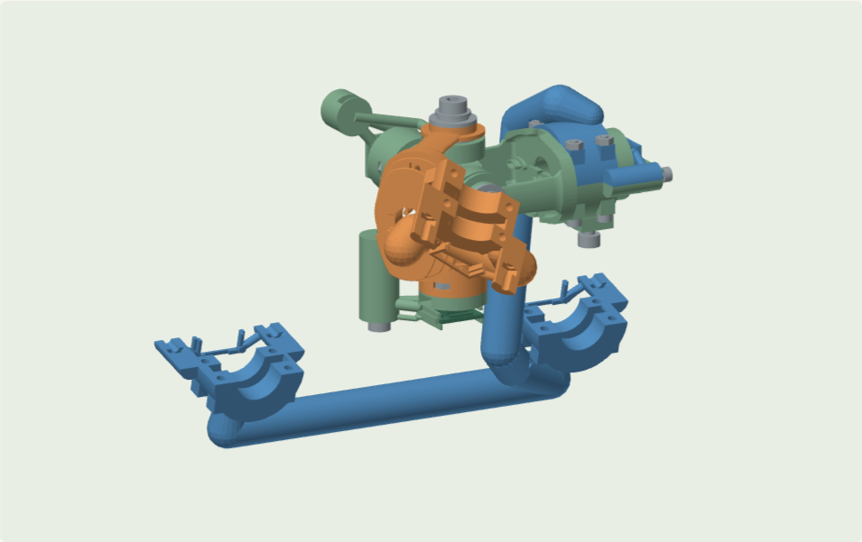

| 取件位置 | 名称 / 原始键 | 本步用途 / 状态 |
| --- | --- | --- |
| 盘 A03-01 · X038（骨架／骨盆） | `frame/pelvis` | 本步新取。一体骨架；已包含 腰部/P_固定半壳、左髋／大腿/P_固定半壳、右髋／大腿/P_固定半壳 |
| 盘 A02-02 · X042（骨架／腰部） | `frame/waist` | 本步新取。一体骨架；已包含 腰部/上叉、胸部/P_固定半壳 |
| 盘 A02-03 · P002（腰部/下环） | `waist/C14` | 本步新取。十字关节下环；先装内部螺母和 M3 反力垫 |
| 盘 A02-05 · P001（腰部/下叉） | `waist/C01` | 本步新取。十字关节叉臂；与另一叉臂正交穿装 |
| 盘 A02-10 · X036（腰部/P_板夹_+14） | `waist/P_pcb_clip_+14` | 本步新取。端轴传感 PCB 的一侧板夹，与另一板夹成对使用 |
| 盘 A02-11 · X035（腰部/P_板夹_-14） | `waist/P_pcb_clip_-14` | 本步新取。端轴传感 PCB 的一侧板夹，与另一板夹成对使用 |
| 盘 A02-12 · P012（腰部/P_径向摩擦块） | `waist/P_radial_pad` | 本步新取。端轴径向摩擦块；凹面朝轴，M3×8 顶压外侧 |
| 盘 A03-02 · X037（腰部/P_活动半壳） | `waist/P_case_plus` | 本步新取。端轴可拆半壳；4 枚 M2×20 合壳 |
| 盘 A03-03 · P003（腰部/上环盖） | `waist/C15` | 本步新取。十字关节上环盖；4 枚 M1.6×6 合环 |
| 盘 A03-06 · X001（腰部/下叉_传感板托夹） | `waist/C01_sensor_cassette` | 本步新取。固定传感 PCB；先滑入板，再装到关节 |
| 盘 A03-08 · X002（腰部/上叉_传感板托夹） | `waist/C02_sensor_cassette` | 本步新取。固定传感 PCB；先滑入板，再装到关节 |
| 盘 A03-10 · P013（腰部/P_磁铁端盖） | `waist/P_magnet_cap` | 本步新取。端轴磁铁端盖；2 枚 M2×4 固定 |
| 盘 A03-12 · N003（腰部/下叉_侧装磁铁座盖） | `waist/C01_magnet_cartridge` | 本步新取。侧面装入并粘固磁铁；旋转侧用 2 枚 M2×5 固定 |
| 盘 A03-13 · N003（腰部/上叉_侧装磁铁座盖） | `waist/C02_magnet_cartridge` | 本步新取。侧面装入并粘固磁铁；旋转侧用 2 枚 M2×5 固定 |

| 五金 / 磁铁 | 本步数量 | 位置 |
| --- | --- | --- |
| M4大平垫圈：外径12、厚1 mm，实物能自由套过Φ4光杆 | 8 | 旋转叉耳两侧，每个支点 2 片 |
| A8不锈钢碟簧：8×4.2×0.4，自由高0.6 mm | 8 | 每个轴肩支点 2 片，相对安装 |
| M4普通平垫圈：外径9、厚0.8 mm，实物通孔验证 | 4 | 螺钉头下、碟簧外侧，每个支点 1 片 |
| 轴肩螺钉 Φ4×8 / M3×0.5，螺纹长6 mm；头Φ7×3，内六角3 mm | 4 | 轴肩摩擦支点，铰链 1 处 / 十字核心 4 处 |
| M3普通六角螺母（不要锁紧螺母替代外形） | 7 | 轴肩捕获窝、板托夹固定点，以及有 P/D 端轴时的摩擦调节槽 |
| M3大平垫圈：外径9、厚0.8 mm，实物通孔验证 | 4 | 固定座内侧，每个支点 1 片反力垫 |
| M1.6×6 内六角圆柱头螺钉；按CAD头径/头高核对 | 4 | C14 / C15 合环 |
| M1.6普通六角螺母（不要锁紧螺母替代外形） | 4 | C14 / C15 合环螺钉对应捕获窝 |
| M2普通六角螺母（不要锁紧螺母替代外形） | 12 | 本步各 M2 螺钉对应捕获窝，一螺钉配一螺母 |
| M2×5 内六角圆柱头螺钉；按CAD头径/头高核对 | 4 | N003 / N004 侧装磁铁座盖，每个 2 枚 |
| 径向两极磁铁 Φ6×2.5 mm；直径方向充磁，不能买轴向充磁 | 3 | 本步每个实测轴 1 颗，位于对应磁铁座 / 端盖 |
| M3×8 内六角圆柱头螺钉；按CAD头径/头高核对 | 3 | 每只传感板托夹 1 枚；每个 P/D 摩擦块调节 1 枚 |
| M2×20 内六角圆柱头螺钉；按CAD头径/头高核对 | 4 | P / D 端轴固定半壳与活动半壳合壳 |
| M2×4 内六角圆柱头螺钉；按CAD头径/头高核对 | 2 | P / D 端轴的磁铁端盖 |
| M2×8 内六角圆柱头螺钉；按CAD头径/头高核对 | 2 | P / D 端轴的成对 PCB 板夹 |

1. 取 盘 A02-03 · P002（腰部/下环）、盘 A03-03 · P003（腰部/上环盖）。两叉分别是 盘 A02-05 · P001（腰部/下叉） 的 C01 部位、盘 A02-02 · X042（骨架／腰部） 的 C02 部位；已经连在骨架上的叉不要拆分或另找重复打印件。
2. 按 [G2](#G2) 先预装 4 枚 M3 螺母与 4 片 M3 反力垫，把两叉交叉放入环，再按 G1 装四套轴肩结构；随后用 4 枚 M1.6×6 + 4 枚 M1.6 螺母合环。
3. P 端按 [G3](#G3)：盘 A03-01 · X038（骨架／骨盆） 内是一体固定半壳，容纳 盘 A02-05 · P001（腰部/下叉） 的圆轴与限位环；装 盘 A02-12 · P012（腰部/P_径向摩擦块），M3×8 + M3 螺母调摩擦。用 盘 A03-02 · X037（腰部/P_活动半壳） 和 4 枚 M2×20 + 4 枚 M2 螺母合壳。磁铁端盖用 2 枚 M2×4 + 2 枚 M2 螺母；两只 PCB 板夹用 2 枚 M2×8 + 2 枚 M2 螺母。
4. C01 测量端按 [G4](#G4)：盘 A03-12 · N003（腰部/下叉_侧装磁铁座盖） 内放 1 颗磁铁，用 2 枚 M2×5 + 2 枚 M2 螺母固定到叉臂端；盘 A03-06 · X001（腰部/下叉_传感板托夹） 先滑入传感板，再用 M3×8 + M3 螺母固定。
5. C02 测量端按 [G4](#G4)：盘 A03-13 · N003（腰部/上叉_侧装磁铁座盖） 内放 1 颗磁铁，用 2 枚 M2×5 + 2 枚 M2 螺母固定到叉臂端；盘 A03-08 · X002（腰部/上叉_传感板托夹） 先滑入传感板，再用 M3×8 + M3 螺母固定。
6. 局部慢慢活动，确认每一相邻活动面不挤压垫片、PCB 和线束。按需要的手感调保持力即可；当前可用行程由实物相邻件与线束决定，软件 raw_limits 不是要求你硬拧到的机械行程。

| 电路端口 / 中央板位号 | 测量轴 | 传感板装在 | 对应磁铁装在 | 每根线建议长度 |
| --- | --- | --- | --- | --- |
| 端口 A01 / J10 | `waist/r0` | 盘 A02-11 · X035（腰部/P_板夹_-14） + 盘 A02-10 · X036（腰部/P_板夹_+14） | 盘 A03-10 · P013（腰部/P_磁铁端盖） | 450 mm × 5 根，首件后定长 |
| 端口 A02 / J11 | `waist/r1` | 盘 A03-06 · X001（腰部/下叉_传感板托夹） | 盘 A03-12 · N003（腰部/下叉_侧装磁铁座盖） | 450 mm × 5 根，首件后定长 |
| 端口 A03 / J12 | `waist/r2` | 盘 A03-08 · X002（腰部/上叉_传感板托夹） | 盘 A03-13 · N003（腰部/上叉_侧装磁铁座盖） | 450 mm × 5 根，首件后定长 |

本步完成检查：A01、A02、A03 标签对应正确；磁铁不相对载体打滑；转轴可手动摆动并保持；线先松放到背盒方向，留待走线章节统一固定。

<a id="S02"></a>

### S02 · 胸部

连接 **盘 A02-02 · X042（骨架／腰部） → 盘 A02-01 · X046（骨架／胸部）**。本步需打开打印盘：A02、A03。

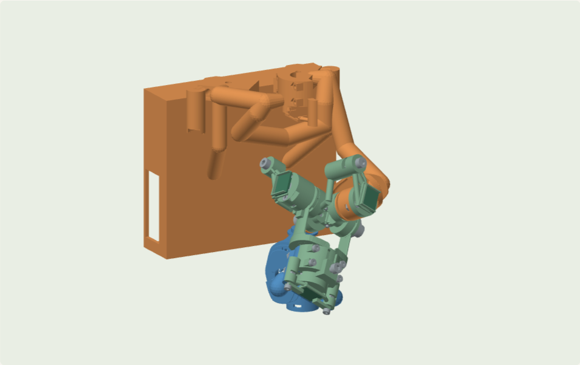

| 取件位置 | 名称 / 原始键 | 本步用途 / 状态 |
| --- | --- | --- |
| 盘 A02-02 · X042（骨架／腰部） | `frame/waist` | 已在 S01 取用，直接使用已装骨架。一体骨架；已包含 腰部/上叉、胸部/P_固定半壳 |
| 盘 A02-01 · X046（骨架／胸部） | `frame/chest` | 本步新取。一体骨架；已包含 胸部/上叉、头颈/P_固定半壳、左锁骨前后/固定侧关节座、右锁骨前后/固定侧关节座 |
| 盘 A02-04 · P018（胸部/下环） | `chest/C14` | 本步新取。十字关节下环；先装内部螺母和 M3 反力垫 |
| 盘 A02-06 · P017（胸部/下叉） | `chest/C01` | 本步新取。十字关节叉臂；与另一叉臂正交穿装 |
| 盘 A02-07 · X041（胸部/P_活动半壳） | `chest/P_case_plus` | 本步新取。端轴可拆半壳；4 枚 M2×20 合壳 |
| 盘 A02-08 · X040（胸部/P_板夹_+14） | `chest/P_pcb_clip_+14` | 本步新取。端轴传感 PCB 的一侧板夹，与另一板夹成对使用 |
| 盘 A02-09 · X039（胸部/P_板夹_-14） | `chest/P_pcb_clip_-14` | 本步新取。端轴传感 PCB 的一侧板夹，与另一板夹成对使用 |
| 盘 A02-13 · P028（胸部/P_径向摩擦块） | `chest/P_radial_pad` | 本步新取。端轴径向摩擦块；凹面朝轴，M3×8 顶压外侧 |
| 盘 A03-04 · P019（胸部/上环盖） | `chest/C15` | 本步新取。十字关节上环盖；4 枚 M1.6×6 合环 |
| 盘 A03-05 · X004（胸部/上叉_传感板托夹） | `chest/C02_sensor_cassette` | 本步新取。固定传感 PCB；先滑入板，再装到关节 |
| 盘 A03-07 · X003（胸部/下叉_传感板托夹） | `chest/C01_sensor_cassette` | 本步新取。固定传感 PCB；先滑入板，再装到关节 |
| 盘 A03-11 · P029（胸部/P_磁铁端盖） | `chest/P_magnet_cap` | 本步新取。端轴磁铁端盖；2 枚 M2×4 固定 |
| 盘 A03-14 · N003（胸部/下叉_侧装磁铁座盖） | `chest/C01_magnet_cartridge` | 本步新取。侧面装入并粘固磁铁；旋转侧用 2 枚 M2×5 固定 |
| 盘 A03-15 · N003（胸部/上叉_侧装磁铁座盖） | `chest/C02_magnet_cartridge` | 本步新取。侧面装入并粘固磁铁；旋转侧用 2 枚 M2×5 固定 |

| 五金 / 磁铁 | 本步数量 | 位置 |
| --- | --- | --- |
| M4大平垫圈：外径12、厚1 mm，实物能自由套过Φ4光杆 | 8 | 旋转叉耳两侧，每个支点 2 片 |
| A8不锈钢碟簧：8×4.2×0.4，自由高0.6 mm | 8 | 每个轴肩支点 2 片，相对安装 |
| M4普通平垫圈：外径9、厚0.8 mm，实物通孔验证 | 4 | 螺钉头下、碟簧外侧，每个支点 1 片 |
| 轴肩螺钉 Φ4×8 / M3×0.5，螺纹长6 mm；头Φ7×3，内六角3 mm | 4 | 轴肩摩擦支点，铰链 1 处 / 十字核心 4 处 |
| M3普通六角螺母（不要锁紧螺母替代外形） | 7 | 轴肩捕获窝、板托夹固定点，以及有 P/D 端轴时的摩擦调节槽 |
| M3大平垫圈：外径9、厚0.8 mm，实物通孔验证 | 4 | 固定座内侧，每个支点 1 片反力垫 |
| M1.6×6 内六角圆柱头螺钉；按CAD头径/头高核对 | 4 | C14 / C15 合环 |
| M1.6普通六角螺母（不要锁紧螺母替代外形） | 4 | C14 / C15 合环螺钉对应捕获窝 |
| M2普通六角螺母（不要锁紧螺母替代外形） | 12 | 本步各 M2 螺钉对应捕获窝，一螺钉配一螺母 |
| M2×5 内六角圆柱头螺钉；按CAD头径/头高核对 | 4 | N003 / N004 侧装磁铁座盖，每个 2 枚 |
| 径向两极磁铁 Φ6×2.5 mm；直径方向充磁，不能买轴向充磁 | 3 | 本步每个实测轴 1 颗，位于对应磁铁座 / 端盖 |
| M3×8 内六角圆柱头螺钉；按CAD头径/头高核对 | 3 | 每只传感板托夹 1 枚；每个 P/D 摩擦块调节 1 枚 |
| M2×20 内六角圆柱头螺钉；按CAD头径/头高核对 | 4 | P / D 端轴固定半壳与活动半壳合壳 |
| M2×4 内六角圆柱头螺钉；按CAD头径/头高核对 | 2 | P / D 端轴的磁铁端盖 |
| M2×8 内六角圆柱头螺钉；按CAD头径/头高核对 | 2 | P / D 端轴的成对 PCB 板夹 |

1. 取 盘 A02-04 · P018（胸部/下环）、盘 A03-04 · P019（胸部/上环盖）。两叉分别是 盘 A02-06 · P017（胸部/下叉） 的 C01 部位、盘 A02-01 · X046（骨架／胸部） 的 C02 部位；已经连在骨架上的叉不要拆分或另找重复打印件。
2. 按 [G2](#G2) 先预装 4 枚 M3 螺母与 4 片 M3 反力垫，把两叉交叉放入环，再按 G1 装四套轴肩结构；随后用 4 枚 M1.6×6 + 4 枚 M1.6 螺母合环。
3. P 端按 [G3](#G3)：盘 A02-02 · X042（骨架／腰部） 内是一体固定半壳，容纳 盘 A02-06 · P017（胸部/下叉） 的圆轴与限位环；装 盘 A02-13 · P028（胸部/P_径向摩擦块），M3×8 + M3 螺母调摩擦。用 盘 A02-07 · X041（胸部/P_活动半壳） 和 4 枚 M2×20 + 4 枚 M2 螺母合壳。磁铁端盖用 2 枚 M2×4 + 2 枚 M2 螺母；两只 PCB 板夹用 2 枚 M2×8 + 2 枚 M2 螺母。
4. C01 测量端按 [G4](#G4)：盘 A03-14 · N003（胸部/下叉_侧装磁铁座盖） 内放 1 颗磁铁，用 2 枚 M2×5 + 2 枚 M2 螺母固定到叉臂端；盘 A03-07 · X003（胸部/下叉_传感板托夹） 先滑入传感板，再用 M3×8 + M3 螺母固定。
5. C02 测量端按 [G4](#G4)：盘 A03-15 · N003（胸部/上叉_侧装磁铁座盖） 内放 1 颗磁铁，用 2 枚 M2×5 + 2 枚 M2 螺母固定到叉臂端；盘 A03-05 · X004（胸部/上叉_传感板托夹） 先滑入传感板，再用 M3×8 + M3 螺母固定。
6. 局部慢慢活动，确认每一相邻活动面不挤压垫片、PCB 和线束。按需要的手感调保持力即可；当前可用行程由实物相邻件与线束决定，软件 raw_limits 不是要求你硬拧到的机械行程。

| 电路端口 / 中央板位号 | 测量轴 | 传感板装在 | 对应磁铁装在 | 每根线建议长度 |
| --- | --- | --- | --- | --- |
| 端口 A04 / J13 | `chest/r0` | 盘 A02-09 · X039（胸部/P_板夹_-14） + 盘 A02-08 · X040（胸部/P_板夹_+14） | 盘 A03-11 · P029（胸部/P_磁铁端盖） | 450 mm × 5 根，首件后定长 |
| 端口 A05 / J14 | `chest/r1` | 盘 A03-07 · X003（胸部/下叉_传感板托夹） | 盘 A03-14 · N003（胸部/下叉_侧装磁铁座盖） | 275 mm × 5 根，首件后定长 |
| 端口 A06 / J15 | `chest/r2` | 盘 A03-05 · X004（胸部/上叉_传感板托夹） | 盘 A03-15 · N003（胸部/上叉_侧装磁铁座盖） | 275 mm × 5 根，首件后定长 |

本步完成检查：A04、A05、A06 标签对应正确；磁铁不相对载体打滑；转轴可手动摆动并保持；线先松放到背盒方向，留待走线章节统一固定。

<a id="S03"></a>

### S03 · 头颈

连接 **盘 A02-01 · X046（骨架／胸部） → 盘 A01-02 · X050（骨架／头颈）**。本步需打开打印盘：A01、A02。

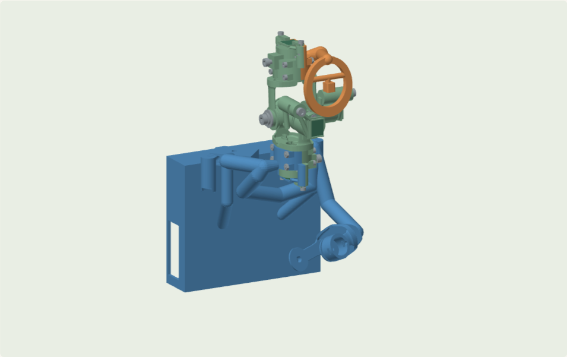

| 取件位置 | 名称 / 原始键 | 本步用途 / 状态 |
| --- | --- | --- |
| 盘 A02-01 · X046（骨架／胸部） | `frame/chest` | 已在 S02 取用，直接使用已装骨架。一体骨架；已包含 胸部/上叉、头颈/P_固定半壳、左锁骨前后/固定侧关节座、右锁骨前后/固定侧关节座 |
| 盘 A01-02 · X050（骨架／头颈） | `frame/head` | 本步新取。一体骨架；已包含 头颈/D_固定半壳 |
| 盘 A01-03 · P035（头颈/下环） | `head/C14` | 本步新取。十字关节下环；先装内部螺母和 M3 反力垫 |
| 盘 A01-04 · P033（头颈/下叉） | `head/C01` | 本步新取。十字关节叉臂；与另一叉臂正交穿装 |
| 盘 A01-05 · P034（头颈/上叉） | `head/C02` | 本步新取。十字关节叉臂；与另一叉臂正交穿装 |
| 盘 A01-06 · X045（头颈/P_活动半壳） | `head/P_case_plus` | 本步新取。端轴可拆半壳；4 枚 M2×20 合壳 |
| 盘 A01-07 · X049（头颈/D_活动半壳） | `head/D_case_plus` | 本步新取。端轴可拆半壳；4 枚 M2×20 合壳 |
| 盘 A01-08 · P036（头颈/上环盖） | `head/C15` | 本步新取。十字关节上环盖；4 枚 M1.6×6 合环 |
| 盘 A01-09 · X005（头颈/下叉_传感板托夹） | `head/C01_sensor_cassette` | 本步新取。固定传感 PCB；先滑入板，再装到关节 |
| 盘 A01-10 · X006（头颈/上叉_传感板托夹） | `head/C02_sensor_cassette` | 本步新取。固定传感 PCB；先滑入板，再装到关节 |
| 盘 A01-11 · P040（头颈/P_磁铁端盖） | `head/P_magnet_cap` | 本步新取。端轴磁铁端盖；2 枚 M2×4 固定 |
| 盘 A01-12 · P045（头颈/D_磁铁端盖） | `head/D_magnet_cap` | 本步新取。端轴磁铁端盖；2 枚 M2×4 固定 |
| 盘 A01-13 · N003（头颈/下叉_侧装磁铁座盖） | `head/C01_magnet_cartridge` | 本步新取。侧面装入并粘固磁铁；旋转侧用 2 枚 M2×5 固定 |
| 盘 A01-14 · N003（头颈/上叉_侧装磁铁座盖） | `head/C02_magnet_cartridge` | 本步新取。侧面装入并粘固磁铁；旋转侧用 2 枚 M2×5 固定 |
| 盘 A01-15 · X043（头颈/P_板夹_-14） | `head/P_pcb_clip_-14` | 本步新取。端轴传感 PCB 的一侧板夹，与另一板夹成对使用 |
| 盘 A01-16 · X044（头颈/P_板夹_+14） | `head/P_pcb_clip_+14` | 本步新取。端轴传感 PCB 的一侧板夹，与另一板夹成对使用 |
| 盘 A01-17 · X047（头颈/D_板夹_-14） | `head/D_pcb_clip_-14` | 本步新取。端轴传感 PCB 的一侧板夹，与另一板夹成对使用 |
| 盘 A01-18 · X048（头颈/D_板夹_+14） | `head/D_pcb_clip_+14` | 本步新取。端轴传感 PCB 的一侧板夹，与另一板夹成对使用 |
| 盘 A01-19 · P039（头颈/P_径向摩擦块） | `head/P_radial_pad` | 本步新取。端轴径向摩擦块；凹面朝轴，M3×8 顶压外侧 |
| 盘 A01-20 · P044（头颈/D_径向摩擦块） | `head/D_radial_pad` | 本步新取。端轴径向摩擦块；凹面朝轴，M3×8 顶压外侧 |

| 五金 / 磁铁 | 本步数量 | 位置 |
| --- | --- | --- |
| M4大平垫圈：外径12、厚1 mm，实物能自由套过Φ4光杆 | 8 | 旋转叉耳两侧，每个支点 2 片 |
| A8不锈钢碟簧：8×4.2×0.4，自由高0.6 mm | 8 | 每个轴肩支点 2 片，相对安装 |
| M4普通平垫圈：外径9、厚0.8 mm，实物通孔验证 | 4 | 螺钉头下、碟簧外侧，每个支点 1 片 |
| 轴肩螺钉 Φ4×8 / M3×0.5，螺纹长6 mm；头Φ7×3，内六角3 mm | 4 | 轴肩摩擦支点，铰链 1 处 / 十字核心 4 处 |
| M3普通六角螺母（不要锁紧螺母替代外形） | 8 | 轴肩捕获窝、板托夹固定点，以及有 P/D 端轴时的摩擦调节槽 |
| M3大平垫圈：外径9、厚0.8 mm，实物通孔验证 | 4 | 固定座内侧，每个支点 1 片反力垫 |
| M1.6×6 内六角圆柱头螺钉；按CAD头径/头高核对 | 4 | C14 / C15 合环 |
| M1.6普通六角螺母（不要锁紧螺母替代外形） | 4 | C14 / C15 合环螺钉对应捕获窝 |
| M2普通六角螺母（不要锁紧螺母替代外形） | 20 | 本步各 M2 螺钉对应捕获窝，一螺钉配一螺母 |
| M2×5 内六角圆柱头螺钉；按CAD头径/头高核对 | 4 | N003 / N004 侧装磁铁座盖，每个 2 枚 |
| 径向两极磁铁 Φ6×2.5 mm；直径方向充磁，不能买轴向充磁 | 4 | 本步每个实测轴 1 颗，位于对应磁铁座 / 端盖 |
| M3×8 内六角圆柱头螺钉；按CAD头径/头高核对 | 4 | 每只传感板托夹 1 枚；每个 P/D 摩擦块调节 1 枚 |
| M2×20 内六角圆柱头螺钉；按CAD头径/头高核对 | 8 | P / D 端轴固定半壳与活动半壳合壳 |
| M2×4 内六角圆柱头螺钉；按CAD头径/头高核对 | 4 | P / D 端轴的磁铁端盖 |
| M2×8 内六角圆柱头螺钉；按CAD头径/头高核对 | 4 | P / D 端轴的成对 PCB 板夹 |

1. 取 盘 A01-03 · P035（头颈/下环）、盘 A01-08 · P036（头颈/上环盖）。两叉分别是 盘 A01-04 · P033（头颈/下叉） 的 C01 部位、盘 A01-05 · P034（头颈/上叉） 的 C02 部位；已经连在骨架上的叉不要拆分或另找重复打印件。
2. 按 [G2](#G2) 先预装 4 枚 M3 螺母与 4 片 M3 反力垫，把两叉交叉放入环，再按 G1 装四套轴肩结构；随后用 4 枚 M1.6×6 + 4 枚 M1.6 螺母合环。
3. P 端按 [G3](#G3)：盘 A02-01 · X046（骨架／胸部） 内是一体固定半壳，容纳 盘 A01-04 · P033（头颈/下叉） 的圆轴与限位环；装 盘 A01-19 · P039（头颈/P_径向摩擦块），M3×8 + M3 螺母调摩擦。用 盘 A01-06 · X045（头颈/P_活动半壳） 和 4 枚 M2×20 + 4 枚 M2 螺母合壳。磁铁端盖用 2 枚 M2×4 + 2 枚 M2 螺母；两只 PCB 板夹用 2 枚 M2×8 + 2 枚 M2 螺母。
4. D 端按 [G3](#G3)：盘 A01-02 · X050（骨架／头颈） 内是一体固定半壳，容纳 盘 A01-05 · P034（头颈/上叉） 的圆轴与限位环；装 盘 A01-20 · P044（头颈/D_径向摩擦块），M3×8 + M3 螺母调摩擦。用 盘 A01-07 · X049（头颈/D_活动半壳） 和 4 枚 M2×20 + 4 枚 M2 螺母合壳。磁铁端盖用 2 枚 M2×4 + 2 枚 M2 螺母；两只 PCB 板夹用 2 枚 M2×8 + 2 枚 M2 螺母。
5. C01 测量端按 [G4](#G4)：盘 A01-13 · N003（头颈/下叉_侧装磁铁座盖） 内放 1 颗磁铁，用 2 枚 M2×5 + 2 枚 M2 螺母固定到叉臂端；盘 A01-09 · X005（头颈/下叉_传感板托夹） 先滑入传感板，再用 M3×8 + M3 螺母固定。
6. C02 测量端按 [G4](#G4)：盘 A01-14 · N003（头颈/上叉_侧装磁铁座盖） 内放 1 颗磁铁，用 2 枚 M2×5 + 2 枚 M2 螺母固定到叉臂端；盘 A01-10 · X006（头颈/上叉_传感板托夹） 先滑入传感板，再用 M3×8 + M3 螺母固定。
7. 局部慢慢活动，确认每一相邻活动面不挤压垫片、PCB 和线束。按需要的手感调保持力即可；当前可用行程由实物相邻件与线束决定，软件 raw_limits 不是要求你硬拧到的机械行程。

| 电路端口 / 中央板位号 | 测量轴 | 传感板装在 | 对应磁铁装在 | 每根线建议长度 |
| --- | --- | --- | --- | --- |
| 端口 A07 / J16 | `head/r0` | 盘 A01-15 · X043（头颈/P_板夹_-14） + 盘 A01-16 · X044（头颈/P_板夹_+14） | 盘 A01-11 · P040（头颈/P_磁铁端盖） | 225 mm × 5 根，首件后定长 |
| 端口 A08 / J17 | `head/r1` | 盘 A01-09 · X005（头颈/下叉_传感板托夹） | 盘 A01-13 · N003（头颈/下叉_侧装磁铁座盖） | 350 mm × 5 根，首件后定长 |
| 端口 A09 / J18 | `head/r2` | 盘 A01-10 · X006（头颈/上叉_传感板托夹） | 盘 A01-14 · N003（头颈/上叉_侧装磁铁座盖） | 350 mm × 5 根，首件后定长 |
| 端口 A10 / J19 | `head/r3` | 盘 A01-17 · X047（头颈/D_板夹_-14） + 盘 A01-18 · X048（头颈/D_板夹_+14） | 盘 A01-12 · P045（头颈/D_磁铁端盖） | 325 mm × 5 根，首件后定长 |

本步完成检查：A07、A08、A09、A10 标签对应正确；磁铁不相对载体打滑；转轴可手动摆动并保持；线先松放到背盒方向，留待走线章节统一固定。

<a id="S04"></a>

### S04 · 左锁骨前后

连接 **盘 A02-01 · X046（骨架／胸部） → 盘 A04-02 · W005（骨架／左锁骨前后中间架）**。本步需打开打印盘：A02、A04、A05。

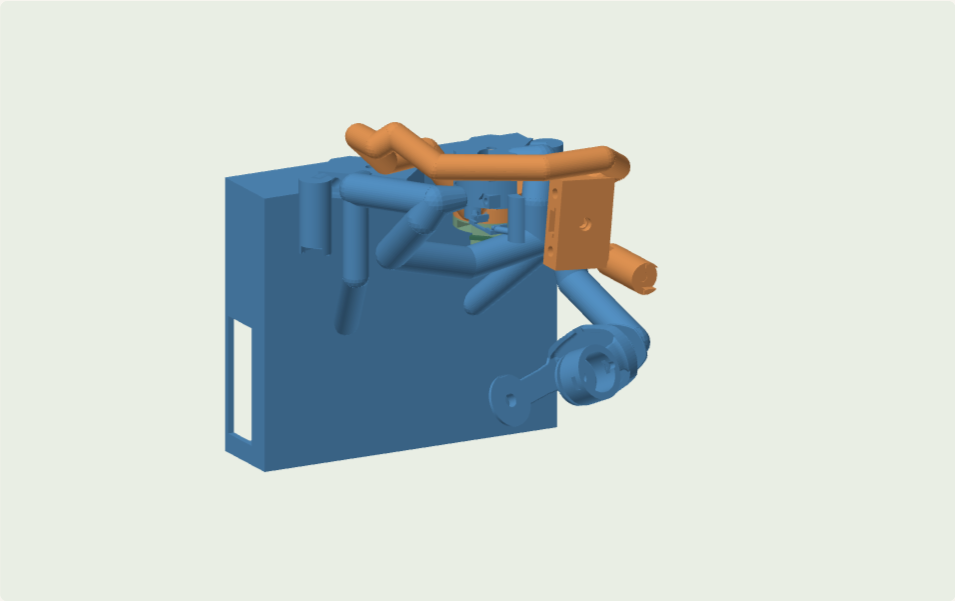

| 取件位置 | 名称 / 原始键 | 本步用途 / 状态 |
| --- | --- | --- |
| 盘 A02-01 · X046（骨架／胸部） | `frame/chest` | 已在 S02 取用，直接使用已装骨架。一体骨架；已包含 胸部/上叉、头颈/P_固定半壳、左锁骨前后/固定侧关节座、右锁骨前后/固定侧关节座 |
| 盘 A04-02 · W005（骨架／左锁骨前后中间架） | `frame/clavicle_l.protract_frame` | 本步新取。一体骨架；已包含 左锁骨前后/旋转侧叉耳、左锁骨升降/固定侧关节座 |
| 盘 A05-19 · N004（左锁骨前后/侧装磁铁座盖） | `clavicle_l.protract/magnet_cartridge` | 本步新取。侧面装入并粘固磁铁；旋转侧用 2 枚 M2×5 固定 |
| 盘 A05-22 · X019（左锁骨前后/传感板托夹） | `clavicle_l.protract/sensor_cassette` | 本步新取。固定传感 PCB；先滑入板，再装到关节 |

| 五金 / 磁铁 | 本步数量 | 位置 |
| --- | --- | --- |
| M4大平垫圈：外径12、厚1 mm，实物能自由套过Φ4光杆 | 2 | 旋转叉耳两侧，每个支点 2 片 |
| A8不锈钢碟簧：8×4.2×0.4，自由高0.6 mm | 2 | 每个轴肩支点 2 片，相对安装 |
| M4普通平垫圈：外径9、厚0.8 mm，实物通孔验证 | 1 | 螺钉头下、碟簧外侧，每个支点 1 片 |
| 轴肩螺钉 Φ4×8 / M3×0.5，螺纹长6 mm；头Φ7×3，内六角3 mm | 1 | 轴肩摩擦支点，铰链 1 处 / 十字核心 4 处 |
| M3普通六角螺母（不要锁紧螺母替代外形） | 2 | 轴肩捕获窝、板托夹固定点，以及有 P/D 端轴时的摩擦调节槽 |
| M3大平垫圈：外径9、厚0.8 mm，实物通孔验证 | 1 | 固定座内侧，每个支点 1 片反力垫 |
| M3×8 内六角圆柱头螺钉；按CAD头径/头高核对 | 1 | 每只传感板托夹 1 枚；每个 P/D 摩擦块调节 1 枚 |
| M2普通六角螺母（不要锁紧螺母替代外形） | 2 | 本步各 M2 螺钉对应捕获窝，一螺钉配一螺母 |
| M2×5 内六角圆柱头螺钉；按CAD头径/头高核对 | 2 | N003 / N004 侧装磁铁座盖，每个 2 枚 |
| 径向两极磁铁 Φ6×2.5 mm；直径方向充磁，不能买轴向充磁 | 1 | 本步每个实测轴 1 颗，位于对应磁铁座 / 端盖 |

1. 将 盘 A02-01 · X046（骨架／胸部） 的固定关节座与 盘 A04-02 · W005（骨架／左锁骨前后中间架） 的旋转叉耳摆到图示连接位置。侧槽尚未被挡住时，预装 1 枚 M3 螺母与 1 片 M3 反力垫。
2. 按 [G5 一体铰链](#G5) 和 [G1 轴肩层次](#G1) 装 1 套轴肩结构。单个支点为 1 枚轴肩螺钉、2 片 M4 大垫、2 片 A8 碟簧、1 片 M4 普通垫，外加刚才放入的螺母和反力垫。
3. 调整摩擦后，按 [G4](#G4) 给 盘 A05-19 · N004（左锁骨前后/侧装磁铁座盖） 装 1 颗磁铁，固化后用 2 枚 M2×5 + 2 枚 M2 螺母固定到旋转侧。
4. 把下表所列传感板装入 盘 A05-22 · X019（左锁骨前后/传感板托夹），再用 1 枚 M3×8 + 1 枚 M3 螺母固定到固定侧。传感器与磁铁相对，不能把两者都固定到同一旋转骨段。
5. 局部慢慢活动，确认每一相邻活动面不挤压垫片、PCB 和线束。按需要的手感调保持力即可；当前可用行程由实物相邻件与线束决定，软件 raw_limits 不是要求你硬拧到的机械行程。

| 电路端口 / 中央板位号 | 测量轴 | 传感板装在 | 对应磁铁装在 | 每根线建议长度 |
| --- | --- | --- | --- | --- |
| 端口 A11 / J20 | `clavicle_l.protract/r0` | 盘 A05-22 · X019（左锁骨前后/传感板托夹） | 盘 A05-19 · N004（左锁骨前后/侧装磁铁座盖） | 200 mm × 5 根，首件后定长 |

本步完成检查：A11 标签对应正确；磁铁不相对载体打滑；转轴可手动摆动并保持；线先松放到背盒方向，留待走线章节统一固定。

<a id="S05"></a>

### S05 · 左锁骨升降

连接 **盘 A04-02 · W005（骨架／左锁骨前后中间架） → 盘 A04-01 · X054（骨架／左锁骨）**。本步需打开打印盘：A04、A05。

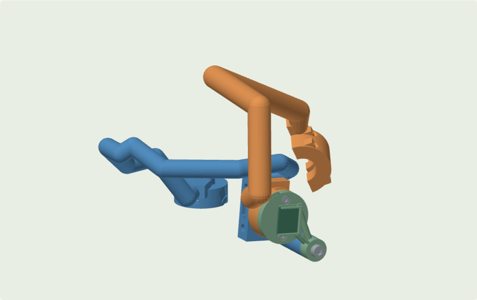

| 取件位置 | 名称 / 原始键 | 本步用途 / 状态 |
| --- | --- | --- |
| 盘 A04-02 · W005（骨架／左锁骨前后中间架） | `frame/clavicle_l.protract_frame` | 已在 S04 取用，直接使用已装骨架。一体骨架；已包含 左锁骨前后/旋转侧叉耳、左锁骨升降/固定侧关节座 |
| 盘 A04-01 · X054（骨架／左锁骨） | `frame/clavicle_l` | 本步新取。一体骨架；已包含 左肩／上臂/P_固定半壳、左锁骨升降/旋转侧叉耳 |
| 盘 A05-05 · N004（左锁骨升降/侧装磁铁座盖） | `clavicle_l.elevate/magnet_cartridge` | 本步新取。侧面装入并粘固磁铁；旋转侧用 2 枚 M2×5 固定 |
| 盘 A05-10 · X020（左锁骨升降/传感板托夹） | `clavicle_l.elevate/sensor_cassette` | 本步新取。固定传感 PCB；先滑入板，再装到关节 |

| 五金 / 磁铁 | 本步数量 | 位置 |
| --- | --- | --- |
| M4大平垫圈：外径12、厚1 mm，实物能自由套过Φ4光杆 | 2 | 旋转叉耳两侧，每个支点 2 片 |
| A8不锈钢碟簧：8×4.2×0.4，自由高0.6 mm | 2 | 每个轴肩支点 2 片，相对安装 |
| M4普通平垫圈：外径9、厚0.8 mm，实物通孔验证 | 1 | 螺钉头下、碟簧外侧，每个支点 1 片 |
| 轴肩螺钉 Φ4×8 / M3×0.5，螺纹长6 mm；头Φ7×3，内六角3 mm | 1 | 轴肩摩擦支点，铰链 1 处 / 十字核心 4 处 |
| M3普通六角螺母（不要锁紧螺母替代外形） | 2 | 轴肩捕获窝、板托夹固定点，以及有 P/D 端轴时的摩擦调节槽 |
| M3大平垫圈：外径9、厚0.8 mm，实物通孔验证 | 1 | 固定座内侧，每个支点 1 片反力垫 |
| M3×8 内六角圆柱头螺钉；按CAD头径/头高核对 | 1 | 每只传感板托夹 1 枚；每个 P/D 摩擦块调节 1 枚 |
| M2普通六角螺母（不要锁紧螺母替代外形） | 2 | 本步各 M2 螺钉对应捕获窝，一螺钉配一螺母 |
| M2×5 内六角圆柱头螺钉；按CAD头径/头高核对 | 2 | N003 / N004 侧装磁铁座盖，每个 2 枚 |
| 径向两极磁铁 Φ6×2.5 mm；直径方向充磁，不能买轴向充磁 | 1 | 本步每个实测轴 1 颗，位于对应磁铁座 / 端盖 |

1. 将 盘 A04-02 · W005（骨架／左锁骨前后中间架） 的固定关节座与 盘 A04-01 · X054（骨架／左锁骨） 的旋转叉耳摆到图示连接位置。侧槽尚未被挡住时，预装 1 枚 M3 螺母与 1 片 M3 反力垫。
2. 按 [G5 一体铰链](#G5) 和 [G1 轴肩层次](#G1) 装 1 套轴肩结构。单个支点为 1 枚轴肩螺钉、2 片 M4 大垫、2 片 A8 碟簧、1 片 M4 普通垫，外加刚才放入的螺母和反力垫。
3. 调整摩擦后，按 [G4](#G4) 给 盘 A05-05 · N004（左锁骨升降/侧装磁铁座盖） 装 1 颗磁铁，固化后用 2 枚 M2×5 + 2 枚 M2 螺母固定到旋转侧。
4. 把下表所列传感板装入 盘 A05-10 · X020（左锁骨升降/传感板托夹），再用 1 枚 M3×8 + 1 枚 M3 螺母固定到固定侧。传感器与磁铁相对，不能把两者都固定到同一旋转骨段。
5. 局部慢慢活动，确认每一相邻活动面不挤压垫片、PCB 和线束。按需要的手感调保持力即可；当前可用行程由实物相邻件与线束决定，软件 raw_limits 不是要求你硬拧到的机械行程。

| 电路端口 / 中央板位号 | 测量轴 | 传感板装在 | 对应磁铁装在 | 每根线建议长度 |
| --- | --- | --- | --- | --- |
| 端口 A12 / J21 | `clavicle_l.elevate/r0` | 盘 A05-10 · X020（左锁骨升降/传感板托夹） | 盘 A05-05 · N004（左锁骨升降/侧装磁铁座盖） | 325 mm × 5 根，首件后定长 |

本步完成检查：A12 标签对应正确；磁铁不相对载体打滑；转轴可手动摆动并保持；线先松放到背盒方向，留待走线章节统一固定。

<a id="S06"></a>

### S06 · 左肩／上臂

连接 **盘 A04-01 · X054（骨架／左锁骨） → 盘 A04-05 · X058（骨架／左肩／上臂）**。本步需打开打印盘：A04、A05。

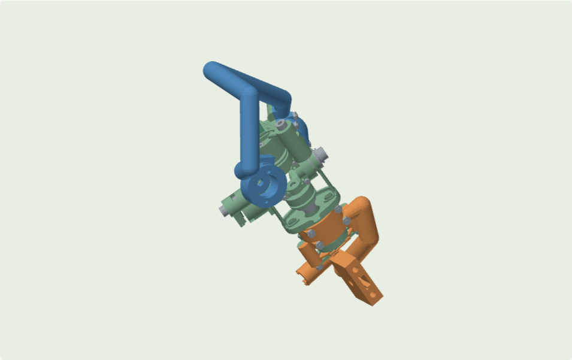

| 取件位置 | 名称 / 原始键 | 本步用途 / 状态 |
| --- | --- | --- |
| 盘 A04-01 · X054（骨架／左锁骨） | `frame/clavicle_l` | 已在 S05 取用，直接使用已装骨架。一体骨架；已包含 左肩／上臂/P_固定半壳、左锁骨升降/旋转侧叉耳 |
| 盘 A04-05 · X058（骨架／左肩／上臂） | `frame/upperarm_l` | 本步新取。一体骨架；已包含 左肩／上臂/D_固定半壳、左肘屈伸/固定侧关节座 |
| 盘 A04-04 · P051（左肩／上臂/下环） | `upperarm_l/C14` | 本步新取。十字关节下环；先装内部螺母和 M3 反力垫 |
| 盘 A04-06 · X051（左肩／上臂/P_板夹_-14） | `upperarm_l/P_pcb_clip_-14` | 本步新取。端轴传感 PCB 的一侧板夹，与另一板夹成对使用 |
| 盘 A04-07 · X056（左肩／上臂/D_板夹_+14） | `upperarm_l/D_pcb_clip_+14` | 本步新取。端轴传感 PCB 的一侧板夹，与另一板夹成对使用 |
| 盘 A04-08 · X055（左肩／上臂/D_板夹_-14） | `upperarm_l/D_pcb_clip_-14` | 本步新取。端轴传感 PCB 的一侧板夹，与另一板夹成对使用 |
| 盘 A04-09 · X052（左肩／上臂/P_板夹_+14） | `upperarm_l/P_pcb_clip_+14` | 本步新取。端轴传感 PCB 的一侧板夹，与另一板夹成对使用 |
| 盘 A04-10 · P061（左肩／上臂/P_径向摩擦块） | `upperarm_l/P_radial_pad` | 本步新取。端轴径向摩擦块；凹面朝轴，M3×8 顶压外侧 |
| 盘 A04-11 · P066（左肩／上臂/D_径向摩擦块） | `upperarm_l/D_radial_pad` | 本步新取。端轴径向摩擦块；凹面朝轴，M3×8 顶压外侧 |
| 盘 A05-02 · P050（左肩／上臂/上叉） | `upperarm_l/C02` | 本步新取。十字关节叉臂；与另一叉臂正交穿装 |
| 盘 A05-06 · X008（左肩／上臂/上叉_传感板托夹） | `upperarm_l/C02_sensor_cassette` | 本步新取。固定传感 PCB；先滑入板，再装到关节 |
| 盘 A05-07 · X007（左肩／上臂/下叉_传感板托夹） | `upperarm_l/C01_sensor_cassette` | 本步新取。固定传感 PCB；先滑入板，再装到关节 |
| 盘 A05-08 · P052（左肩／上臂/上环盖） | `upperarm_l/C15` | 本步新取。十字关节上环盖；4 枚 M1.6×6 合环 |
| 盘 A05-09 · X053（左肩／上臂/P_活动半壳） | `upperarm_l/P_case_plus` | 本步新取。端轴可拆半壳；4 枚 M2×20 合壳 |
| 盘 A05-14 · P049（左肩／上臂/下叉） | `upperarm_l/C01` | 本步新取。十字关节叉臂；与另一叉臂正交穿装 |
| 盘 A05-16 · X057（左肩／上臂/D_活动半壳） | `upperarm_l/D_case_plus` | 本步新取。端轴可拆半壳；4 枚 M2×20 合壳 |
| 盘 A05-23 · P067（左肩／上臂/D_磁铁端盖） | `upperarm_l/D_magnet_cap` | 本步新取。端轴磁铁端盖；2 枚 M2×4 固定 |
| 盘 A05-24 · P062（左肩／上臂/P_磁铁端盖） | `upperarm_l/P_magnet_cap` | 本步新取。端轴磁铁端盖；2 枚 M2×4 固定 |
| 盘 A05-25 · N003（左肩／上臂/下叉_侧装磁铁座盖） | `upperarm_l/C01_magnet_cartridge` | 本步新取。侧面装入并粘固磁铁；旋转侧用 2 枚 M2×5 固定 |
| 盘 A05-26 · N003（左肩／上臂/上叉_侧装磁铁座盖） | `upperarm_l/C02_magnet_cartridge` | 本步新取。侧面装入并粘固磁铁；旋转侧用 2 枚 M2×5 固定 |

| 五金 / 磁铁 | 本步数量 | 位置 |
| --- | --- | --- |
| M4大平垫圈：外径12、厚1 mm，实物能自由套过Φ4光杆 | 8 | 旋转叉耳两侧，每个支点 2 片 |
| A8不锈钢碟簧：8×4.2×0.4，自由高0.6 mm | 8 | 每个轴肩支点 2 片，相对安装 |
| M4普通平垫圈：外径9、厚0.8 mm，实物通孔验证 | 4 | 螺钉头下、碟簧外侧，每个支点 1 片 |
| 轴肩螺钉 Φ4×8 / M3×0.5，螺纹长6 mm；头Φ7×3，内六角3 mm | 4 | 轴肩摩擦支点，铰链 1 处 / 十字核心 4 处 |
| M3普通六角螺母（不要锁紧螺母替代外形） | 8 | 轴肩捕获窝、板托夹固定点，以及有 P/D 端轴时的摩擦调节槽 |
| M3大平垫圈：外径9、厚0.8 mm，实物通孔验证 | 4 | 固定座内侧，每个支点 1 片反力垫 |
| M1.6×6 内六角圆柱头螺钉；按CAD头径/头高核对 | 4 | C14 / C15 合环 |
| M1.6普通六角螺母（不要锁紧螺母替代外形） | 4 | C14 / C15 合环螺钉对应捕获窝 |
| M2普通六角螺母（不要锁紧螺母替代外形） | 20 | 本步各 M2 螺钉对应捕获窝，一螺钉配一螺母 |
| M2×5 内六角圆柱头螺钉；按CAD头径/头高核对 | 4 | N003 / N004 侧装磁铁座盖，每个 2 枚 |
| 径向两极磁铁 Φ6×2.5 mm；直径方向充磁，不能买轴向充磁 | 4 | 本步每个实测轴 1 颗，位于对应磁铁座 / 端盖 |
| M3×8 内六角圆柱头螺钉；按CAD头径/头高核对 | 4 | 每只传感板托夹 1 枚；每个 P/D 摩擦块调节 1 枚 |
| M2×20 内六角圆柱头螺钉；按CAD头径/头高核对 | 8 | P / D 端轴固定半壳与活动半壳合壳 |
| M2×4 内六角圆柱头螺钉；按CAD头径/头高核对 | 4 | P / D 端轴的磁铁端盖 |
| M2×8 内六角圆柱头螺钉；按CAD头径/头高核对 | 4 | P / D 端轴的成对 PCB 板夹 |

1. 取 盘 A04-04 · P051（左肩／上臂/下环）、盘 A05-08 · P052（左肩／上臂/上环盖）。两叉分别是 盘 A05-14 · P049（左肩／上臂/下叉） 的 C01 部位、盘 A05-02 · P050（左肩／上臂/上叉） 的 C02 部位；已经连在骨架上的叉不要拆分或另找重复打印件。
2. 按 [G2](#G2) 先预装 4 枚 M3 螺母与 4 片 M3 反力垫，把两叉交叉放入环，再按 G1 装四套轴肩结构；随后用 4 枚 M1.6×6 + 4 枚 M1.6 螺母合环。
3. P 端按 [G3](#G3)：盘 A04-01 · X054（骨架／左锁骨） 内是一体固定半壳，容纳 盘 A05-14 · P049（左肩／上臂/下叉） 的圆轴与限位环；装 盘 A04-10 · P061（左肩／上臂/P_径向摩擦块），M3×8 + M3 螺母调摩擦。用 盘 A05-09 · X053（左肩／上臂/P_活动半壳） 和 4 枚 M2×20 + 4 枚 M2 螺母合壳。磁铁端盖用 2 枚 M2×4 + 2 枚 M2 螺母；两只 PCB 板夹用 2 枚 M2×8 + 2 枚 M2 螺母。
4. D 端按 [G3](#G3)：盘 A04-05 · X058（骨架／左肩／上臂） 内是一体固定半壳，容纳 盘 A05-02 · P050（左肩／上臂/上叉） 的圆轴与限位环；装 盘 A04-11 · P066（左肩／上臂/D_径向摩擦块），M3×8 + M3 螺母调摩擦。用 盘 A05-16 · X057（左肩／上臂/D_活动半壳） 和 4 枚 M2×20 + 4 枚 M2 螺母合壳。磁铁端盖用 2 枚 M2×4 + 2 枚 M2 螺母；两只 PCB 板夹用 2 枚 M2×8 + 2 枚 M2 螺母。
5. C01 测量端按 [G4](#G4)：盘 A05-25 · N003（左肩／上臂/下叉_侧装磁铁座盖） 内放 1 颗磁铁，用 2 枚 M2×5 + 2 枚 M2 螺母固定到叉臂端；盘 A05-07 · X007（左肩／上臂/下叉_传感板托夹） 先滑入传感板，再用 M3×8 + M3 螺母固定。
6. C02 测量端按 [G4](#G4)：盘 A05-26 · N003（左肩／上臂/上叉_侧装磁铁座盖） 内放 1 颗磁铁，用 2 枚 M2×5 + 2 枚 M2 螺母固定到叉臂端；盘 A05-06 · X008（左肩／上臂/上叉_传感板托夹） 先滑入传感板，再用 M3×8 + M3 螺母固定。
7. 局部慢慢活动，确认每一相邻活动面不挤压垫片、PCB 和线束。按需要的手感调保持力即可；当前可用行程由实物相邻件与线束决定，软件 raw_limits 不是要求你硬拧到的机械行程。

| 电路端口 / 中央板位号 | 测量轴 | 传感板装在 | 对应磁铁装在 | 每根线建议长度 |
| --- | --- | --- | --- | --- |
| 端口 B01 / J26 | `upperarm_l/r0` | 盘 A04-06 · X051（左肩／上臂/P_板夹_-14） + 盘 A04-09 · X052（左肩／上臂/P_板夹_+14） | 盘 A05-24 · P062（左肩／上臂/P_磁铁端盖） | 375 mm × 5 根，首件后定长 |
| 端口 B02 / J27 | `upperarm_l/r1` | 盘 A05-07 · X007（左肩／上臂/下叉_传感板托夹） | 盘 A05-25 · N003（左肩／上臂/下叉_侧装磁铁座盖） | 550 mm × 5 根，首件后定长 |
| 端口 B03 / J28 | `upperarm_l/r2` | 盘 A05-06 · X008（左肩／上臂/上叉_传感板托夹） | 盘 A05-26 · N003（左肩／上臂/上叉_侧装磁铁座盖） | 500 mm × 5 根，首件后定长 |
| 端口 B04 / J29 | `upperarm_l/r3` | 盘 A04-08 · X055（左肩／上臂/D_板夹_-14） + 盘 A04-07 · X056（左肩／上臂/D_板夹_+14） | 盘 A05-23 · P067（左肩／上臂/D_磁铁端盖） | 475 mm × 5 根，首件后定长 |

本步完成检查：B01、B02、B03、B04 标签对应正确；磁铁不相对载体打滑；转轴可手动摆动并保持；线先松放到背盒方向，留待走线章节统一固定。

<a id="S07"></a>

### S07 · 左肘屈伸

连接 **盘 A04-05 · X058（骨架／左肩／上臂） → 盘 A04-03 · H004（骨架／左肘）**。本步需打开打印盘：A04、A05。

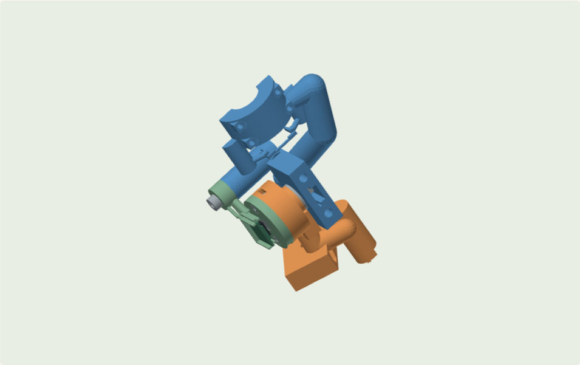

| 取件位置 | 名称 / 原始键 | 本步用途 / 状态 |
| --- | --- | --- |
| 盘 A04-05 · X058（骨架／左肩／上臂） | `frame/upperarm_l` | 已在 S06 取用，直接使用已装骨架。一体骨架；已包含 左肩／上臂/D_固定半壳、左肘屈伸/固定侧关节座 |
| 盘 A04-03 · H004（骨架／左肘） | `frame/elbow_l` | 本步新取。一体骨架；已包含 左肘屈伸/旋转侧叉耳、左前臂扭转/固定侧关节座 |
| 盘 A05-18 · X021（左肘屈伸/传感板托夹） | `elbow_l.flex/sensor_cassette` | 本步新取。固定传感 PCB；先滑入板，再装到关节 |
| 盘 A05-20 · N004（左肘屈伸/侧装磁铁座盖） | `elbow_l.flex/magnet_cartridge` | 本步新取。侧面装入并粘固磁铁；旋转侧用 2 枚 M2×5 固定 |

| 五金 / 磁铁 | 本步数量 | 位置 |
| --- | --- | --- |
| M4大平垫圈：外径12、厚1 mm，实物能自由套过Φ4光杆 | 2 | 旋转叉耳两侧，每个支点 2 片 |
| A8不锈钢碟簧：8×4.2×0.4，自由高0.6 mm | 2 | 每个轴肩支点 2 片，相对安装 |
| M4普通平垫圈：外径9、厚0.8 mm，实物通孔验证 | 1 | 螺钉头下、碟簧外侧，每个支点 1 片 |
| 轴肩螺钉 Φ4×8 / M3×0.5，螺纹长6 mm；头Φ7×3，内六角3 mm | 1 | 轴肩摩擦支点，铰链 1 处 / 十字核心 4 处 |
| M3普通六角螺母（不要锁紧螺母替代外形） | 2 | 轴肩捕获窝、板托夹固定点，以及有 P/D 端轴时的摩擦调节槽 |
| M3大平垫圈：外径9、厚0.8 mm，实物通孔验证 | 1 | 固定座内侧，每个支点 1 片反力垫 |
| M3×8 内六角圆柱头螺钉；按CAD头径/头高核对 | 1 | 每只传感板托夹 1 枚；每个 P/D 摩擦块调节 1 枚 |
| M2普通六角螺母（不要锁紧螺母替代外形） | 2 | 本步各 M2 螺钉对应捕获窝，一螺钉配一螺母 |
| M2×5 内六角圆柱头螺钉；按CAD头径/头高核对 | 2 | N003 / N004 侧装磁铁座盖，每个 2 枚 |
| 径向两极磁铁 Φ6×2.5 mm；直径方向充磁，不能买轴向充磁 | 1 | 本步每个实测轴 1 颗，位于对应磁铁座 / 端盖 |

1. 将 盘 A04-05 · X058（骨架／左肩／上臂） 的固定关节座与 盘 A04-03 · H004（骨架／左肘） 的旋转叉耳摆到图示连接位置。侧槽尚未被挡住时，预装 1 枚 M3 螺母与 1 片 M3 反力垫。
2. 按 [G5 一体铰链](#G5) 和 [G1 轴肩层次](#G1) 装 1 套轴肩结构。单个支点为 1 枚轴肩螺钉、2 片 M4 大垫、2 片 A8 碟簧、1 片 M4 普通垫，外加刚才放入的螺母和反力垫。
3. 调整摩擦后，按 [G4](#G4) 给 盘 A05-20 · N004（左肘屈伸/侧装磁铁座盖） 装 1 颗磁铁，固化后用 2 枚 M2×5 + 2 枚 M2 螺母固定到旋转侧。
4. 把下表所列传感板装入 盘 A05-18 · X021（左肘屈伸/传感板托夹），再用 1 枚 M3×8 + 1 枚 M3 螺母固定到固定侧。传感器与磁铁相对，不能把两者都固定到同一旋转骨段。
5. 局部慢慢活动，确认每一相邻活动面不挤压垫片、PCB 和线束。按需要的手感调保持力即可；当前可用行程由实物相邻件与线束决定，软件 raw_limits 不是要求你硬拧到的机械行程。

| 电路端口 / 中央板位号 | 测量轴 | 传感板装在 | 对应磁铁装在 | 每根线建议长度 |
| --- | --- | --- | --- | --- |
| 端口 B05 / J30 | `elbow_l.flex/r0` | 盘 A05-18 · X021（左肘屈伸/传感板托夹） | 盘 A05-20 · N004（左肘屈伸/侧装磁铁座盖） | 500 mm × 5 根，首件后定长 |

本步完成检查：B05 标签对应正确；磁铁不相对载体打滑；转轴可手动摆动并保持；线先松放到背盒方向，留待走线章节统一固定。

<a id="S08"></a>

### S08 · 左前臂扭转

连接 **盘 A04-03 · H004（骨架／左肘） → 盘 A05-03 · W004（骨架／左前臂）**。本步需打开打印盘：A04、A05。

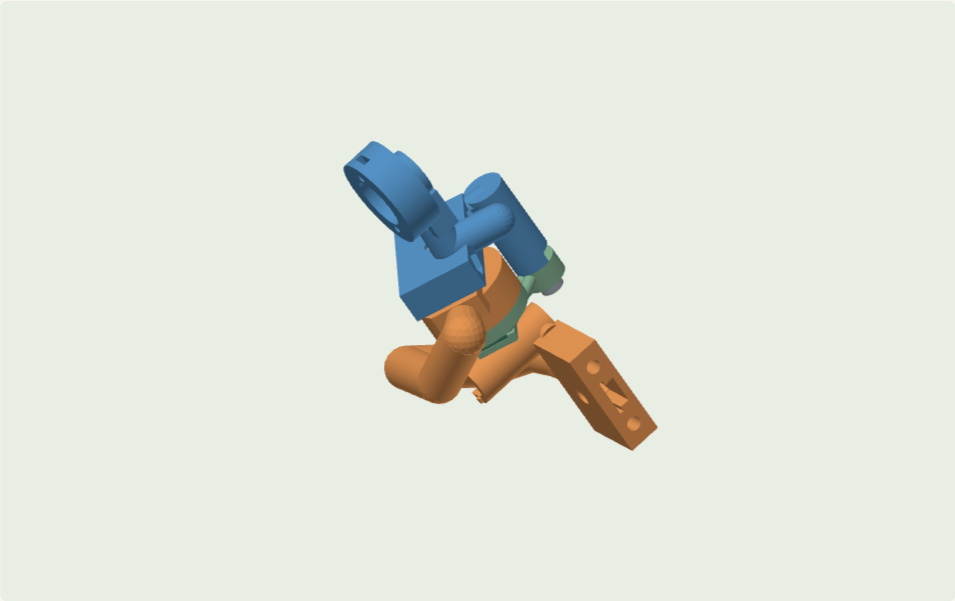

| 取件位置 | 名称 / 原始键 | 本步用途 / 状态 |
| --- | --- | --- |
| 盘 A04-03 · H004（骨架／左肘） | `frame/elbow_l` | 已在 S07 取用，直接使用已装骨架。一体骨架；已包含 左肘屈伸/旋转侧叉耳、左前臂扭转/固定侧关节座 |
| 盘 A05-03 · W004（骨架／左前臂） | `frame/forearm_l` | 本步新取。一体骨架；已包含 左前臂扭转/旋转侧叉耳、左手腕屈伸/固定侧关节座 |
| 盘 A05-12 · N004（左前臂扭转/侧装磁铁座盖） | `forearm_l.twist/magnet_cartridge` | 本步新取。侧面装入并粘固磁铁；旋转侧用 2 枚 M2×5 固定 |
| 盘 A05-13 · X022（左前臂扭转/传感板托夹） | `forearm_l.twist/sensor_cassette` | 本步新取。固定传感 PCB；先滑入板，再装到关节 |

| 五金 / 磁铁 | 本步数量 | 位置 |
| --- | --- | --- |
| M4大平垫圈：外径12、厚1 mm，实物能自由套过Φ4光杆 | 2 | 旋转叉耳两侧，每个支点 2 片 |
| A8不锈钢碟簧：8×4.2×0.4，自由高0.6 mm | 2 | 每个轴肩支点 2 片，相对安装 |
| M4普通平垫圈：外径9、厚0.8 mm，实物通孔验证 | 1 | 螺钉头下、碟簧外侧，每个支点 1 片 |
| 轴肩螺钉 Φ4×8 / M3×0.5，螺纹长6 mm；头Φ7×3，内六角3 mm | 1 | 轴肩摩擦支点，铰链 1 处 / 十字核心 4 处 |
| M3普通六角螺母（不要锁紧螺母替代外形） | 2 | 轴肩捕获窝、板托夹固定点，以及有 P/D 端轴时的摩擦调节槽 |
| M3大平垫圈：外径9、厚0.8 mm，实物通孔验证 | 1 | 固定座内侧，每个支点 1 片反力垫 |
| M3×8 内六角圆柱头螺钉；按CAD头径/头高核对 | 1 | 每只传感板托夹 1 枚；每个 P/D 摩擦块调节 1 枚 |
| M2普通六角螺母（不要锁紧螺母替代外形） | 2 | 本步各 M2 螺钉对应捕获窝，一螺钉配一螺母 |
| M2×5 内六角圆柱头螺钉；按CAD头径/头高核对 | 2 | N003 / N004 侧装磁铁座盖，每个 2 枚 |
| 径向两极磁铁 Φ6×2.5 mm；直径方向充磁，不能买轴向充磁 | 1 | 本步每个实测轴 1 颗，位于对应磁铁座 / 端盖 |

1. 将 盘 A04-03 · H004（骨架／左肘） 的固定关节座与 盘 A05-03 · W004（骨架／左前臂） 的旋转叉耳摆到图示连接位置。侧槽尚未被挡住时，预装 1 枚 M3 螺母与 1 片 M3 反力垫。
2. 按 [G5 一体铰链](#G5) 和 [G1 轴肩层次](#G1) 装 1 套轴肩结构。单个支点为 1 枚轴肩螺钉、2 片 M4 大垫、2 片 A8 碟簧、1 片 M4 普通垫，外加刚才放入的螺母和反力垫。
3. 调整摩擦后，按 [G4](#G4) 给 盘 A05-12 · N004（左前臂扭转/侧装磁铁座盖） 装 1 颗磁铁，固化后用 2 枚 M2×5 + 2 枚 M2 螺母固定到旋转侧。
4. 把下表所列传感板装入 盘 A05-13 · X022（左前臂扭转/传感板托夹），再用 1 枚 M3×8 + 1 枚 M3 螺母固定到固定侧。传感器与磁铁相对，不能把两者都固定到同一旋转骨段。
5. 局部慢慢活动，确认每一相邻活动面不挤压垫片、PCB 和线束。按需要的手感调保持力即可；当前可用行程由实物相邻件与线束决定，软件 raw_limits 不是要求你硬拧到的机械行程。

| 电路端口 / 中央板位号 | 测量轴 | 传感板装在 | 对应磁铁装在 | 每根线建议长度 |
| --- | --- | --- | --- | --- |
| 端口 B06 / J31 | `forearm_l.twist/r0` | 盘 A05-13 · X022（左前臂扭转/传感板托夹） | 盘 A05-12 · N004（左前臂扭转/侧装磁铁座盖） | 550 mm × 5 根，首件后定长 |

本步完成检查：B06 标签对应正确；磁铁不相对载体打滑；转轴可手动摆动并保持；线先松放到背盒方向，留待走线章节统一固定。

<a id="S09"></a>

### S09 · 左手腕屈伸

连接 **盘 A05-03 · W004（骨架／左前臂） → 盘 A05-01 · H006（骨架／左腕屈伸中间架）**。本步需打开打印盘：A05。

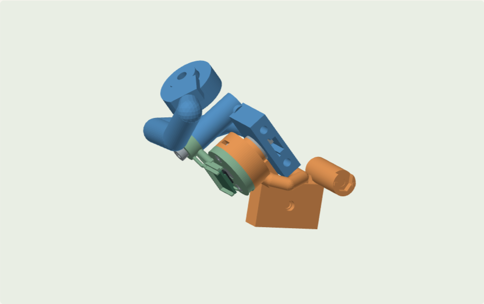

| 取件位置 | 名称 / 原始键 | 本步用途 / 状态 |
| --- | --- | --- |
| 盘 A05-03 · W004（骨架／左前臂） | `frame/forearm_l` | 已在 S08 取用，直接使用已装骨架。一体骨架；已包含 左前臂扭转/旋转侧叉耳、左手腕屈伸/固定侧关节座 |
| 盘 A05-01 · H006（骨架／左腕屈伸中间架） | `frame/hand_l.flex_frame` | 本步新取。一体骨架；已包含 左手腕屈伸/旋转侧叉耳、左手腕侧摆/固定侧关节座 |
| 盘 A05-17 · N004（左手腕屈伸/侧装磁铁座盖） | `hand_l.flex/magnet_cartridge` | 本步新取。侧面装入并粘固磁铁；旋转侧用 2 枚 M2×5 固定 |
| 盘 A05-21 · X023（左手腕屈伸/传感板托夹） | `hand_l.flex/sensor_cassette` | 本步新取。固定传感 PCB；先滑入板，再装到关节 |

| 五金 / 磁铁 | 本步数量 | 位置 |
| --- | --- | --- |
| M4大平垫圈：外径12、厚1 mm，实物能自由套过Φ4光杆 | 2 | 旋转叉耳两侧，每个支点 2 片 |
| A8不锈钢碟簧：8×4.2×0.4，自由高0.6 mm | 2 | 每个轴肩支点 2 片，相对安装 |
| M4普通平垫圈：外径9、厚0.8 mm，实物通孔验证 | 1 | 螺钉头下、碟簧外侧，每个支点 1 片 |
| 轴肩螺钉 Φ4×8 / M3×0.5，螺纹长6 mm；头Φ7×3，内六角3 mm | 1 | 轴肩摩擦支点，铰链 1 处 / 十字核心 4 处 |
| M3普通六角螺母（不要锁紧螺母替代外形） | 2 | 轴肩捕获窝、板托夹固定点，以及有 P/D 端轴时的摩擦调节槽 |
| M3大平垫圈：外径9、厚0.8 mm，实物通孔验证 | 1 | 固定座内侧，每个支点 1 片反力垫 |
| M3×8 内六角圆柱头螺钉；按CAD头径/头高核对 | 1 | 每只传感板托夹 1 枚；每个 P/D 摩擦块调节 1 枚 |
| M2普通六角螺母（不要锁紧螺母替代外形） | 2 | 本步各 M2 螺钉对应捕获窝，一螺钉配一螺母 |
| M2×5 内六角圆柱头螺钉；按CAD头径/头高核对 | 2 | N003 / N004 侧装磁铁座盖，每个 2 枚 |
| 径向两极磁铁 Φ6×2.5 mm；直径方向充磁，不能买轴向充磁 | 1 | 本步每个实测轴 1 颗，位于对应磁铁座 / 端盖 |

1. 将 盘 A05-03 · W004（骨架／左前臂） 的固定关节座与 盘 A05-01 · H006（骨架／左腕屈伸中间架） 的旋转叉耳摆到图示连接位置。侧槽尚未被挡住时，预装 1 枚 M3 螺母与 1 片 M3 反力垫。
2. 按 [G5 一体铰链](#G5) 和 [G1 轴肩层次](#G1) 装 1 套轴肩结构。单个支点为 1 枚轴肩螺钉、2 片 M4 大垫、2 片 A8 碟簧、1 片 M4 普通垫，外加刚才放入的螺母和反力垫。
3. 调整摩擦后，按 [G4](#G4) 给 盘 A05-17 · N004（左手腕屈伸/侧装磁铁座盖） 装 1 颗磁铁，固化后用 2 枚 M2×5 + 2 枚 M2 螺母固定到旋转侧。
4. 把下表所列传感板装入 盘 A05-21 · X023（左手腕屈伸/传感板托夹），再用 1 枚 M3×8 + 1 枚 M3 螺母固定到固定侧。传感器与磁铁相对，不能把两者都固定到同一旋转骨段。
5. 局部慢慢活动，确认每一相邻活动面不挤压垫片、PCB 和线束。按需要的手感调保持力即可；当前可用行程由实物相邻件与线束决定，软件 raw_limits 不是要求你硬拧到的机械行程。

| 电路端口 / 中央板位号 | 测量轴 | 传感板装在 | 对应磁铁装在 | 每根线建议长度 |
| --- | --- | --- | --- | --- |
| 端口 B07 / J32 | `hand_l.flex/r0` | 盘 A05-21 · X023（左手腕屈伸/传感板托夹） | 盘 A05-17 · N004（左手腕屈伸/侧装磁铁座盖） | 625 mm × 5 根，首件后定长 |

本步完成检查：B07 标签对应正确；磁铁不相对载体打滑；转轴可手动摆动并保持；线先松放到背盒方向，留待走线章节统一固定。

<a id="S10"></a>

### S10 · 左手腕侧摆

连接 **盘 A05-01 · H006（骨架／左腕屈伸中间架） → 盘 A05-04 · P191（骨架／左手腕）**。本步需打开打印盘：A05。

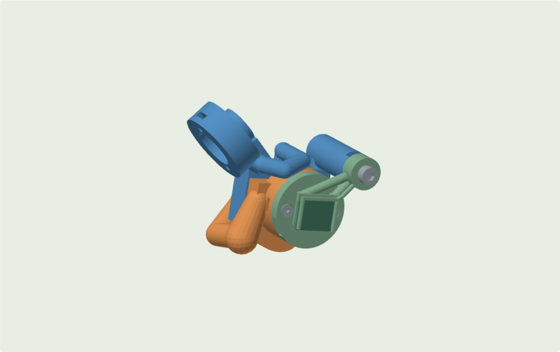

| 取件位置 | 名称 / 原始键 | 本步用途 / 状态 |
| --- | --- | --- |
| 盘 A05-01 · H006（骨架／左腕屈伸中间架） | `frame/hand_l.flex_frame` | 已在 S09 取用，直接使用已装骨架。一体骨架；已包含 左手腕屈伸/旋转侧叉耳、左手腕侧摆/固定侧关节座 |
| 盘 A05-04 · P191（骨架／左手腕） | `frame/hand_l` | 本步新取。一体骨架；已包含 左手腕侧摆/旋转侧叉耳 |
| 盘 A05-11 · N004（左手腕侧摆/侧装磁铁座盖） | `hand_l.deviate/magnet_cartridge` | 本步新取。侧面装入并粘固磁铁；旋转侧用 2 枚 M2×5 固定 |
| 盘 A05-15 · X024（左手腕侧摆/传感板托夹） | `hand_l.deviate/sensor_cassette` | 本步新取。固定传感 PCB；先滑入板，再装到关节 |

| 五金 / 磁铁 | 本步数量 | 位置 |
| --- | --- | --- |
| M4大平垫圈：外径12、厚1 mm，实物能自由套过Φ4光杆 | 2 | 旋转叉耳两侧，每个支点 2 片 |
| A8不锈钢碟簧：8×4.2×0.4，自由高0.6 mm | 2 | 每个轴肩支点 2 片，相对安装 |
| M4普通平垫圈：外径9、厚0.8 mm，实物通孔验证 | 1 | 螺钉头下、碟簧外侧，每个支点 1 片 |
| 轴肩螺钉 Φ4×8 / M3×0.5，螺纹长6 mm；头Φ7×3，内六角3 mm | 1 | 轴肩摩擦支点，铰链 1 处 / 十字核心 4 处 |
| M3普通六角螺母（不要锁紧螺母替代外形） | 2 | 轴肩捕获窝、板托夹固定点，以及有 P/D 端轴时的摩擦调节槽 |
| M3大平垫圈：外径9、厚0.8 mm，实物通孔验证 | 1 | 固定座内侧，每个支点 1 片反力垫 |
| M3×8 内六角圆柱头螺钉；按CAD头径/头高核对 | 1 | 每只传感板托夹 1 枚；每个 P/D 摩擦块调节 1 枚 |
| M2普通六角螺母（不要锁紧螺母替代外形） | 2 | 本步各 M2 螺钉对应捕获窝，一螺钉配一螺母 |
| M2×5 内六角圆柱头螺钉；按CAD头径/头高核对 | 2 | N003 / N004 侧装磁铁座盖，每个 2 枚 |
| 径向两极磁铁 Φ6×2.5 mm；直径方向充磁，不能买轴向充磁 | 1 | 本步每个实测轴 1 颗，位于对应磁铁座 / 端盖 |

1. 将 盘 A05-01 · H006（骨架／左腕屈伸中间架） 的固定关节座与 盘 A05-04 · P191（骨架／左手腕） 的旋转叉耳摆到图示连接位置。侧槽尚未被挡住时，预装 1 枚 M3 螺母与 1 片 M3 反力垫。
2. 按 [G5 一体铰链](#G5) 和 [G1 轴肩层次](#G1) 装 1 套轴肩结构。单个支点为 1 枚轴肩螺钉、2 片 M4 大垫、2 片 A8 碟簧、1 片 M4 普通垫，外加刚才放入的螺母和反力垫。
3. 调整摩擦后，按 [G4](#G4) 给 盘 A05-11 · N004（左手腕侧摆/侧装磁铁座盖） 装 1 颗磁铁，固化后用 2 枚 M2×5 + 2 枚 M2 螺母固定到旋转侧。
4. 把下表所列传感板装入 盘 A05-15 · X024（左手腕侧摆/传感板托夹），再用 1 枚 M3×8 + 1 枚 M3 螺母固定到固定侧。传感器与磁铁相对，不能把两者都固定到同一旋转骨段。
5. 局部慢慢活动，确认每一相邻活动面不挤压垫片、PCB 和线束。按需要的手感调保持力即可；当前可用行程由实物相邻件与线束决定，软件 raw_limits 不是要求你硬拧到的机械行程。

| 电路端口 / 中央板位号 | 测量轴 | 传感板装在 | 对应磁铁装在 | 每根线建议长度 |
| --- | --- | --- | --- | --- |
| 端口 B08 / J33 | `hand_l.deviate/r0` | 盘 A05-15 · X024（左手腕侧摆/传感板托夹） | 盘 A05-11 · N004（左手腕侧摆/侧装磁铁座盖） | 675 mm × 5 根，首件后定长 |

本步完成检查：B08 标签对应正确；磁铁不相对载体打滑；转轴可手动摆动并保持；线先松放到背盒方向，留待走线章节统一固定。

<a id="S11"></a>

### S11 · 右锁骨前后

连接 **盘 A02-01 · X046（骨架／胸部） → 盘 A06-01 · H008（骨架／右锁骨前后中间架）**。本步需打开打印盘：A02、A06、A07。

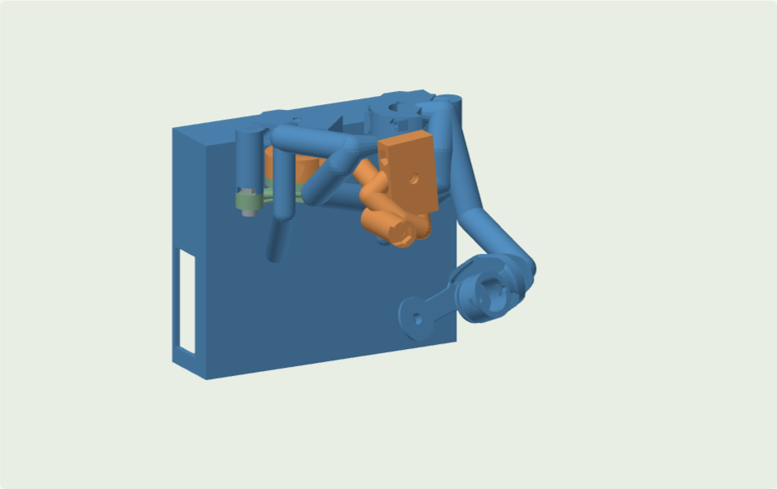

| 取件位置 | 名称 / 原始键 | 本步用途 / 状态 |
| --- | --- | --- |
| 盘 A02-01 · X046（骨架／胸部） | `frame/chest` | 已在 S02 取用，直接使用已装骨架。一体骨架；已包含 胸部/上叉、头颈/P_固定半壳、左锁骨前后/固定侧关节座、右锁骨前后/固定侧关节座 |
| 盘 A06-01 · H008（骨架／右锁骨前后中间架） | `frame/clavicle_r.protract_frame` | 本步新取。一体骨架；已包含 右锁骨前后/旋转侧叉耳、右锁骨升降/固定侧关节座 |
| 盘 A07-02 · X027（右锁骨前后/传感板托夹） | `clavicle_r.protract/sensor_cassette` | 本步新取。固定传感 PCB；先滑入板，再装到关节 |
| 盘 A07-08 · N004（右锁骨前后/侧装磁铁座盖） | `clavicle_r.protract/magnet_cartridge` | 本步新取。侧面装入并粘固磁铁；旋转侧用 2 枚 M2×5 固定 |

| 五金 / 磁铁 | 本步数量 | 位置 |
| --- | --- | --- |
| M4大平垫圈：外径12、厚1 mm，实物能自由套过Φ4光杆 | 2 | 旋转叉耳两侧，每个支点 2 片 |
| A8不锈钢碟簧：8×4.2×0.4，自由高0.6 mm | 2 | 每个轴肩支点 2 片，相对安装 |
| M4普通平垫圈：外径9、厚0.8 mm，实物通孔验证 | 1 | 螺钉头下、碟簧外侧，每个支点 1 片 |
| 轴肩螺钉 Φ4×8 / M3×0.5，螺纹长6 mm；头Φ7×3，内六角3 mm | 1 | 轴肩摩擦支点，铰链 1 处 / 十字核心 4 处 |
| M3普通六角螺母（不要锁紧螺母替代外形） | 2 | 轴肩捕获窝、板托夹固定点，以及有 P/D 端轴时的摩擦调节槽 |
| M3大平垫圈：外径9、厚0.8 mm，实物通孔验证 | 1 | 固定座内侧，每个支点 1 片反力垫 |
| M3×8 内六角圆柱头螺钉；按CAD头径/头高核对 | 1 | 每只传感板托夹 1 枚；每个 P/D 摩擦块调节 1 枚 |
| M2普通六角螺母（不要锁紧螺母替代外形） | 2 | 本步各 M2 螺钉对应捕获窝，一螺钉配一螺母 |
| M2×5 内六角圆柱头螺钉；按CAD头径/头高核对 | 2 | N003 / N004 侧装磁铁座盖，每个 2 枚 |
| 径向两极磁铁 Φ6×2.5 mm；直径方向充磁，不能买轴向充磁 | 1 | 本步每个实测轴 1 颗，位于对应磁铁座 / 端盖 |

1. 将 盘 A02-01 · X046（骨架／胸部） 的固定关节座与 盘 A06-01 · H008（骨架／右锁骨前后中间架） 的旋转叉耳摆到图示连接位置。侧槽尚未被挡住时，预装 1 枚 M3 螺母与 1 片 M3 反力垫。
2. 按 [G5 一体铰链](#G5) 和 [G1 轴肩层次](#G1) 装 1 套轴肩结构。单个支点为 1 枚轴肩螺钉、2 片 M4 大垫、2 片 A8 碟簧、1 片 M4 普通垫，外加刚才放入的螺母和反力垫。
3. 调整摩擦后，按 [G4](#G4) 给 盘 A07-08 · N004（右锁骨前后/侧装磁铁座盖） 装 1 颗磁铁，固化后用 2 枚 M2×5 + 2 枚 M2 螺母固定到旋转侧。
4. 把下表所列传感板装入 盘 A07-02 · X027（右锁骨前后/传感板托夹），再用 1 枚 M3×8 + 1 枚 M3 螺母固定到固定侧。传感器与磁铁相对，不能把两者都固定到同一旋转骨段。
5. 局部慢慢活动，确认每一相邻活动面不挤压垫片、PCB 和线束。按需要的手感调保持力即可；当前可用行程由实物相邻件与线束决定，软件 raw_limits 不是要求你硬拧到的机械行程。

| 电路端口 / 中央板位号 | 测量轴 | 传感板装在 | 对应磁铁装在 | 每根线建议长度 |
| --- | --- | --- | --- | --- |
| 端口 A13 / J22 | `clavicle_r.protract/r0` | 盘 A07-02 · X027（右锁骨前后/传感板托夹） | 盘 A07-08 · N004（右锁骨前后/侧装磁铁座盖） | 200 mm × 5 根，首件后定长 |

本步完成检查：A13 标签对应正确；磁铁不相对载体打滑；转轴可手动摆动并保持；线先松放到背盒方向，留待走线章节统一固定。

<a id="S12"></a>

### S12 · 右锁骨升降

连接 **盘 A06-01 · H008（骨架／右锁骨前后中间架） → 盘 A06-04 · X062（骨架／右锁骨）**。本步需打开打印盘：A06、A07。

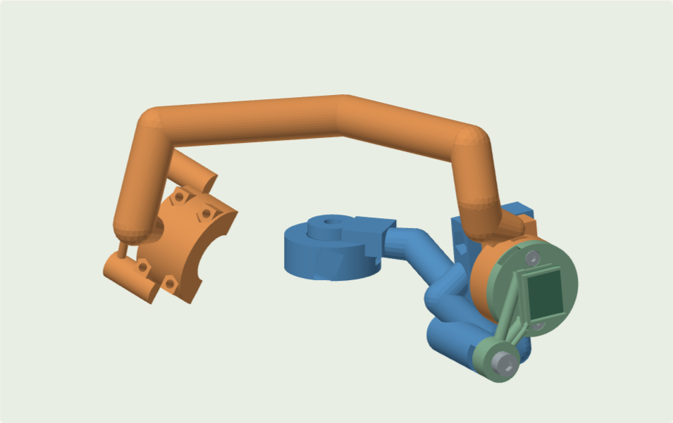

| 取件位置 | 名称 / 原始键 | 本步用途 / 状态 |
| --- | --- | --- |
| 盘 A06-01 · H008（骨架／右锁骨前后中间架） | `frame/clavicle_r.protract_frame` | 已在 S11 取用，直接使用已装骨架。一体骨架；已包含 右锁骨前后/旋转侧叉耳、右锁骨升降/固定侧关节座 |
| 盘 A06-04 · X062（骨架／右锁骨） | `frame/clavicle_r` | 本步新取。一体骨架；已包含 右肩／上臂/P_固定半壳、右锁骨升降/旋转侧叉耳 |
| 盘 A06-12 · X028（右锁骨升降/传感板托夹） | `clavicle_r.elevate/sensor_cassette` | 本步新取。固定传感 PCB；先滑入板，再装到关节 |
| 盘 A07-11 · N004（右锁骨升降/侧装磁铁座盖） | `clavicle_r.elevate/magnet_cartridge` | 本步新取。侧面装入并粘固磁铁；旋转侧用 2 枚 M2×5 固定 |

| 五金 / 磁铁 | 本步数量 | 位置 |
| --- | --- | --- |
| M4大平垫圈：外径12、厚1 mm，实物能自由套过Φ4光杆 | 2 | 旋转叉耳两侧，每个支点 2 片 |
| A8不锈钢碟簧：8×4.2×0.4，自由高0.6 mm | 2 | 每个轴肩支点 2 片，相对安装 |
| M4普通平垫圈：外径9、厚0.8 mm，实物通孔验证 | 1 | 螺钉头下、碟簧外侧，每个支点 1 片 |
| 轴肩螺钉 Φ4×8 / M3×0.5，螺纹长6 mm；头Φ7×3，内六角3 mm | 1 | 轴肩摩擦支点，铰链 1 处 / 十字核心 4 处 |
| M3普通六角螺母（不要锁紧螺母替代外形） | 2 | 轴肩捕获窝、板托夹固定点，以及有 P/D 端轴时的摩擦调节槽 |
| M3大平垫圈：外径9、厚0.8 mm，实物通孔验证 | 1 | 固定座内侧，每个支点 1 片反力垫 |
| M3×8 内六角圆柱头螺钉；按CAD头径/头高核对 | 1 | 每只传感板托夹 1 枚；每个 P/D 摩擦块调节 1 枚 |
| M2普通六角螺母（不要锁紧螺母替代外形） | 2 | 本步各 M2 螺钉对应捕获窝，一螺钉配一螺母 |
| M2×5 内六角圆柱头螺钉；按CAD头径/头高核对 | 2 | N003 / N004 侧装磁铁座盖，每个 2 枚 |
| 径向两极磁铁 Φ6×2.5 mm；直径方向充磁，不能买轴向充磁 | 1 | 本步每个实测轴 1 颗，位于对应磁铁座 / 端盖 |

1. 将 盘 A06-01 · H008（骨架／右锁骨前后中间架） 的固定关节座与 盘 A06-04 · X062（骨架／右锁骨） 的旋转叉耳摆到图示连接位置。侧槽尚未被挡住时，预装 1 枚 M3 螺母与 1 片 M3 反力垫。
2. 按 [G5 一体铰链](#G5) 和 [G1 轴肩层次](#G1) 装 1 套轴肩结构。单个支点为 1 枚轴肩螺钉、2 片 M4 大垫、2 片 A8 碟簧、1 片 M4 普通垫，外加刚才放入的螺母和反力垫。
3. 调整摩擦后，按 [G4](#G4) 给 盘 A07-11 · N004（右锁骨升降/侧装磁铁座盖） 装 1 颗磁铁，固化后用 2 枚 M2×5 + 2 枚 M2 螺母固定到旋转侧。
4. 把下表所列传感板装入 盘 A06-12 · X028（右锁骨升降/传感板托夹），再用 1 枚 M3×8 + 1 枚 M3 螺母固定到固定侧。传感器与磁铁相对，不能把两者都固定到同一旋转骨段。
5. 局部慢慢活动，确认每一相邻活动面不挤压垫片、PCB 和线束。按需要的手感调保持力即可；当前可用行程由实物相邻件与线束决定，软件 raw_limits 不是要求你硬拧到的机械行程。

| 电路端口 / 中央板位号 | 测量轴 | 传感板装在 | 对应磁铁装在 | 每根线建议长度 |
| --- | --- | --- | --- | --- |
| 端口 A14 / J23 | `clavicle_r.elevate/r0` | 盘 A06-12 · X028（右锁骨升降/传感板托夹） | 盘 A07-11 · N004（右锁骨升降/侧装磁铁座盖） | 275 mm × 5 根，首件后定长 |

本步完成检查：A14 标签对应正确；磁铁不相对载体打滑；转轴可手动摆动并保持；线先松放到背盒方向，留待走线章节统一固定。

<a id="S13"></a>

### S13 · 右肩／上臂

连接 **盘 A06-04 · X062（骨架／右锁骨） → 盘 A06-05 · X066（骨架／右肩／上臂）**。本步需打开打印盘：A06、A07。

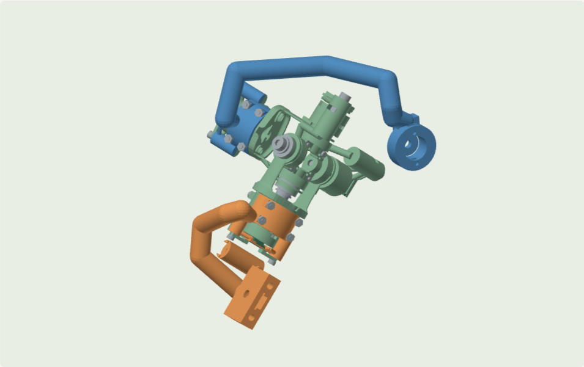

| 取件位置 | 名称 / 原始键 | 本步用途 / 状态 |
| --- | --- | --- |
| 盘 A06-04 · X062（骨架／右锁骨） | `frame/clavicle_r` | 已在 S12 取用，直接使用已装骨架。一体骨架；已包含 右肩／上臂/P_固定半壳、右锁骨升降/旋转侧叉耳 |
| 盘 A06-05 · X066（骨架／右肩／上臂） | `frame/upperarm_r` | 本步新取。一体骨架；已包含 右肩／上臂/D_固定半壳、右肘屈伸/固定侧关节座 |
| 盘 A06-06 · P071（右肩／上臂/下叉） | `upperarm_r/C01` | 本步新取。十字关节叉臂；与另一叉臂正交穿装 |
| 盘 A06-07 · X061（右肩／上臂/P_活动半壳） | `upperarm_r/P_case_plus` | 本步新取。端轴可拆半壳；4 枚 M2×20 合壳 |
| 盘 A06-08 · X065（右肩／上臂/D_活动半壳） | `upperarm_r/D_case_plus` | 本步新取。端轴可拆半壳；4 枚 M2×20 合壳 |
| 盘 A06-09 · P073（右肩／上臂/下环） | `upperarm_r/C14` | 本步新取。十字关节下环；先装内部螺母和 M3 反力垫 |
| 盘 A06-13 · X009（右肩／上臂/下叉_传感板托夹） | `upperarm_r/C01_sensor_cassette` | 本步新取。固定传感 PCB；先滑入板，再装到关节 |
| 盘 A07-05 · X010（右肩／上臂/上叉_传感板托夹） | `upperarm_r/C02_sensor_cassette` | 本步新取。固定传感 PCB；先滑入板，再装到关节 |
| 盘 A07-07 · P074（右肩／上臂/上环盖） | `upperarm_r/C15` | 本步新取。十字关节上环盖；4 枚 M1.6×6 合环 |
| 盘 A07-09 · P072（右肩／上臂/上叉） | `upperarm_r/C02` | 本步新取。十字关节叉臂；与另一叉臂正交穿装 |
| 盘 A07-13 · P084（右肩／上臂/P_磁铁端盖） | `upperarm_r/P_magnet_cap` | 本步新取。端轴磁铁端盖；2 枚 M2×4 固定 |
| 盘 A07-15 · P089（右肩／上臂/D_磁铁端盖） | `upperarm_r/D_magnet_cap` | 本步新取。端轴磁铁端盖；2 枚 M2×4 固定 |
| 盘 A07-16 · N003（右肩／上臂/下叉_侧装磁铁座盖） | `upperarm_r/C01_magnet_cartridge` | 本步新取。侧面装入并粘固磁铁；旋转侧用 2 枚 M2×5 固定 |
| 盘 A07-17 · N003（右肩／上臂/上叉_侧装磁铁座盖） | `upperarm_r/C02_magnet_cartridge` | 本步新取。侧面装入并粘固磁铁；旋转侧用 2 枚 M2×5 固定 |
| 盘 A07-18 · X063（右肩／上臂/D_板夹_-14） | `upperarm_r/D_pcb_clip_-14` | 本步新取。端轴传感 PCB 的一侧板夹，与另一板夹成对使用 |
| 盘 A07-19 · X059（右肩／上臂/P_板夹_-14） | `upperarm_r/P_pcb_clip_-14` | 本步新取。端轴传感 PCB 的一侧板夹，与另一板夹成对使用 |
| 盘 A07-20 · X064（右肩／上臂/D_板夹_+14） | `upperarm_r/D_pcb_clip_+14` | 本步新取。端轴传感 PCB 的一侧板夹，与另一板夹成对使用 |
| 盘 A07-21 · X060（右肩／上臂/P_板夹_+14） | `upperarm_r/P_pcb_clip_+14` | 本步新取。端轴传感 PCB 的一侧板夹，与另一板夹成对使用 |
| 盘 A07-22 · P083（右肩／上臂/P_径向摩擦块） | `upperarm_r/P_radial_pad` | 本步新取。端轴径向摩擦块；凹面朝轴，M3×8 顶压外侧 |
| 盘 A07-23 · P088（右肩／上臂/D_径向摩擦块） | `upperarm_r/D_radial_pad` | 本步新取。端轴径向摩擦块；凹面朝轴，M3×8 顶压外侧 |

| 五金 / 磁铁 | 本步数量 | 位置 |
| --- | --- | --- |
| M4大平垫圈：外径12、厚1 mm，实物能自由套过Φ4光杆 | 8 | 旋转叉耳两侧，每个支点 2 片 |
| A8不锈钢碟簧：8×4.2×0.4，自由高0.6 mm | 8 | 每个轴肩支点 2 片，相对安装 |
| M4普通平垫圈：外径9、厚0.8 mm，实物通孔验证 | 4 | 螺钉头下、碟簧外侧，每个支点 1 片 |
| 轴肩螺钉 Φ4×8 / M3×0.5，螺纹长6 mm；头Φ7×3，内六角3 mm | 4 | 轴肩摩擦支点，铰链 1 处 / 十字核心 4 处 |
| M3普通六角螺母（不要锁紧螺母替代外形） | 8 | 轴肩捕获窝、板托夹固定点，以及有 P/D 端轴时的摩擦调节槽 |
| M3大平垫圈：外径9、厚0.8 mm，实物通孔验证 | 4 | 固定座内侧，每个支点 1 片反力垫 |
| M1.6×6 内六角圆柱头螺钉；按CAD头径/头高核对 | 4 | C14 / C15 合环 |
| M1.6普通六角螺母（不要锁紧螺母替代外形） | 4 | C14 / C15 合环螺钉对应捕获窝 |
| M2普通六角螺母（不要锁紧螺母替代外形） | 20 | 本步各 M2 螺钉对应捕获窝，一螺钉配一螺母 |
| M2×5 内六角圆柱头螺钉；按CAD头径/头高核对 | 4 | N003 / N004 侧装磁铁座盖，每个 2 枚 |
| 径向两极磁铁 Φ6×2.5 mm；直径方向充磁，不能买轴向充磁 | 4 | 本步每个实测轴 1 颗，位于对应磁铁座 / 端盖 |
| M3×8 内六角圆柱头螺钉；按CAD头径/头高核对 | 4 | 每只传感板托夹 1 枚；每个 P/D 摩擦块调节 1 枚 |
| M2×20 内六角圆柱头螺钉；按CAD头径/头高核对 | 8 | P / D 端轴固定半壳与活动半壳合壳 |
| M2×4 内六角圆柱头螺钉；按CAD头径/头高核对 | 4 | P / D 端轴的磁铁端盖 |
| M2×8 内六角圆柱头螺钉；按CAD头径/头高核对 | 4 | P / D 端轴的成对 PCB 板夹 |

1. 取 盘 A06-09 · P073（右肩／上臂/下环）、盘 A07-07 · P074（右肩／上臂/上环盖）。两叉分别是 盘 A06-06 · P071（右肩／上臂/下叉） 的 C01 部位、盘 A07-09 · P072（右肩／上臂/上叉） 的 C02 部位；已经连在骨架上的叉不要拆分或另找重复打印件。
2. 按 [G2](#G2) 先预装 4 枚 M3 螺母与 4 片 M3 反力垫，把两叉交叉放入环，再按 G1 装四套轴肩结构；随后用 4 枚 M1.6×6 + 4 枚 M1.6 螺母合环。
3. P 端按 [G3](#G3)：盘 A06-04 · X062（骨架／右锁骨） 内是一体固定半壳，容纳 盘 A06-06 · P071（右肩／上臂/下叉） 的圆轴与限位环；装 盘 A07-22 · P083（右肩／上臂/P_径向摩擦块），M3×8 + M3 螺母调摩擦。用 盘 A06-07 · X061（右肩／上臂/P_活动半壳） 和 4 枚 M2×20 + 4 枚 M2 螺母合壳。磁铁端盖用 2 枚 M2×4 + 2 枚 M2 螺母；两只 PCB 板夹用 2 枚 M2×8 + 2 枚 M2 螺母。
4. D 端按 [G3](#G3)：盘 A06-05 · X066（骨架／右肩／上臂） 内是一体固定半壳，容纳 盘 A07-09 · P072（右肩／上臂/上叉） 的圆轴与限位环；装 盘 A07-23 · P088（右肩／上臂/D_径向摩擦块），M3×8 + M3 螺母调摩擦。用 盘 A06-08 · X065（右肩／上臂/D_活动半壳） 和 4 枚 M2×20 + 4 枚 M2 螺母合壳。磁铁端盖用 2 枚 M2×4 + 2 枚 M2 螺母；两只 PCB 板夹用 2 枚 M2×8 + 2 枚 M2 螺母。
5. C01 测量端按 [G4](#G4)：盘 A07-16 · N003（右肩／上臂/下叉_侧装磁铁座盖） 内放 1 颗磁铁，用 2 枚 M2×5 + 2 枚 M2 螺母固定到叉臂端；盘 A06-13 · X009（右肩／上臂/下叉_传感板托夹） 先滑入传感板，再用 M3×8 + M3 螺母固定。
6. C02 测量端按 [G4](#G4)：盘 A07-17 · N003（右肩／上臂/上叉_侧装磁铁座盖） 内放 1 颗磁铁，用 2 枚 M2×5 + 2 枚 M2 螺母固定到叉臂端；盘 A07-05 · X010（右肩／上臂/上叉_传感板托夹） 先滑入传感板，再用 M3×8 + M3 螺母固定。
7. 局部慢慢活动，确认每一相邻活动面不挤压垫片、PCB 和线束。按需要的手感调保持力即可；当前可用行程由实物相邻件与线束决定，软件 raw_limits 不是要求你硬拧到的机械行程。

| 电路端口 / 中央板位号 | 测量轴 | 传感板装在 | 对应磁铁装在 | 每根线建议长度 |
| --- | --- | --- | --- | --- |
| 端口 B09 / J34 | `upperarm_r/r0` | 盘 A07-19 · X059（右肩／上臂/P_板夹_-14） + 盘 A07-21 · X060（右肩／上臂/P_板夹_+14） | 盘 A07-13 · P084（右肩／上臂/P_磁铁端盖） | 350 mm × 5 根，首件后定长 |
| 端口 B10 / J35 | `upperarm_r/r1` | 盘 A06-13 · X009（右肩／上臂/下叉_传感板托夹） | 盘 A07-16 · N003（右肩／上臂/下叉_侧装磁铁座盖） | 550 mm × 5 根，首件后定长 |
| 端口 B11 / J36 | `upperarm_r/r2` | 盘 A07-05 · X010（右肩／上臂/上叉_传感板托夹） | 盘 A07-17 · N003（右肩／上臂/上叉_侧装磁铁座盖） | 525 mm × 5 根，首件后定长 |
| 端口 B12 / J37 | `upperarm_r/r3` | 盘 A07-18 · X063（右肩／上臂/D_板夹_-14） + 盘 A07-20 · X064（右肩／上臂/D_板夹_+14） | 盘 A07-15 · P089（右肩／上臂/D_磁铁端盖） | 500 mm × 5 根，首件后定长 |

本步完成检查：B09、B10、B11、B12 标签对应正确；磁铁不相对载体打滑；转轴可手动摆动并保持；线先松放到背盒方向，留待走线章节统一固定。

<a id="S14"></a>

### S14 · 右肘屈伸

连接 **盘 A06-05 · X066（骨架／右肩／上臂） → 盘 A06-03 · H010（骨架／右肘）**。本步需打开打印盘：A06、A07。

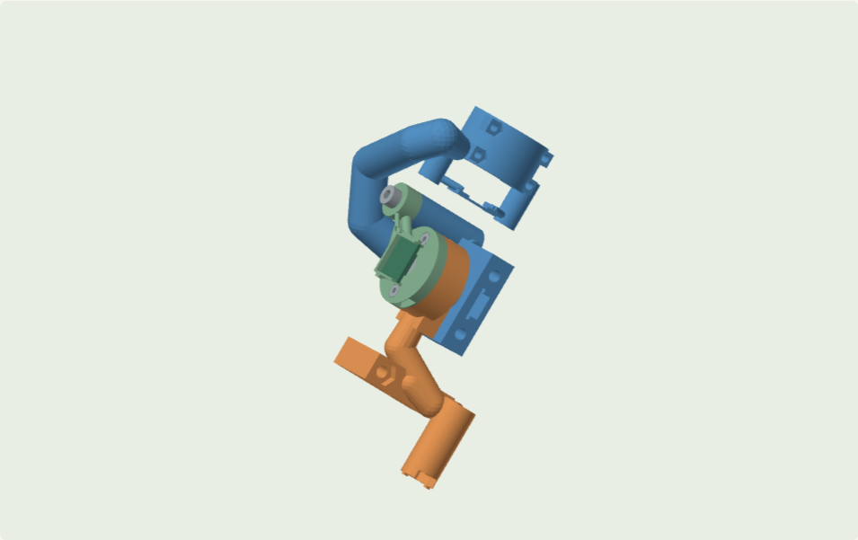

| 取件位置 | 名称 / 原始键 | 本步用途 / 状态 |
| --- | --- | --- |
| 盘 A06-05 · X066（骨架／右肩／上臂） | `frame/upperarm_r` | 已在 S13 取用，直接使用已装骨架。一体骨架；已包含 右肩／上臂/D_固定半壳、右肘屈伸/固定侧关节座 |
| 盘 A06-03 · H010（骨架／右肘） | `frame/elbow_r` | 本步新取。一体骨架；已包含 右肘屈伸/旋转侧叉耳、右前臂扭转/固定侧关节座 |
| 盘 A07-03 · X029（右肘屈伸/传感板托夹） | `elbow_r.flex/sensor_cassette` | 本步新取。固定传感 PCB；先滑入板，再装到关节 |
| 盘 A07-06 · N004（右肘屈伸/侧装磁铁座盖） | `elbow_r.flex/magnet_cartridge` | 本步新取。侧面装入并粘固磁铁；旋转侧用 2 枚 M2×5 固定 |

| 五金 / 磁铁 | 本步数量 | 位置 |
| --- | --- | --- |
| M4大平垫圈：外径12、厚1 mm，实物能自由套过Φ4光杆 | 2 | 旋转叉耳两侧，每个支点 2 片 |
| A8不锈钢碟簧：8×4.2×0.4，自由高0.6 mm | 2 | 每个轴肩支点 2 片，相对安装 |
| M4普通平垫圈：外径9、厚0.8 mm，实物通孔验证 | 1 | 螺钉头下、碟簧外侧，每个支点 1 片 |
| 轴肩螺钉 Φ4×8 / M3×0.5，螺纹长6 mm；头Φ7×3，内六角3 mm | 1 | 轴肩摩擦支点，铰链 1 处 / 十字核心 4 处 |
| M3普通六角螺母（不要锁紧螺母替代外形） | 2 | 轴肩捕获窝、板托夹固定点，以及有 P/D 端轴时的摩擦调节槽 |
| M3大平垫圈：外径9、厚0.8 mm，实物通孔验证 | 1 | 固定座内侧，每个支点 1 片反力垫 |
| M3×8 内六角圆柱头螺钉；按CAD头径/头高核对 | 1 | 每只传感板托夹 1 枚；每个 P/D 摩擦块调节 1 枚 |
| M2普通六角螺母（不要锁紧螺母替代外形） | 2 | 本步各 M2 螺钉对应捕获窝，一螺钉配一螺母 |
| M2×5 内六角圆柱头螺钉；按CAD头径/头高核对 | 2 | N003 / N004 侧装磁铁座盖，每个 2 枚 |
| 径向两极磁铁 Φ6×2.5 mm；直径方向充磁，不能买轴向充磁 | 1 | 本步每个实测轴 1 颗，位于对应磁铁座 / 端盖 |

1. 将 盘 A06-05 · X066（骨架／右肩／上臂） 的固定关节座与 盘 A06-03 · H010（骨架／右肘） 的旋转叉耳摆到图示连接位置。侧槽尚未被挡住时，预装 1 枚 M3 螺母与 1 片 M3 反力垫。
2. 按 [G5 一体铰链](#G5) 和 [G1 轴肩层次](#G1) 装 1 套轴肩结构。单个支点为 1 枚轴肩螺钉、2 片 M4 大垫、2 片 A8 碟簧、1 片 M4 普通垫，外加刚才放入的螺母和反力垫。
3. 调整摩擦后，按 [G4](#G4) 给 盘 A07-06 · N004（右肘屈伸/侧装磁铁座盖） 装 1 颗磁铁，固化后用 2 枚 M2×5 + 2 枚 M2 螺母固定到旋转侧。
4. 把下表所列传感板装入 盘 A07-03 · X029（右肘屈伸/传感板托夹），再用 1 枚 M3×8 + 1 枚 M3 螺母固定到固定侧。传感器与磁铁相对，不能把两者都固定到同一旋转骨段。
5. 局部慢慢活动，确认每一相邻活动面不挤压垫片、PCB 和线束。按需要的手感调保持力即可；当前可用行程由实物相邻件与线束决定，软件 raw_limits 不是要求你硬拧到的机械行程。

| 电路端口 / 中央板位号 | 测量轴 | 传感板装在 | 对应磁铁装在 | 每根线建议长度 |
| --- | --- | --- | --- | --- |
| 端口 B13 / J38 | `elbow_r.flex/r0` | 盘 A07-03 · X029（右肘屈伸/传感板托夹） | 盘 A07-06 · N004（右肘屈伸/侧装磁铁座盖） | 500 mm × 5 根，首件后定长 |

本步完成检查：B13 标签对应正确；磁铁不相对载体打滑；转轴可手动摆动并保持；线先松放到背盒方向，留待走线章节统一固定。

<a id="S15"></a>

### S15 · 右前臂扭转

连接 **盘 A06-03 · H010（骨架／右肘） → 盘 A06-02 · W002（骨架／右前臂）**。本步需打开打印盘：A06、A07。

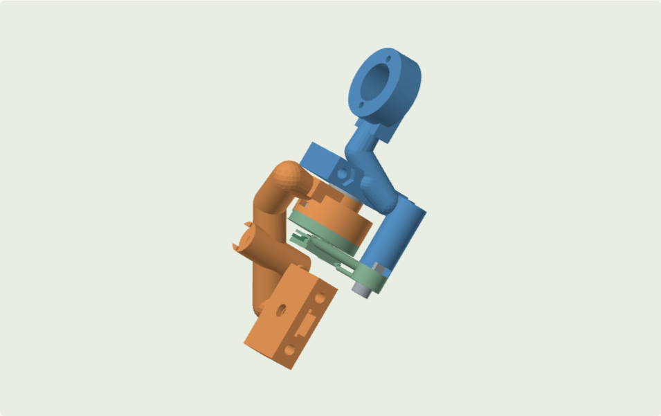

| 取件位置 | 名称 / 原始键 | 本步用途 / 状态 |
| --- | --- | --- |
| 盘 A06-03 · H010（骨架／右肘） | `frame/elbow_r` | 已在 S14 取用，直接使用已装骨架。一体骨架；已包含 右肘屈伸/旋转侧叉耳、右前臂扭转/固定侧关节座 |
| 盘 A06-02 · W002（骨架／右前臂） | `frame/forearm_r` | 本步新取。一体骨架；已包含 右前臂扭转/旋转侧叉耳、右手腕屈伸/固定侧关节座 |
| 盘 A06-11 · X030（右前臂扭转/传感板托夹） | `forearm_r.twist/sensor_cassette` | 本步新取。固定传感 PCB；先滑入板，再装到关节 |
| 盘 A07-04 · N004（右前臂扭转/侧装磁铁座盖） | `forearm_r.twist/magnet_cartridge` | 本步新取。侧面装入并粘固磁铁；旋转侧用 2 枚 M2×5 固定 |

| 五金 / 磁铁 | 本步数量 | 位置 |
| --- | --- | --- |
| M4大平垫圈：外径12、厚1 mm，实物能自由套过Φ4光杆 | 2 | 旋转叉耳两侧，每个支点 2 片 |
| A8不锈钢碟簧：8×4.2×0.4，自由高0.6 mm | 2 | 每个轴肩支点 2 片，相对安装 |
| M4普通平垫圈：外径9、厚0.8 mm，实物通孔验证 | 1 | 螺钉头下、碟簧外侧，每个支点 1 片 |
| 轴肩螺钉 Φ4×8 / M3×0.5，螺纹长6 mm；头Φ7×3，内六角3 mm | 1 | 轴肩摩擦支点，铰链 1 处 / 十字核心 4 处 |
| M3普通六角螺母（不要锁紧螺母替代外形） | 2 | 轴肩捕获窝、板托夹固定点，以及有 P/D 端轴时的摩擦调节槽 |
| M3大平垫圈：外径9、厚0.8 mm，实物通孔验证 | 1 | 固定座内侧，每个支点 1 片反力垫 |
| M3×8 内六角圆柱头螺钉；按CAD头径/头高核对 | 1 | 每只传感板托夹 1 枚；每个 P/D 摩擦块调节 1 枚 |
| M2普通六角螺母（不要锁紧螺母替代外形） | 2 | 本步各 M2 螺钉对应捕获窝，一螺钉配一螺母 |
| M2×5 内六角圆柱头螺钉；按CAD头径/头高核对 | 2 | N003 / N004 侧装磁铁座盖，每个 2 枚 |
| 径向两极磁铁 Φ6×2.5 mm；直径方向充磁，不能买轴向充磁 | 1 | 本步每个实测轴 1 颗，位于对应磁铁座 / 端盖 |

1. 将 盘 A06-03 · H010（骨架／右肘） 的固定关节座与 盘 A06-02 · W002（骨架／右前臂） 的旋转叉耳摆到图示连接位置。侧槽尚未被挡住时，预装 1 枚 M3 螺母与 1 片 M3 反力垫。
2. 按 [G5 一体铰链](#G5) 和 [G1 轴肩层次](#G1) 装 1 套轴肩结构。单个支点为 1 枚轴肩螺钉、2 片 M4 大垫、2 片 A8 碟簧、1 片 M4 普通垫，外加刚才放入的螺母和反力垫。
3. 调整摩擦后，按 [G4](#G4) 给 盘 A07-04 · N004（右前臂扭转/侧装磁铁座盖） 装 1 颗磁铁，固化后用 2 枚 M2×5 + 2 枚 M2 螺母固定到旋转侧。
4. 把下表所列传感板装入 盘 A06-11 · X030（右前臂扭转/传感板托夹），再用 1 枚 M3×8 + 1 枚 M3 螺母固定到固定侧。传感器与磁铁相对，不能把两者都固定到同一旋转骨段。
5. 局部慢慢活动，确认每一相邻活动面不挤压垫片、PCB 和线束。按需要的手感调保持力即可；当前可用行程由实物相邻件与线束决定，软件 raw_limits 不是要求你硬拧到的机械行程。

| 电路端口 / 中央板位号 | 测量轴 | 传感板装在 | 对应磁铁装在 | 每根线建议长度 |
| --- | --- | --- | --- | --- |
| 端口 B14 / J39 | `forearm_r.twist/r0` | 盘 A06-11 · X030（右前臂扭转/传感板托夹） | 盘 A07-04 · N004（右前臂扭转/侧装磁铁座盖） | 550 mm × 5 根，首件后定长 |

本步完成检查：B14 标签对应正确；磁铁不相对载体打滑；转轴可手动摆动并保持；线先松放到背盒方向，留待走线章节统一固定。

<a id="S16"></a>

### S16 · 右手腕屈伸

连接 **盘 A06-02 · W002（骨架／右前臂） → 盘 A07-01 · H012（骨架／右腕屈伸中间架）**。本步需打开打印盘：A06、A07。

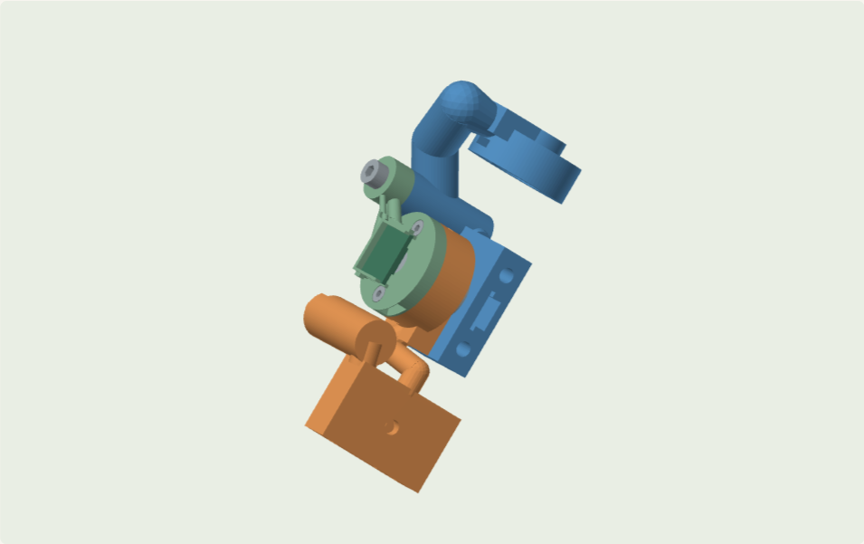

| 取件位置 | 名称 / 原始键 | 本步用途 / 状态 |
| --- | --- | --- |
| 盘 A06-02 · W002（骨架／右前臂） | `frame/forearm_r` | 已在 S15 取用，直接使用已装骨架。一体骨架；已包含 右前臂扭转/旋转侧叉耳、右手腕屈伸/固定侧关节座 |
| 盘 A07-01 · H012（骨架／右腕屈伸中间架） | `frame/hand_r.flex_frame` | 本步新取。一体骨架；已包含 右手腕屈伸/旋转侧叉耳、右手腕侧摆/固定侧关节座 |
| 盘 A06-14 · X031（右手腕屈伸/传感板托夹） | `hand_r.flex/sensor_cassette` | 本步新取。固定传感 PCB；先滑入板，再装到关节 |
| 盘 A07-10 · N004（右手腕屈伸/侧装磁铁座盖） | `hand_r.flex/magnet_cartridge` | 本步新取。侧面装入并粘固磁铁；旋转侧用 2 枚 M2×5 固定 |

| 五金 / 磁铁 | 本步数量 | 位置 |
| --- | --- | --- |
| M4大平垫圈：外径12、厚1 mm，实物能自由套过Φ4光杆 | 2 | 旋转叉耳两侧，每个支点 2 片 |
| A8不锈钢碟簧：8×4.2×0.4，自由高0.6 mm | 2 | 每个轴肩支点 2 片，相对安装 |
| M4普通平垫圈：外径9、厚0.8 mm，实物通孔验证 | 1 | 螺钉头下、碟簧外侧，每个支点 1 片 |
| 轴肩螺钉 Φ4×8 / M3×0.5，螺纹长6 mm；头Φ7×3，内六角3 mm | 1 | 轴肩摩擦支点，铰链 1 处 / 十字核心 4 处 |
| M3普通六角螺母（不要锁紧螺母替代外形） | 2 | 轴肩捕获窝、板托夹固定点，以及有 P/D 端轴时的摩擦调节槽 |
| M3大平垫圈：外径9、厚0.8 mm，实物通孔验证 | 1 | 固定座内侧，每个支点 1 片反力垫 |
| M3×8 内六角圆柱头螺钉；按CAD头径/头高核对 | 1 | 每只传感板托夹 1 枚；每个 P/D 摩擦块调节 1 枚 |
| M2普通六角螺母（不要锁紧螺母替代外形） | 2 | 本步各 M2 螺钉对应捕获窝，一螺钉配一螺母 |
| M2×5 内六角圆柱头螺钉；按CAD头径/头高核对 | 2 | N003 / N004 侧装磁铁座盖，每个 2 枚 |
| 径向两极磁铁 Φ6×2.5 mm；直径方向充磁，不能买轴向充磁 | 1 | 本步每个实测轴 1 颗，位于对应磁铁座 / 端盖 |

1. 将 盘 A06-02 · W002（骨架／右前臂） 的固定关节座与 盘 A07-01 · H012（骨架／右腕屈伸中间架） 的旋转叉耳摆到图示连接位置。侧槽尚未被挡住时，预装 1 枚 M3 螺母与 1 片 M3 反力垫。
2. 按 [G5 一体铰链](#G5) 和 [G1 轴肩层次](#G1) 装 1 套轴肩结构。单个支点为 1 枚轴肩螺钉、2 片 M4 大垫、2 片 A8 碟簧、1 片 M4 普通垫，外加刚才放入的螺母和反力垫。
3. 调整摩擦后，按 [G4](#G4) 给 盘 A07-10 · N004（右手腕屈伸/侧装磁铁座盖） 装 1 颗磁铁，固化后用 2 枚 M2×5 + 2 枚 M2 螺母固定到旋转侧。
4. 把下表所列传感板装入 盘 A06-14 · X031（右手腕屈伸/传感板托夹），再用 1 枚 M3×8 + 1 枚 M3 螺母固定到固定侧。传感器与磁铁相对，不能把两者都固定到同一旋转骨段。
5. 局部慢慢活动，确认每一相邻活动面不挤压垫片、PCB 和线束。按需要的手感调保持力即可；当前可用行程由实物相邻件与线束决定，软件 raw_limits 不是要求你硬拧到的机械行程。

| 电路端口 / 中央板位号 | 测量轴 | 传感板装在 | 对应磁铁装在 | 每根线建议长度 |
| --- | --- | --- | --- | --- |
| 端口 B15 / J40 | `hand_r.flex/r0` | 盘 A06-14 · X031（右手腕屈伸/传感板托夹） | 盘 A07-10 · N004（右手腕屈伸/侧装磁铁座盖） | 625 mm × 5 根，首件后定长 |

本步完成检查：B15 标签对应正确；磁铁不相对载体打滑；转轴可手动摆动并保持；线先松放到背盒方向，留待走线章节统一固定。

<a id="S17"></a>

### S17 · 右手腕侧摆

连接 **盘 A07-01 · H012（骨架／右腕屈伸中间架） → 盘 A07-14 · P185（骨架／右手腕）**。本步需打开打印盘：A06、A07。

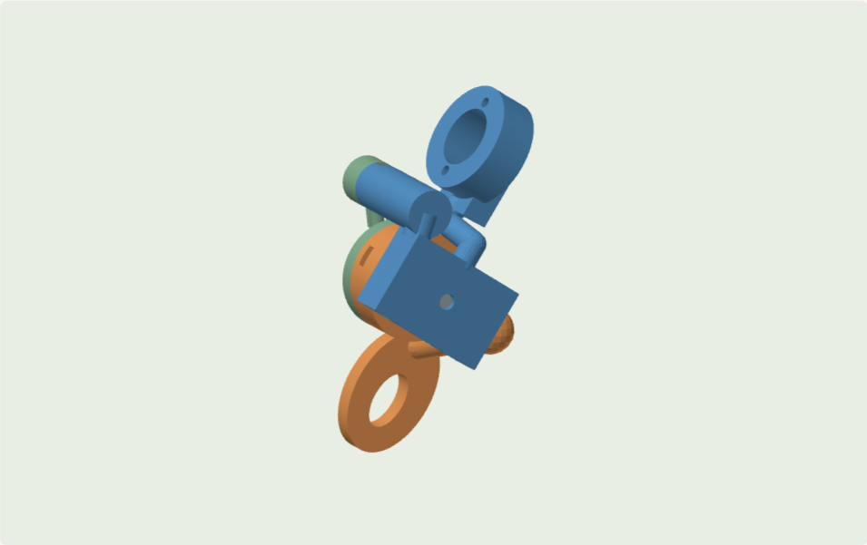

| 取件位置 | 名称 / 原始键 | 本步用途 / 状态 |
| --- | --- | --- |
| 盘 A07-01 · H012（骨架／右腕屈伸中间架） | `frame/hand_r.flex_frame` | 已在 S16 取用，直接使用已装骨架。一体骨架；已包含 右手腕屈伸/旋转侧叉耳、右手腕侧摆/固定侧关节座 |
| 盘 A07-14 · P185（骨架／右手腕） | `frame/hand_r` | 本步新取。一体骨架；已包含 右手腕侧摆/旋转侧叉耳 |
| 盘 A06-10 · X032（右手腕侧摆/传感板托夹） | `hand_r.deviate/sensor_cassette` | 本步新取。固定传感 PCB；先滑入板，再装到关节 |
| 盘 A07-12 · N004（右手腕侧摆/侧装磁铁座盖） | `hand_r.deviate/magnet_cartridge` | 本步新取。侧面装入并粘固磁铁；旋转侧用 2 枚 M2×5 固定 |

| 五金 / 磁铁 | 本步数量 | 位置 |
| --- | --- | --- |
| M4大平垫圈：外径12、厚1 mm，实物能自由套过Φ4光杆 | 2 | 旋转叉耳两侧，每个支点 2 片 |
| A8不锈钢碟簧：8×4.2×0.4，自由高0.6 mm | 2 | 每个轴肩支点 2 片，相对安装 |
| M4普通平垫圈：外径9、厚0.8 mm，实物通孔验证 | 1 | 螺钉头下、碟簧外侧，每个支点 1 片 |
| 轴肩螺钉 Φ4×8 / M3×0.5，螺纹长6 mm；头Φ7×3，内六角3 mm | 1 | 轴肩摩擦支点，铰链 1 处 / 十字核心 4 处 |
| M3普通六角螺母（不要锁紧螺母替代外形） | 2 | 轴肩捕获窝、板托夹固定点，以及有 P/D 端轴时的摩擦调节槽 |
| M3大平垫圈：外径9、厚0.8 mm，实物通孔验证 | 1 | 固定座内侧，每个支点 1 片反力垫 |
| M3×8 内六角圆柱头螺钉；按CAD头径/头高核对 | 1 | 每只传感板托夹 1 枚；每个 P/D 摩擦块调节 1 枚 |
| M2普通六角螺母（不要锁紧螺母替代外形） | 2 | 本步各 M2 螺钉对应捕获窝，一螺钉配一螺母 |
| M2×5 内六角圆柱头螺钉；按CAD头径/头高核对 | 2 | N003 / N004 侧装磁铁座盖，每个 2 枚 |
| 径向两极磁铁 Φ6×2.5 mm；直径方向充磁，不能买轴向充磁 | 1 | 本步每个实测轴 1 颗，位于对应磁铁座 / 端盖 |

1. 将 盘 A07-01 · H012（骨架／右腕屈伸中间架） 的固定关节座与 盘 A07-14 · P185（骨架／右手腕） 的旋转叉耳摆到图示连接位置。侧槽尚未被挡住时，预装 1 枚 M3 螺母与 1 片 M3 反力垫。
2. 按 [G5 一体铰链](#G5) 和 [G1 轴肩层次](#G1) 装 1 套轴肩结构。单个支点为 1 枚轴肩螺钉、2 片 M4 大垫、2 片 A8 碟簧、1 片 M4 普通垫，外加刚才放入的螺母和反力垫。
3. 调整摩擦后，按 [G4](#G4) 给 盘 A07-12 · N004（右手腕侧摆/侧装磁铁座盖） 装 1 颗磁铁，固化后用 2 枚 M2×5 + 2 枚 M2 螺母固定到旋转侧。
4. 把下表所列传感板装入 盘 A06-10 · X032（右手腕侧摆/传感板托夹），再用 1 枚 M3×8 + 1 枚 M3 螺母固定到固定侧。传感器与磁铁相对，不能把两者都固定到同一旋转骨段。
5. 局部慢慢活动，确认每一相邻活动面不挤压垫片、PCB 和线束。按需要的手感调保持力即可；当前可用行程由实物相邻件与线束决定，软件 raw_limits 不是要求你硬拧到的机械行程。

| 电路端口 / 中央板位号 | 测量轴 | 传感板装在 | 对应磁铁装在 | 每根线建议长度 |
| --- | --- | --- | --- | --- |
| 端口 B16 / J41 | `hand_r.deviate/r0` | 盘 A06-10 · X032（右手腕侧摆/传感板托夹） | 盘 A07-12 · N004（右手腕侧摆/侧装磁铁座盖） | 675 mm × 5 根，首件后定长 |

本步完成检查：B16 标签对应正确；磁铁不相对载体打滑；转轴可手动摆动并保持；线先松放到背盒方向，留待走线章节统一固定。

<a id="S18"></a>

### S18 · 左髋／大腿

连接 **盘 A03-01 · X038（骨架／骨盆） → 盘 A08-01 · X073（骨架／左髋／大腿）**。本步需打开打印盘：A03、A08。

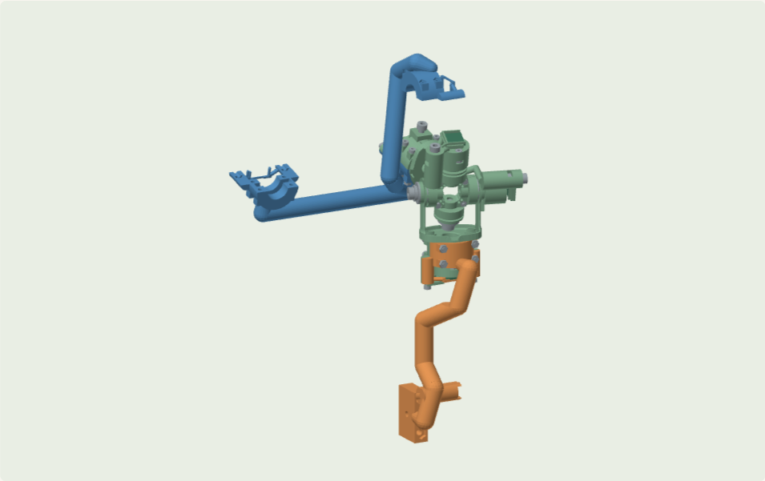

| 取件位置 | 名称 / 原始键 | 本步用途 / 状态 |
| --- | --- | --- |
| 盘 A03-01 · X038（骨架／骨盆） | `frame/pelvis` | 已在 S01 取用，直接使用已装骨架。一体骨架；已包含 腰部/P_固定半壳、左髋／大腿/P_固定半壳、右髋／大腿/P_固定半壳 |
| 盘 A08-01 · X073（骨架／左髋／大腿） | `frame/thigh_l` | 本步新取。一体骨架；已包含 左髋／大腿/D_固定半壳、左膝／小腿屈伸/固定侧关节座 |
| 盘 A08-02 · P095（左髋／大腿/下环） | `thigh_l/C14` | 本步新取。十字关节下环；先装内部螺母和 M3 反力垫 |
| 盘 A08-03 · P093（左髋／大腿/下叉） | `thigh_l/C01` | 本步新取。十字关节叉臂；与另一叉臂正交穿装 |
| 盘 A08-04 · P094（左髋／大腿/上叉） | `thigh_l/C02` | 本步新取。十字关节叉臂；与另一叉臂正交穿装 |
| 盘 A08-05 · X069（左髋／大腿/P_活动半壳） | `thigh_l/P_case_plus` | 本步新取。端轴可拆半壳；4 枚 M2×20 合壳 |
| 盘 A08-06 · X072（左髋／大腿/D_活动半壳） | `thigh_l/D_case_plus` | 本步新取。端轴可拆半壳；4 枚 M2×20 合壳 |
| 盘 A08-07 · P096（左髋／大腿/上环盖） | `thigh_l/C15` | 本步新取。十字关节上环盖；4 枚 M1.6×6 合环 |
| 盘 A08-08 · X012（左髋／大腿/上叉_传感板托夹） | `thigh_l/C02_sensor_cassette` | 本步新取。固定传感 PCB；先滑入板，再装到关节 |
| 盘 A08-12 · X011（左髋／大腿/下叉_传感板托夹） | `thigh_l/C01_sensor_cassette` | 本步新取。固定传感 PCB；先滑入板，再装到关节 |
| 盘 A08-16 · P106（左髋／大腿/P_磁铁端盖） | `thigh_l/P_magnet_cap` | 本步新取。端轴磁铁端盖；2 枚 M2×4 固定 |
| 盘 A08-17 · P111（左髋／大腿/D_磁铁端盖） | `thigh_l/D_magnet_cap` | 本步新取。端轴磁铁端盖；2 枚 M2×4 固定 |
| 盘 A08-18 · N003（左髋／大腿/下叉_侧装磁铁座盖） | `thigh_l/C01_magnet_cartridge` | 本步新取。侧面装入并粘固磁铁；旋转侧用 2 枚 M2×5 固定 |
| 盘 A08-19 · N003（左髋／大腿/上叉_侧装磁铁座盖） | `thigh_l/C02_magnet_cartridge` | 本步新取。侧面装入并粘固磁铁；旋转侧用 2 枚 M2×5 固定 |
| 盘 A08-22 · X068（左髋／大腿/P_板夹_+14） | `thigh_l/P_pcb_clip_+14` | 本步新取。端轴传感 PCB 的一侧板夹，与另一板夹成对使用 |
| 盘 A08-23 · X067（左髋／大腿/P_板夹_-14） | `thigh_l/P_pcb_clip_-14` | 本步新取。端轴传感 PCB 的一侧板夹，与另一板夹成对使用 |
| 盘 A08-24 · X071（左髋／大腿/D_板夹_+14） | `thigh_l/D_pcb_clip_+14` | 本步新取。端轴传感 PCB 的一侧板夹，与另一板夹成对使用 |
| 盘 A08-25 · X070（左髋／大腿/D_板夹_-14） | `thigh_l/D_pcb_clip_-14` | 本步新取。端轴传感 PCB 的一侧板夹，与另一板夹成对使用 |
| 盘 A08-26 · P105（左髋／大腿/P_径向摩擦块） | `thigh_l/P_radial_pad` | 本步新取。端轴径向摩擦块；凹面朝轴，M3×8 顶压外侧 |
| 盘 A08-27 · P110（左髋／大腿/D_径向摩擦块） | `thigh_l/D_radial_pad` | 本步新取。端轴径向摩擦块；凹面朝轴，M3×8 顶压外侧 |

| 五金 / 磁铁 | 本步数量 | 位置 |
| --- | --- | --- |
| M4大平垫圈：外径12、厚1 mm，实物能自由套过Φ4光杆 | 8 | 旋转叉耳两侧，每个支点 2 片 |
| A8不锈钢碟簧：8×4.2×0.4，自由高0.6 mm | 8 | 每个轴肩支点 2 片，相对安装 |
| M4普通平垫圈：外径9、厚0.8 mm，实物通孔验证 | 4 | 螺钉头下、碟簧外侧，每个支点 1 片 |
| 轴肩螺钉 Φ4×8 / M3×0.5，螺纹长6 mm；头Φ7×3，内六角3 mm | 4 | 轴肩摩擦支点，铰链 1 处 / 十字核心 4 处 |
| M3普通六角螺母（不要锁紧螺母替代外形） | 8 | 轴肩捕获窝、板托夹固定点，以及有 P/D 端轴时的摩擦调节槽 |
| M3大平垫圈：外径9、厚0.8 mm，实物通孔验证 | 4 | 固定座内侧，每个支点 1 片反力垫 |
| M1.6×6 内六角圆柱头螺钉；按CAD头径/头高核对 | 4 | C14 / C15 合环 |
| M1.6普通六角螺母（不要锁紧螺母替代外形） | 4 | C14 / C15 合环螺钉对应捕获窝 |
| M2普通六角螺母（不要锁紧螺母替代外形） | 20 | 本步各 M2 螺钉对应捕获窝，一螺钉配一螺母 |
| M2×5 内六角圆柱头螺钉；按CAD头径/头高核对 | 4 | N003 / N004 侧装磁铁座盖，每个 2 枚 |
| 径向两极磁铁 Φ6×2.5 mm；直径方向充磁，不能买轴向充磁 | 4 | 本步每个实测轴 1 颗，位于对应磁铁座 / 端盖 |
| M3×8 内六角圆柱头螺钉；按CAD头径/头高核对 | 4 | 每只传感板托夹 1 枚；每个 P/D 摩擦块调节 1 枚 |
| M2×20 内六角圆柱头螺钉；按CAD头径/头高核对 | 8 | P / D 端轴固定半壳与活动半壳合壳 |
| M2×4 内六角圆柱头螺钉；按CAD头径/头高核对 | 4 | P / D 端轴的磁铁端盖 |
| M2×8 内六角圆柱头螺钉；按CAD头径/头高核对 | 4 | P / D 端轴的成对 PCB 板夹 |

1. 取 盘 A08-02 · P095（左髋／大腿/下环）、盘 A08-07 · P096（左髋／大腿/上环盖）。两叉分别是 盘 A08-03 · P093（左髋／大腿/下叉） 的 C01 部位、盘 A08-04 · P094（左髋／大腿/上叉） 的 C02 部位；已经连在骨架上的叉不要拆分或另找重复打印件。
2. 按 [G2](#G2) 先预装 4 枚 M3 螺母与 4 片 M3 反力垫，把两叉交叉放入环，再按 G1 装四套轴肩结构；随后用 4 枚 M1.6×6 + 4 枚 M1.6 螺母合环。
3. P 端按 [G3](#G3)：盘 A03-01 · X038（骨架／骨盆） 内是一体固定半壳，容纳 盘 A08-03 · P093（左髋／大腿/下叉） 的圆轴与限位环；装 盘 A08-26 · P105（左髋／大腿/P_径向摩擦块），M3×8 + M3 螺母调摩擦。用 盘 A08-05 · X069（左髋／大腿/P_活动半壳） 和 4 枚 M2×20 + 4 枚 M2 螺母合壳。磁铁端盖用 2 枚 M2×4 + 2 枚 M2 螺母；两只 PCB 板夹用 2 枚 M2×8 + 2 枚 M2 螺母。
4. D 端按 [G3](#G3)：盘 A08-01 · X073（骨架／左髋／大腿） 内是一体固定半壳，容纳 盘 A08-04 · P094（左髋／大腿/上叉） 的圆轴与限位环；装 盘 A08-27 · P110（左髋／大腿/D_径向摩擦块），M3×8 + M3 螺母调摩擦。用 盘 A08-06 · X072（左髋／大腿/D_活动半壳） 和 4 枚 M2×20 + 4 枚 M2 螺母合壳。磁铁端盖用 2 枚 M2×4 + 2 枚 M2 螺母；两只 PCB 板夹用 2 枚 M2×8 + 2 枚 M2 螺母。
5. C01 测量端按 [G4](#G4)：盘 A08-18 · N003（左髋／大腿/下叉_侧装磁铁座盖） 内放 1 颗磁铁，用 2 枚 M2×5 + 2 枚 M2 螺母固定到叉臂端；盘 A08-12 · X011（左髋／大腿/下叉_传感板托夹） 先滑入传感板，再用 M3×8 + M3 螺母固定。
6. C02 测量端按 [G4](#G4)：盘 A08-19 · N003（左髋／大腿/上叉_侧装磁铁座盖） 内放 1 颗磁铁，用 2 枚 M2×5 + 2 枚 M2 螺母固定到叉臂端；盘 A08-08 · X012（左髋／大腿/上叉_传感板托夹） 先滑入传感板，再用 M3×8 + M3 螺母固定。
7. 局部慢慢活动，确认每一相邻活动面不挤压垫片、PCB 和线束。按需要的手感调保持力即可；当前可用行程由实物相邻件与线束决定，软件 raw_limits 不是要求你硬拧到的机械行程。

| 电路端口 / 中央板位号 | 测量轴 | 传感板装在 | 对应磁铁装在 | 每根线建议长度 |
| --- | --- | --- | --- | --- |
| 端口 C01 / J42 | `thigh_l/r0` | 盘 A08-23 · X067（左髋／大腿/P_板夹_-14） + 盘 A08-22 · X068（左髋／大腿/P_板夹_+14） | 盘 A08-16 · P106（左髋／大腿/P_磁铁端盖） | 425 mm × 5 根，首件后定长 |
| 端口 C02 / J43 | `thigh_l/r1` | 盘 A08-12 · X011（左髋／大腿/下叉_传感板托夹） | 盘 A08-18 · N003（左髋／大腿/下叉_侧装磁铁座盖） | 625 mm × 5 根，首件后定长 |
| 端口 C03 / J44 | `thigh_l/r2` | 盘 A08-08 · X012（左髋／大腿/上叉_传感板托夹） | 盘 A08-19 · N003（左髋／大腿/上叉_侧装磁铁座盖） | 575 mm × 5 根，首件后定长 |
| 端口 C04 / J45 | `thigh_l/r3` | 盘 A08-25 · X070（左髋／大腿/D_板夹_-14） + 盘 A08-24 · X071（左髋／大腿/D_板夹_+14） | 盘 A08-17 · P111（左髋／大腿/D_磁铁端盖） | 550 mm × 5 根，首件后定长 |

本步完成检查：C01、C02、C03、C04 标签对应正确；磁铁不相对载体打滑；转轴可手动摆动并保持；线先松放到背盒方向，留待走线章节统一固定。

<a id="S19"></a>

### S19 · 左膝／小腿屈伸

连接 **盘 A08-01 · X073（骨架／左髋／大腿） → 盘 A10-02 · W007（骨架／左膝／小腿）**。本步需打开打印盘：A08、A10。

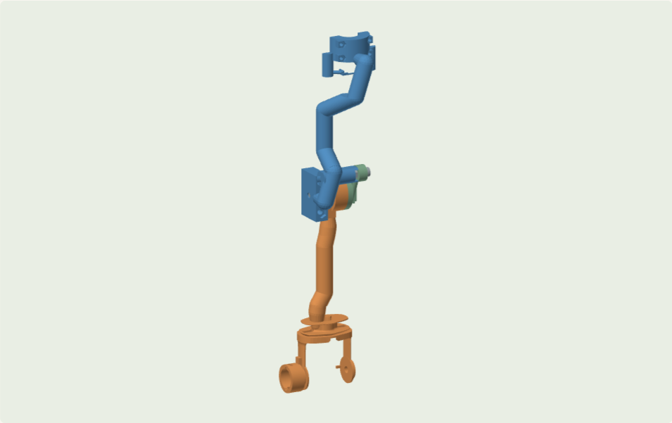

| 取件位置 | 名称 / 原始键 | 本步用途 / 状态 |
| --- | --- | --- |
| 盘 A08-01 · X073（骨架／左髋／大腿） | `frame/thigh_l` | 已在 S18 取用，直接使用已装骨架。一体骨架；已包含 左髋／大腿/D_固定半壳、左膝／小腿屈伸/固定侧关节座 |
| 盘 A10-02 · W007（骨架／左膝／小腿） | `frame/calf_l` | 本步新取。一体骨架；已包含 左踝／脚掌/上叉、左膝／小腿屈伸/旋转侧叉耳 |
| 盘 A08-10 · X025（左膝／小腿屈伸/传感板托夹） | `calf_l.flex/sensor_cassette` | 本步新取。固定传感 PCB；先滑入板，再装到关节 |
| 盘 A08-14 · N004（左膝／小腿屈伸/侧装磁铁座盖） | `calf_l.flex/magnet_cartridge` | 本步新取。侧面装入并粘固磁铁；旋转侧用 2 枚 M2×5 固定 |

| 五金 / 磁铁 | 本步数量 | 位置 |
| --- | --- | --- |
| M4大平垫圈：外径12、厚1 mm，实物能自由套过Φ4光杆 | 2 | 旋转叉耳两侧，每个支点 2 片 |
| A8不锈钢碟簧：8×4.2×0.4，自由高0.6 mm | 2 | 每个轴肩支点 2 片，相对安装 |
| M4普通平垫圈：外径9、厚0.8 mm，实物通孔验证 | 1 | 螺钉头下、碟簧外侧，每个支点 1 片 |
| 轴肩螺钉 Φ4×8 / M3×0.5，螺纹长6 mm；头Φ7×3，内六角3 mm | 1 | 轴肩摩擦支点，铰链 1 处 / 十字核心 4 处 |
| M3普通六角螺母（不要锁紧螺母替代外形） | 2 | 轴肩捕获窝、板托夹固定点，以及有 P/D 端轴时的摩擦调节槽 |
| M3大平垫圈：外径9、厚0.8 mm，实物通孔验证 | 1 | 固定座内侧，每个支点 1 片反力垫 |
| M3×8 内六角圆柱头螺钉；按CAD头径/头高核对 | 1 | 每只传感板托夹 1 枚；每个 P/D 摩擦块调节 1 枚 |
| M2普通六角螺母（不要锁紧螺母替代外形） | 2 | 本步各 M2 螺钉对应捕获窝，一螺钉配一螺母 |
| M2×5 内六角圆柱头螺钉；按CAD头径/头高核对 | 2 | N003 / N004 侧装磁铁座盖，每个 2 枚 |
| 径向两极磁铁 Φ6×2.5 mm；直径方向充磁，不能买轴向充磁 | 1 | 本步每个实测轴 1 颗，位于对应磁铁座 / 端盖 |

1. 将 盘 A08-01 · X073（骨架／左髋／大腿） 的固定关节座与 盘 A10-02 · W007（骨架／左膝／小腿） 的旋转叉耳摆到图示连接位置。侧槽尚未被挡住时，预装 1 枚 M3 螺母与 1 片 M3 反力垫。
2. 按 [G5 一体铰链](#G5) 和 [G1 轴肩层次](#G1) 装 1 套轴肩结构。单个支点为 1 枚轴肩螺钉、2 片 M4 大垫、2 片 A8 碟簧、1 片 M4 普通垫，外加刚才放入的螺母和反力垫。
3. 调整摩擦后，按 [G4](#G4) 给 盘 A08-14 · N004（左膝／小腿屈伸/侧装磁铁座盖） 装 1 颗磁铁，固化后用 2 枚 M2×5 + 2 枚 M2 螺母固定到旋转侧。
4. 把下表所列传感板装入 盘 A08-10 · X025（左膝／小腿屈伸/传感板托夹），再用 1 枚 M3×8 + 1 枚 M3 螺母固定到固定侧。传感器与磁铁相对，不能把两者都固定到同一旋转骨段。
5. 局部慢慢活动，确认每一相邻活动面不挤压垫片、PCB 和线束。按需要的手感调保持力即可；当前可用行程由实物相邻件与线束决定，软件 raw_limits 不是要求你硬拧到的机械行程。

| 电路端口 / 中央板位号 | 测量轴 | 传感板装在 | 对应磁铁装在 | 每根线建议长度 |
| --- | --- | --- | --- | --- |
| 端口 C05 / J46 | `calf_l.flex/r0` | 盘 A08-10 · X025（左膝／小腿屈伸/传感板托夹） | 盘 A08-14 · N004（左膝／小腿屈伸/侧装磁铁座盖） | 525 mm × 5 根，首件后定长 |

本步完成检查：C05 标签对应正确；磁铁不相对载体打滑；转轴可手动摆动并保持；线先松放到背盒方向，留待走线章节统一固定。

<a id="S20"></a>

### S20 · 左踝／脚掌

连接 **盘 A10-02 · W007（骨架／左膝／小腿） → 盘 A10-07 · W016（骨架／左踝／脚掌）**。本步需打开打印盘：A08、A10。

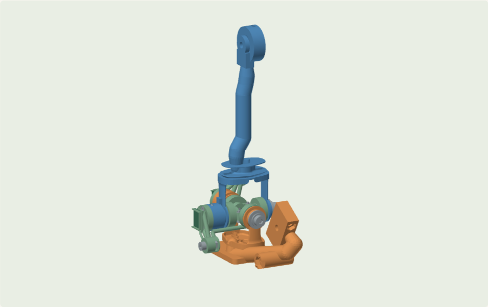

| 取件位置 | 名称 / 原始键 | 本步用途 / 状态 |
| --- | --- | --- |
| 盘 A10-02 · W007（骨架／左膝／小腿） | `frame/calf_l` | 已在 S19 取用，直接使用已装骨架。一体骨架；已包含 左踝／脚掌/上叉、左膝／小腿屈伸/旋转侧叉耳 |
| 盘 A10-07 · W016（骨架／左踝／脚掌） | `frame/foot_l` | 本步新取。一体骨架；已包含 左踝／脚掌/下叉、左脚趾屈伸/固定侧关节座 |
| 盘 A08-09 · X016（左踝／脚掌/上叉_传感板托夹） | `foot_l/C02_sensor_cassette` | 本步新取。固定传感 PCB；先滑入板，再装到关节 |
| 盘 A08-11 · X015（左踝／脚掌/下叉_传感板托夹） | `foot_l/C01_sensor_cassette` | 本步新取。固定传感 PCB；先滑入板，再装到关节 |
| 盘 A08-20 · N003（左踝／脚掌/下叉_侧装磁铁座盖） | `foot_l/C01_magnet_cartridge` | 本步新取。侧面装入并粘固磁铁；旋转侧用 2 枚 M2×5 固定 |
| 盘 A08-21 · N003（左踝／脚掌/上叉_侧装磁铁座盖） | `foot_l/C02_magnet_cartridge` | 本步新取。侧面装入并粘固磁铁；旋转侧用 2 枚 M2×5 固定 |
| 盘 A10-03 · P130（左踝／脚掌/下环） | `foot_l/C14` | 本步新取。十字关节下环；先装内部螺母和 M3 反力垫 |
| 盘 A10-09 · P131（左踝／脚掌/上环盖） | `foot_l/C15` | 本步新取。十字关节上环盖；4 枚 M1.6×6 合环 |

| 五金 / 磁铁 | 本步数量 | 位置 |
| --- | --- | --- |
| M4大平垫圈：外径12、厚1 mm，实物能自由套过Φ4光杆 | 8 | 旋转叉耳两侧，每个支点 2 片 |
| A8不锈钢碟簧：8×4.2×0.4，自由高0.6 mm | 8 | 每个轴肩支点 2 片，相对安装 |
| M4普通平垫圈：外径9、厚0.8 mm，实物通孔验证 | 4 | 螺钉头下、碟簧外侧，每个支点 1 片 |
| 轴肩螺钉 Φ4×8 / M3×0.5，螺纹长6 mm；头Φ7×3，内六角3 mm | 4 | 轴肩摩擦支点，铰链 1 处 / 十字核心 4 处 |
| M3普通六角螺母（不要锁紧螺母替代外形） | 6 | 轴肩捕获窝、板托夹固定点，以及有 P/D 端轴时的摩擦调节槽 |
| M3大平垫圈：外径9、厚0.8 mm，实物通孔验证 | 4 | 固定座内侧，每个支点 1 片反力垫 |
| M1.6×6 内六角圆柱头螺钉；按CAD头径/头高核对 | 4 | C14 / C15 合环 |
| M1.6普通六角螺母（不要锁紧螺母替代外形） | 4 | C14 / C15 合环螺钉对应捕获窝 |
| M2普通六角螺母（不要锁紧螺母替代外形） | 4 | 本步各 M2 螺钉对应捕获窝，一螺钉配一螺母 |
| M2×5 内六角圆柱头螺钉；按CAD头径/头高核对 | 4 | N003 / N004 侧装磁铁座盖，每个 2 枚 |
| 径向两极磁铁 Φ6×2.5 mm；直径方向充磁，不能买轴向充磁 | 2 | 本步每个实测轴 1 颗，位于对应磁铁座 / 端盖 |
| M3×8 内六角圆柱头螺钉；按CAD头径/头高核对 | 2 | 每只传感板托夹 1 枚；每个 P/D 摩擦块调节 1 枚 |

1. 取 盘 A10-03 · P130（左踝／脚掌/下环）、盘 A10-09 · P131（左踝／脚掌/上环盖）。两叉分别是 盘 A10-07 · W016（骨架／左踝／脚掌） 的 C01 部位、盘 A10-02 · W007（骨架／左膝／小腿） 的 C02 部位；已经连在骨架上的叉不要拆分或另找重复打印件。
2. 按 [G2](#G2) 先预装 4 枚 M3 螺母与 4 片 M3 反力垫，把两叉交叉放入环，再按 G1 装四套轴肩结构；随后用 4 枚 M1.6×6 + 4 枚 M1.6 螺母合环。
3. C01 测量端按 [G4](#G4)：盘 A08-20 · N003（左踝／脚掌/下叉_侧装磁铁座盖） 内放 1 颗磁铁，用 2 枚 M2×5 + 2 枚 M2 螺母固定到叉臂端；盘 A08-11 · X015（左踝／脚掌/下叉_传感板托夹） 先滑入传感板，再用 M3×8 + M3 螺母固定。
4. C02 测量端按 [G4](#G4)：盘 A08-21 · N003（左踝／脚掌/上叉_侧装磁铁座盖） 内放 1 颗磁铁，用 2 枚 M2×5 + 2 枚 M2 螺母固定到叉臂端；盘 A08-09 · X016（左踝／脚掌/上叉_传感板托夹） 先滑入传感板，再用 M3×8 + M3 螺母固定。
5. 局部慢慢活动，确认每一相邻活动面不挤压垫片、PCB 和线束。按需要的手感调保持力即可；当前可用行程由实物相邻件与线束决定，软件 raw_limits 不是要求你硬拧到的机械行程。

| 电路端口 / 中央板位号 | 测量轴 | 传感板装在 | 对应磁铁装在 | 每根线建议长度 |
| --- | --- | --- | --- | --- |
| 端口 C06 / J47 | `foot_l/r0` | 盘 A08-11 · X015（左踝／脚掌/下叉_传感板托夹） | 盘 A08-20 · N003（左踝／脚掌/下叉_侧装磁铁座盖） | 725 mm × 5 根，首件后定长 |
| 端口 C07 / J48 | `foot_l/r1` | 盘 A08-09 · X016（左踝／脚掌/上叉_传感板托夹） | 盘 A08-21 · N003（左踝／脚掌/上叉_侧装磁铁座盖） | 725 mm × 5 根，首件后定长 |

本步完成检查：C06、C07 标签对应正确；磁铁不相对载体打滑；转轴可手动摆动并保持；线先松放到背盒方向，留待走线章节统一固定。

<a id="S21"></a>

### S21 · 左脚趾屈伸

连接 **盘 A10-07 · W016（骨架／左踝／脚掌） → 盘 A10-05 · W003（骨架／左脚趾）**。本步需打开打印盘：A08、A10。


| 取件位置 | 名称 / 原始键 | 本步用途 / 状态 |
| --- | --- | --- |
| 盘 A10-07 · W016（骨架／左踝／脚掌） | `frame/foot_l` | 已在 S20 取用，直接使用已装骨架。一体骨架；已包含 左踝／脚掌/下叉、左脚趾屈伸/固定侧关节座 |
| 盘 A10-05 · W003（骨架／左脚趾） | `frame/ball_l` | 本步新取。一体骨架；已包含 左脚趾屈伸/旋转侧叉耳 |
| 盘 A08-13 · X026（左脚趾屈伸/传感板托夹） | `ball_l.flex/sensor_cassette` | 本步新取。固定传感 PCB；先滑入板，再装到关节 |
| 盘 A08-15 · N004（左脚趾屈伸/侧装磁铁座盖） | `ball_l.flex/magnet_cartridge` | 本步新取。侧面装入并粘固磁铁；旋转侧用 2 枚 M2×5 固定 |

| 五金 / 磁铁 | 本步数量 | 位置 |
| --- | --- | --- |
| M4大平垫圈：外径12、厚1 mm，实物能自由套过Φ4光杆 | 2 | 旋转叉耳两侧，每个支点 2 片 |
| A8不锈钢碟簧：8×4.2×0.4，自由高0.6 mm | 2 | 每个轴肩支点 2 片，相对安装 |
| M4普通平垫圈：外径9、厚0.8 mm，实物通孔验证 | 1 | 螺钉头下、碟簧外侧，每个支点 1 片 |
| 轴肩螺钉 Φ4×8 / M3×0.5，螺纹长6 mm；头Φ7×3，内六角3 mm | 1 | 轴肩摩擦支点，铰链 1 处 / 十字核心 4 处 |
| M3普通六角螺母（不要锁紧螺母替代外形） | 2 | 轴肩捕获窝、板托夹固定点，以及有 P/D 端轴时的摩擦调节槽 |
| M3大平垫圈：外径9、厚0.8 mm，实物通孔验证 | 1 | 固定座内侧，每个支点 1 片反力垫 |
| M3×8 内六角圆柱头螺钉；按CAD头径/头高核对 | 1 | 每只传感板托夹 1 枚；每个 P/D 摩擦块调节 1 枚 |
| M2普通六角螺母（不要锁紧螺母替代外形） | 2 | 本步各 M2 螺钉对应捕获窝，一螺钉配一螺母 |
| M2×5 内六角圆柱头螺钉；按CAD头径/头高核对 | 2 | N003 / N004 侧装磁铁座盖，每个 2 枚 |
| 径向两极磁铁 Φ6×2.5 mm；直径方向充磁，不能买轴向充磁 | 1 | 本步每个实测轴 1 颗，位于对应磁铁座 / 端盖 |

1. 将 盘 A10-07 · W016（骨架／左踝／脚掌） 的固定关节座与 盘 A10-05 · W003（骨架／左脚趾） 的旋转叉耳摆到图示连接位置。侧槽尚未被挡住时，预装 1 枚 M3 螺母与 1 片 M3 反力垫。
2. 按 [G5 一体铰链](#G5) 和 [G1 轴肩层次](#G1) 装 1 套轴肩结构。单个支点为 1 枚轴肩螺钉、2 片 M4 大垫、2 片 A8 碟簧、1 片 M4 普通垫，外加刚才放入的螺母和反力垫。
3. 调整摩擦后，按 [G4](#G4) 给 盘 A08-15 · N004（左脚趾屈伸/侧装磁铁座盖） 装 1 颗磁铁，固化后用 2 枚 M2×5 + 2 枚 M2 螺母固定到旋转侧。
4. 把下表所列传感板装入 盘 A08-13 · X026（左脚趾屈伸/传感板托夹），再用 1 枚 M3×8 + 1 枚 M3 螺母固定到固定侧。传感器与磁铁相对，不能把两者都固定到同一旋转骨段。
5. 局部慢慢活动，确认每一相邻活动面不挤压垫片、PCB 和线束。按需要的手感调保持力即可；当前可用行程由实物相邻件与线束决定，软件 raw_limits 不是要求你硬拧到的机械行程。

| 电路端口 / 中央板位号 | 测量轴 | 传感板装在 | 对应磁铁装在 | 每根线建议长度 |
| --- | --- | --- | --- | --- |
| 端口 C08 / J49 | `ball_l.flex/r0` | 盘 A08-13 · X026（左脚趾屈伸/传感板托夹） | 盘 A08-15 · N004（左脚趾屈伸/侧装磁铁座盖） | 750 mm × 5 根，首件后定长 |

本步完成检查：C08 标签对应正确；磁铁不相对载体打滑；转轴可手动摆动并保持；线先松放到背盒方向，留待走线章节统一固定。

<a id="S22"></a>

### S22 · 右髋／大腿

连接 **盘 A03-01 · X038（骨架／骨盆） → 盘 A09-01 · X080（骨架／右髋／大腿）**。本步需打开打印盘：A03、A09。

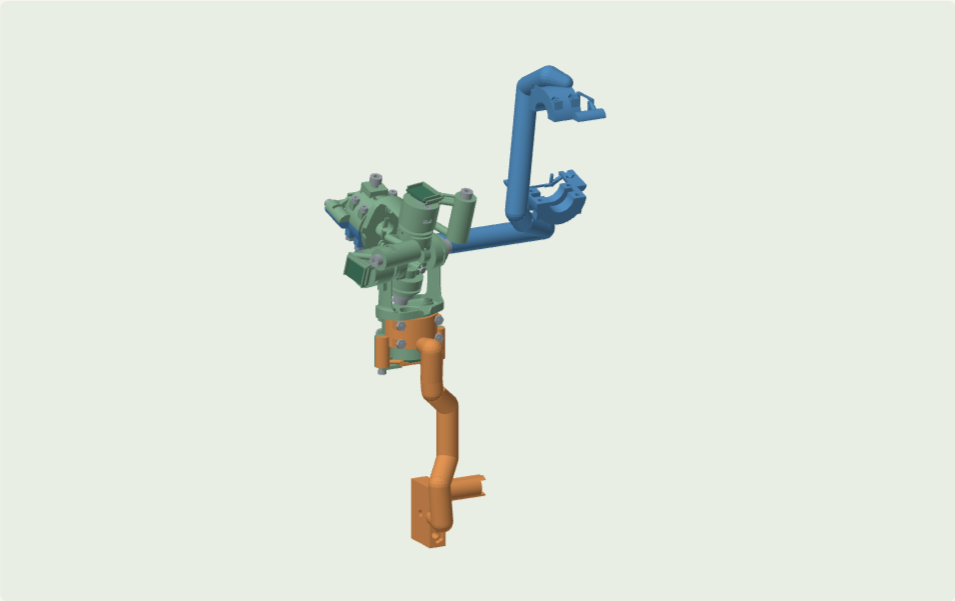

| 取件位置 | 名称 / 原始键 | 本步用途 / 状态 |
| --- | --- | --- |
| 盘 A03-01 · X038（骨架／骨盆） | `frame/pelvis` | 已在 S01 取用，直接使用已装骨架。一体骨架；已包含 腰部/P_固定半壳、左髋／大腿/P_固定半壳、右髋／大腿/P_固定半壳 |
| 盘 A09-01 · X080（骨架／右髋／大腿） | `frame/thigh_r` | 本步新取。一体骨架；已包含 右髋／大腿/D_固定半壳、右膝／小腿屈伸/固定侧关节座 |
| 盘 A09-02 · P117（右髋／大腿/下环） | `thigh_r/C14` | 本步新取。十字关节下环；先装内部螺母和 M3 反力垫 |
| 盘 A09-03 · P115（右髋／大腿/下叉） | `thigh_r/C01` | 本步新取。十字关节叉臂；与另一叉臂正交穿装 |
| 盘 A09-04 · P116（右髋／大腿/上叉） | `thigh_r/C02` | 本步新取。十字关节叉臂；与另一叉臂正交穿装 |
| 盘 A09-05 · X076（右髋／大腿/P_活动半壳） | `thigh_r/P_case_plus` | 本步新取。端轴可拆半壳；4 枚 M2×20 合壳 |
| 盘 A09-06 · X079（右髋／大腿/D_活动半壳） | `thigh_r/D_case_plus` | 本步新取。端轴可拆半壳；4 枚 M2×20 合壳 |
| 盘 A09-07 · P118（右髋／大腿/上环盖） | `thigh_r/C15` | 本步新取。十字关节上环盖；4 枚 M1.6×6 合环 |
| 盘 A09-08 · X013（右髋／大腿/下叉_传感板托夹） | `thigh_r/C01_sensor_cassette` | 本步新取。固定传感 PCB；先滑入板，再装到关节 |
| 盘 A09-09 · X014（右髋／大腿/上叉_传感板托夹） | `thigh_r/C02_sensor_cassette` | 本步新取。固定传感 PCB；先滑入板，再装到关节 |
| 盘 A09-16 · P013（右髋／大腿/P_磁铁端盖） | `thigh_r/P_magnet_cap` | 本步新取。端轴磁铁端盖；2 枚 M2×4 固定 |
| 盘 A09-17 · P126（右髋／大腿/D_磁铁端盖） | `thigh_r/D_magnet_cap` | 本步新取。端轴磁铁端盖；2 枚 M2×4 固定 |
| 盘 A09-18 · N003（右髋／大腿/下叉_侧装磁铁座盖） | `thigh_r/C01_magnet_cartridge` | 本步新取。侧面装入并粘固磁铁；旋转侧用 2 枚 M2×5 固定 |
| 盘 A09-19 · N003（右髋／大腿/上叉_侧装磁铁座盖） | `thigh_r/C02_magnet_cartridge` | 本步新取。侧面装入并粘固磁铁；旋转侧用 2 枚 M2×5 固定 |
| 盘 A09-22 · X074（右髋／大腿/P_板夹_-14） | `thigh_r/P_pcb_clip_-14` | 本步新取。端轴传感 PCB 的一侧板夹，与另一板夹成对使用 |
| 盘 A09-23 · X075（右髋／大腿/P_板夹_+14） | `thigh_r/P_pcb_clip_+14` | 本步新取。端轴传感 PCB 的一侧板夹，与另一板夹成对使用 |
| 盘 A09-24 · X077（右髋／大腿/D_板夹_-14） | `thigh_r/D_pcb_clip_-14` | 本步新取。端轴传感 PCB 的一侧板夹，与另一板夹成对使用 |
| 盘 A09-25 · X078（右髋／大腿/D_板夹_+14） | `thigh_r/D_pcb_clip_+14` | 本步新取。端轴传感 PCB 的一侧板夹，与另一板夹成对使用 |
| 盘 A09-26 · P012（右髋／大腿/P_径向摩擦块） | `thigh_r/P_radial_pad` | 本步新取。端轴径向摩擦块；凹面朝轴，M3×8 顶压外侧 |
| 盘 A09-27 · P125（右髋／大腿/D_径向摩擦块） | `thigh_r/D_radial_pad` | 本步新取。端轴径向摩擦块；凹面朝轴，M3×8 顶压外侧 |

| 五金 / 磁铁 | 本步数量 | 位置 |
| --- | --- | --- |
| M4大平垫圈：外径12、厚1 mm，实物能自由套过Φ4光杆 | 8 | 旋转叉耳两侧，每个支点 2 片 |
| A8不锈钢碟簧：8×4.2×0.4，自由高0.6 mm | 8 | 每个轴肩支点 2 片，相对安装 |
| M4普通平垫圈：外径9、厚0.8 mm，实物通孔验证 | 4 | 螺钉头下、碟簧外侧，每个支点 1 片 |
| 轴肩螺钉 Φ4×8 / M3×0.5，螺纹长6 mm；头Φ7×3，内六角3 mm | 4 | 轴肩摩擦支点，铰链 1 处 / 十字核心 4 处 |
| M3普通六角螺母（不要锁紧螺母替代外形） | 8 | 轴肩捕获窝、板托夹固定点，以及有 P/D 端轴时的摩擦调节槽 |
| M3大平垫圈：外径9、厚0.8 mm，实物通孔验证 | 4 | 固定座内侧，每个支点 1 片反力垫 |
| M1.6×6 内六角圆柱头螺钉；按CAD头径/头高核对 | 4 | C14 / C15 合环 |
| M1.6普通六角螺母（不要锁紧螺母替代外形） | 4 | C14 / C15 合环螺钉对应捕获窝 |
| M2普通六角螺母（不要锁紧螺母替代外形） | 20 | 本步各 M2 螺钉对应捕获窝，一螺钉配一螺母 |
| M2×5 内六角圆柱头螺钉；按CAD头径/头高核对 | 4 | N003 / N004 侧装磁铁座盖，每个 2 枚 |
| 径向两极磁铁 Φ6×2.5 mm；直径方向充磁，不能买轴向充磁 | 4 | 本步每个实测轴 1 颗，位于对应磁铁座 / 端盖 |
| M3×8 内六角圆柱头螺钉；按CAD头径/头高核对 | 4 | 每只传感板托夹 1 枚；每个 P/D 摩擦块调节 1 枚 |
| M2×20 内六角圆柱头螺钉；按CAD头径/头高核对 | 8 | P / D 端轴固定半壳与活动半壳合壳 |
| M2×4 内六角圆柱头螺钉；按CAD头径/头高核对 | 4 | P / D 端轴的磁铁端盖 |
| M2×8 内六角圆柱头螺钉；按CAD头径/头高核对 | 4 | P / D 端轴的成对 PCB 板夹 |

1. 取 盘 A09-02 · P117（右髋／大腿/下环）、盘 A09-07 · P118（右髋／大腿/上环盖）。两叉分别是 盘 A09-03 · P115（右髋／大腿/下叉） 的 C01 部位、盘 A09-04 · P116（右髋／大腿/上叉） 的 C02 部位；已经连在骨架上的叉不要拆分或另找重复打印件。
2. 按 [G2](#G2) 先预装 4 枚 M3 螺母与 4 片 M3 反力垫，把两叉交叉放入环，再按 G1 装四套轴肩结构；随后用 4 枚 M1.6×6 + 4 枚 M1.6 螺母合环。
3. P 端按 [G3](#G3)：盘 A03-01 · X038（骨架／骨盆） 内是一体固定半壳，容纳 盘 A09-03 · P115（右髋／大腿/下叉） 的圆轴与限位环；装 盘 A09-26 · P012（右髋／大腿/P_径向摩擦块），M3×8 + M3 螺母调摩擦。用 盘 A09-05 · X076（右髋／大腿/P_活动半壳） 和 4 枚 M2×20 + 4 枚 M2 螺母合壳。磁铁端盖用 2 枚 M2×4 + 2 枚 M2 螺母；两只 PCB 板夹用 2 枚 M2×8 + 2 枚 M2 螺母。
4. D 端按 [G3](#G3)：盘 A09-01 · X080（骨架／右髋／大腿） 内是一体固定半壳，容纳 盘 A09-04 · P116（右髋／大腿/上叉） 的圆轴与限位环；装 盘 A09-27 · P125（右髋／大腿/D_径向摩擦块），M3×8 + M3 螺母调摩擦。用 盘 A09-06 · X079（右髋／大腿/D_活动半壳） 和 4 枚 M2×20 + 4 枚 M2 螺母合壳。磁铁端盖用 2 枚 M2×4 + 2 枚 M2 螺母；两只 PCB 板夹用 2 枚 M2×8 + 2 枚 M2 螺母。
5. C01 测量端按 [G4](#G4)：盘 A09-18 · N003（右髋／大腿/下叉_侧装磁铁座盖） 内放 1 颗磁铁，用 2 枚 M2×5 + 2 枚 M2 螺母固定到叉臂端；盘 A09-08 · X013（右髋／大腿/下叉_传感板托夹） 先滑入传感板，再用 M3×8 + M3 螺母固定。
6. C02 测量端按 [G4](#G4)：盘 A09-19 · N003（右髋／大腿/上叉_侧装磁铁座盖） 内放 1 颗磁铁，用 2 枚 M2×5 + 2 枚 M2 螺母固定到叉臂端；盘 A09-09 · X014（右髋／大腿/上叉_传感板托夹） 先滑入传感板，再用 M3×8 + M3 螺母固定。
7. 局部慢慢活动，确认每一相邻活动面不挤压垫片、PCB 和线束。按需要的手感调保持力即可；当前可用行程由实物相邻件与线束决定，软件 raw_limits 不是要求你硬拧到的机械行程。

| 电路端口 / 中央板位号 | 测量轴 | 传感板装在 | 对应磁铁装在 | 每根线建议长度 |
| --- | --- | --- | --- | --- |
| 端口 C09 / J50 | `thigh_r/r0` | 盘 A09-22 · X074（右髋／大腿/P_板夹_-14） + 盘 A09-23 · X075（右髋／大腿/P_板夹_+14） | 盘 A09-16 · P013（右髋／大腿/P_磁铁端盖） | 400 mm × 5 根，首件后定长 |
| 端口 C10 / J51 | `thigh_r/r1` | 盘 A09-08 · X013（右髋／大腿/下叉_传感板托夹） | 盘 A09-18 · N003（右髋／大腿/下叉_侧装磁铁座盖） | 600 mm × 5 根，首件后定长 |
| 端口 C11 / J52 | `thigh_r/r2` | 盘 A09-09 · X014（右髋／大腿/上叉_传感板托夹） | 盘 A09-19 · N003（右髋／大腿/上叉_侧装磁铁座盖） | 550 mm × 5 根，首件后定长 |
| 端口 C12 / J53 | `thigh_r/r3` | 盘 A09-24 · X077（右髋／大腿/D_板夹_-14） + 盘 A09-25 · X078（右髋／大腿/D_板夹_+14） | 盘 A09-17 · P126（右髋／大腿/D_磁铁端盖） | 525 mm × 5 根，首件后定长 |

本步完成检查：C09、C10、C11、C12 标签对应正确；磁铁不相对载体打滑；转轴可手动摆动并保持；线先松放到背盒方向，留待走线章节统一固定。

<a id="S23"></a>

### S23 · 右膝／小腿屈伸

连接 **盘 A09-01 · X080（骨架／右髋／大腿） → 盘 A10-01 · W006（骨架／右膝／小腿）**。本步需打开打印盘：A09、A10。

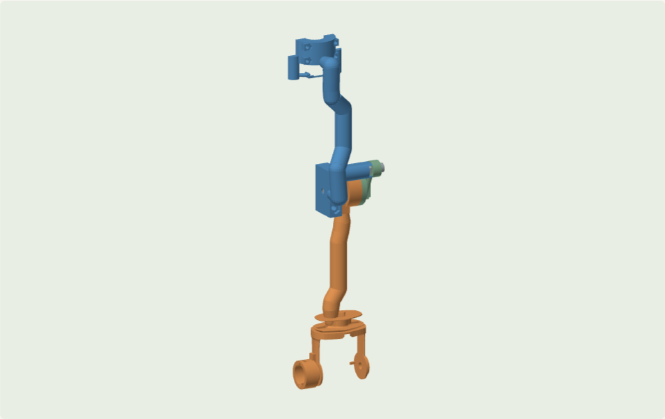

| 取件位置 | 名称 / 原始键 | 本步用途 / 状态 |
| --- | --- | --- |
| 盘 A09-01 · X080（骨架／右髋／大腿） | `frame/thigh_r` | 已在 S22 取用，直接使用已装骨架。一体骨架；已包含 右髋／大腿/D_固定半壳、右膝／小腿屈伸/固定侧关节座 |
| 盘 A10-01 · W006（骨架／右膝／小腿） | `frame/calf_r` | 本步新取。一体骨架；已包含 右踝／脚掌/上叉、右膝／小腿屈伸/旋转侧叉耳 |
| 盘 A09-12 · X033（右膝／小腿屈伸/传感板托夹） | `calf_r.flex/sensor_cassette` | 本步新取。固定传感 PCB；先滑入板，再装到关节 |
| 盘 A09-14 · N004（右膝／小腿屈伸/侧装磁铁座盖） | `calf_r.flex/magnet_cartridge` | 本步新取。侧面装入并粘固磁铁；旋转侧用 2 枚 M2×5 固定 |

| 五金 / 磁铁 | 本步数量 | 位置 |
| --- | --- | --- |
| M4大平垫圈：外径12、厚1 mm，实物能自由套过Φ4光杆 | 2 | 旋转叉耳两侧，每个支点 2 片 |
| A8不锈钢碟簧：8×4.2×0.4，自由高0.6 mm | 2 | 每个轴肩支点 2 片，相对安装 |
| M4普通平垫圈：外径9、厚0.8 mm，实物通孔验证 | 1 | 螺钉头下、碟簧外侧，每个支点 1 片 |
| 轴肩螺钉 Φ4×8 / M3×0.5，螺纹长6 mm；头Φ7×3，内六角3 mm | 1 | 轴肩摩擦支点，铰链 1 处 / 十字核心 4 处 |
| M3普通六角螺母（不要锁紧螺母替代外形） | 2 | 轴肩捕获窝、板托夹固定点，以及有 P/D 端轴时的摩擦调节槽 |
| M3大平垫圈：外径9、厚0.8 mm，实物通孔验证 | 1 | 固定座内侧，每个支点 1 片反力垫 |
| M3×8 内六角圆柱头螺钉；按CAD头径/头高核对 | 1 | 每只传感板托夹 1 枚；每个 P/D 摩擦块调节 1 枚 |
| M2普通六角螺母（不要锁紧螺母替代外形） | 2 | 本步各 M2 螺钉对应捕获窝，一螺钉配一螺母 |
| M2×5 内六角圆柱头螺钉；按CAD头径/头高核对 | 2 | N003 / N004 侧装磁铁座盖，每个 2 枚 |
| 径向两极磁铁 Φ6×2.5 mm；直径方向充磁，不能买轴向充磁 | 1 | 本步每个实测轴 1 颗，位于对应磁铁座 / 端盖 |

1. 将 盘 A09-01 · X080（骨架／右髋／大腿） 的固定关节座与 盘 A10-01 · W006（骨架／右膝／小腿） 的旋转叉耳摆到图示连接位置。侧槽尚未被挡住时，预装 1 枚 M3 螺母与 1 片 M3 反力垫。
2. 按 [G5 一体铰链](#G5) 和 [G1 轴肩层次](#G1) 装 1 套轴肩结构。单个支点为 1 枚轴肩螺钉、2 片 M4 大垫、2 片 A8 碟簧、1 片 M4 普通垫，外加刚才放入的螺母和反力垫。
3. 调整摩擦后，按 [G4](#G4) 给 盘 A09-14 · N004（右膝／小腿屈伸/侧装磁铁座盖） 装 1 颗磁铁，固化后用 2 枚 M2×5 + 2 枚 M2 螺母固定到旋转侧。
4. 把下表所列传感板装入 盘 A09-12 · X033（右膝／小腿屈伸/传感板托夹），再用 1 枚 M3×8 + 1 枚 M3 螺母固定到固定侧。传感器与磁铁相对，不能把两者都固定到同一旋转骨段。
5. 局部慢慢活动，确认每一相邻活动面不挤压垫片、PCB 和线束。按需要的手感调保持力即可；当前可用行程由实物相邻件与线束决定，软件 raw_limits 不是要求你硬拧到的机械行程。

| 电路端口 / 中央板位号 | 测量轴 | 传感板装在 | 对应磁铁装在 | 每根线建议长度 |
| --- | --- | --- | --- | --- |
| 端口 C13 / J54 | `calf_r.flex/r0` | 盘 A09-12 · X033（右膝／小腿屈伸/传感板托夹） | 盘 A09-14 · N004（右膝／小腿屈伸/侧装磁铁座盖） | 525 mm × 5 根，首件后定长 |

本步完成检查：C13 标签对应正确；磁铁不相对载体打滑；转轴可手动摆动并保持；线先松放到背盒方向，留待走线章节统一固定。

<a id="S24"></a>

### S24 · 右踝／脚掌

连接 **盘 A10-01 · W006（骨架／右膝／小腿） → 盘 A10-08 · W017（骨架／右踝／脚掌）**。本步需打开打印盘：A09、A10。


| 取件位置 | 名称 / 原始键 | 本步用途 / 状态 |
| --- | --- | --- |
| 盘 A10-01 · W006（骨架／右膝／小腿） | `frame/calf_r` | 已在 S23 取用，直接使用已装骨架。一体骨架；已包含 右踝／脚掌/上叉、右膝／小腿屈伸/旋转侧叉耳 |
| 盘 A10-08 · W017（骨架／右踝／脚掌） | `frame/foot_r` | 本步新取。一体骨架；已包含 右踝／脚掌/下叉、右脚趾屈伸/固定侧关节座 |
| 盘 A09-10 · X017（右踝／脚掌/下叉_传感板托夹） | `foot_r/C01_sensor_cassette` | 本步新取。固定传感 PCB；先滑入板，再装到关节 |
| 盘 A09-11 · X018（右踝／脚掌/上叉_传感板托夹） | `foot_r/C02_sensor_cassette` | 本步新取。固定传感 PCB；先滑入板，再装到关节 |
| 盘 A09-20 · N003（右踝／脚掌/下叉_侧装磁铁座盖） | `foot_r/C01_magnet_cartridge` | 本步新取。侧面装入并粘固磁铁；旋转侧用 2 枚 M2×5 固定 |
| 盘 A09-21 · N003（右踝／脚掌/上叉_侧装磁铁座盖） | `foot_r/C02_magnet_cartridge` | 本步新取。侧面装入并粘固磁铁；旋转侧用 2 枚 M2×5 固定 |
| 盘 A10-04 · P130（右踝／脚掌/下环） | `foot_r/C14` | 本步新取。十字关节下环；先装内部螺母和 M3 反力垫 |
| 盘 A10-10 · P131（右踝／脚掌/上环盖） | `foot_r/C15` | 本步新取。十字关节上环盖；4 枚 M1.6×6 合环 |

| 五金 / 磁铁 | 本步数量 | 位置 |
| --- | --- | --- |
| M4大平垫圈：外径12、厚1 mm，实物能自由套过Φ4光杆 | 8 | 旋转叉耳两侧，每个支点 2 片 |
| A8不锈钢碟簧：8×4.2×0.4，自由高0.6 mm | 8 | 每个轴肩支点 2 片，相对安装 |
| M4普通平垫圈：外径9、厚0.8 mm，实物通孔验证 | 4 | 螺钉头下、碟簧外侧，每个支点 1 片 |
| 轴肩螺钉 Φ4×8 / M3×0.5，螺纹长6 mm；头Φ7×3，内六角3 mm | 4 | 轴肩摩擦支点，铰链 1 处 / 十字核心 4 处 |
| M3普通六角螺母（不要锁紧螺母替代外形） | 6 | 轴肩捕获窝、板托夹固定点，以及有 P/D 端轴时的摩擦调节槽 |
| M3大平垫圈：外径9、厚0.8 mm，实物通孔验证 | 4 | 固定座内侧，每个支点 1 片反力垫 |
| M1.6×6 内六角圆柱头螺钉；按CAD头径/头高核对 | 4 | C14 / C15 合环 |
| M1.6普通六角螺母（不要锁紧螺母替代外形） | 4 | C14 / C15 合环螺钉对应捕获窝 |
| M2普通六角螺母（不要锁紧螺母替代外形） | 4 | 本步各 M2 螺钉对应捕获窝，一螺钉配一螺母 |
| M2×5 内六角圆柱头螺钉；按CAD头径/头高核对 | 4 | N003 / N004 侧装磁铁座盖，每个 2 枚 |
| 径向两极磁铁 Φ6×2.5 mm；直径方向充磁，不能买轴向充磁 | 2 | 本步每个实测轴 1 颗，位于对应磁铁座 / 端盖 |
| M3×8 内六角圆柱头螺钉；按CAD头径/头高核对 | 2 | 每只传感板托夹 1 枚；每个 P/D 摩擦块调节 1 枚 |

1. 取 盘 A10-04 · P130（右踝／脚掌/下环）、盘 A10-10 · P131（右踝／脚掌/上环盖）。两叉分别是 盘 A10-08 · W017（骨架／右踝／脚掌） 的 C01 部位、盘 A10-01 · W006（骨架／右膝／小腿） 的 C02 部位；已经连在骨架上的叉不要拆分或另找重复打印件。
2. 按 [G2](#G2) 先预装 4 枚 M3 螺母与 4 片 M3 反力垫，把两叉交叉放入环，再按 G1 装四套轴肩结构；随后用 4 枚 M1.6×6 + 4 枚 M1.6 螺母合环。
3. C01 测量端按 [G4](#G4)：盘 A09-20 · N003（右踝／脚掌/下叉_侧装磁铁座盖） 内放 1 颗磁铁，用 2 枚 M2×5 + 2 枚 M2 螺母固定到叉臂端；盘 A09-10 · X017（右踝／脚掌/下叉_传感板托夹） 先滑入传感板，再用 M3×8 + M3 螺母固定。
4. C02 测量端按 [G4](#G4)：盘 A09-21 · N003（右踝／脚掌/上叉_侧装磁铁座盖） 内放 1 颗磁铁，用 2 枚 M2×5 + 2 枚 M2 螺母固定到叉臂端；盘 A09-11 · X018（右踝／脚掌/上叉_传感板托夹） 先滑入传感板，再用 M3×8 + M3 螺母固定。
5. 局部慢慢活动，确认每一相邻活动面不挤压垫片、PCB 和线束。按需要的手感调保持力即可；当前可用行程由实物相邻件与线束决定，软件 raw_limits 不是要求你硬拧到的机械行程。

| 电路端口 / 中央板位号 | 测量轴 | 传感板装在 | 对应磁铁装在 | 每根线建议长度 |
| --- | --- | --- | --- | --- |
| 端口 C14 / J55 | `foot_r/r0` | 盘 A09-10 · X017（右踝／脚掌/下叉_传感板托夹） | 盘 A09-20 · N003（右踝／脚掌/下叉_侧装磁铁座盖） | 700 mm × 5 根，首件后定长 |
| 端口 C15 / J56 | `foot_r/r1` | 盘 A09-11 · X018（右踝／脚掌/上叉_传感板托夹） | 盘 A09-21 · N003（右踝／脚掌/上叉_侧装磁铁座盖） | 700 mm × 5 根，首件后定长 |

本步完成检查：C14、C15 标签对应正确；磁铁不相对载体打滑；转轴可手动摆动并保持；线先松放到背盒方向，留待走线章节统一固定。

<a id="S25"></a>

### S25 · 右脚趾屈伸

连接 **盘 A10-08 · W017（骨架／右踝／脚掌） → 盘 A10-06 · W001（骨架／右脚趾）**。本步需打开打印盘：A09、A10。

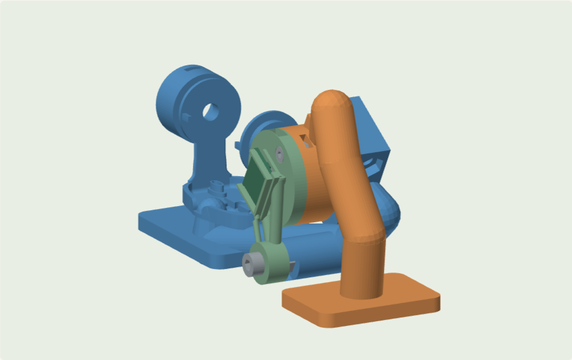

| 取件位置 | 名称 / 原始键 | 本步用途 / 状态 |
| --- | --- | --- |
| 盘 A10-08 · W017（骨架／右踝／脚掌） | `frame/foot_r` | 已在 S24 取用，直接使用已装骨架。一体骨架；已包含 右踝／脚掌/下叉、右脚趾屈伸/固定侧关节座 |
| 盘 A10-06 · W001（骨架／右脚趾） | `frame/ball_r` | 本步新取。一体骨架；已包含 右脚趾屈伸/旋转侧叉耳 |
| 盘 A09-13 · X034（右脚趾屈伸/传感板托夹） | `ball_r.flex/sensor_cassette` | 本步新取。固定传感 PCB；先滑入板，再装到关节 |
| 盘 A09-15 · N004（右脚趾屈伸/侧装磁铁座盖） | `ball_r.flex/magnet_cartridge` | 本步新取。侧面装入并粘固磁铁；旋转侧用 2 枚 M2×5 固定 |

| 五金 / 磁铁 | 本步数量 | 位置 |
| --- | --- | --- |
| M4大平垫圈：外径12、厚1 mm，实物能自由套过Φ4光杆 | 2 | 旋转叉耳两侧，每个支点 2 片 |
| A8不锈钢碟簧：8×4.2×0.4，自由高0.6 mm | 2 | 每个轴肩支点 2 片，相对安装 |
| M4普通平垫圈：外径9、厚0.8 mm，实物通孔验证 | 1 | 螺钉头下、碟簧外侧，每个支点 1 片 |
| 轴肩螺钉 Φ4×8 / M3×0.5，螺纹长6 mm；头Φ7×3，内六角3 mm | 1 | 轴肩摩擦支点，铰链 1 处 / 十字核心 4 处 |
| M3普通六角螺母（不要锁紧螺母替代外形） | 2 | 轴肩捕获窝、板托夹固定点，以及有 P/D 端轴时的摩擦调节槽 |
| M3大平垫圈：外径9、厚0.8 mm，实物通孔验证 | 1 | 固定座内侧，每个支点 1 片反力垫 |
| M3×8 内六角圆柱头螺钉；按CAD头径/头高核对 | 1 | 每只传感板托夹 1 枚；每个 P/D 摩擦块调节 1 枚 |
| M2普通六角螺母（不要锁紧螺母替代外形） | 2 | 本步各 M2 螺钉对应捕获窝，一螺钉配一螺母 |
| M2×5 内六角圆柱头螺钉；按CAD头径/头高核对 | 2 | N003 / N004 侧装磁铁座盖，每个 2 枚 |
| 径向两极磁铁 Φ6×2.5 mm；直径方向充磁，不能买轴向充磁 | 1 | 本步每个实测轴 1 颗，位于对应磁铁座 / 端盖 |

1. 将 盘 A10-08 · W017（骨架／右踝／脚掌） 的固定关节座与 盘 A10-06 · W001（骨架／右脚趾） 的旋转叉耳摆到图示连接位置。侧槽尚未被挡住时，预装 1 枚 M3 螺母与 1 片 M3 反力垫。
2. 按 [G5 一体铰链](#G5) 和 [G1 轴肩层次](#G1) 装 1 套轴肩结构。单个支点为 1 枚轴肩螺钉、2 片 M4 大垫、2 片 A8 碟簧、1 片 M4 普通垫，外加刚才放入的螺母和反力垫。
3. 调整摩擦后，按 [G4](#G4) 给 盘 A09-15 · N004（右脚趾屈伸/侧装磁铁座盖） 装 1 颗磁铁，固化后用 2 枚 M2×5 + 2 枚 M2 螺母固定到旋转侧。
4. 把下表所列传感板装入 盘 A09-13 · X034（右脚趾屈伸/传感板托夹），再用 1 枚 M3×8 + 1 枚 M3 螺母固定到固定侧。传感器与磁铁相对，不能把两者都固定到同一旋转骨段。
5. 局部慢慢活动，确认每一相邻活动面不挤压垫片、PCB 和线束。按需要的手感调保持力即可；当前可用行程由实物相邻件与线束决定，软件 raw_limits 不是要求你硬拧到的机械行程。

| 电路端口 / 中央板位号 | 测量轴 | 传感板装在 | 对应磁铁装在 | 每根线建议长度 |
| --- | --- | --- | --- | --- |
| 端口 C16 / J57 | `ball_r.flex/r0` | 盘 A09-13 · X034（右脚趾屈伸/传感板托夹） | 盘 A09-15 · N004（右脚趾屈伸/侧装磁铁座盖） | 725 mm × 5 根，首件后定长 |

本步完成检查：C16 标签对应正确；磁铁不相对载体打滑；转轴可手动摆动并保持；线先松放到背盒方向，留待走线章节统一固定。

<a id="electronics"></a>

## 05 · 电路、中央板与背盒

以下区分“交给工厂做的电路”和“你总装时需要做的插接”。整机没有电机，也不需要电池、摄像头或旧版 AS5048A 串链排线。传感板各自五线返回中央板。

| 要准备的东西 | 数量 / 规格 | 交付与装配要求 |
| --- | --- | --- |
| MT6701 传感成品板 | 46 使用 + 2 完整备件；12×10×1 mm；SOP8 | 裸板报价口径 50 张、装 48 张；芯片 50 颗含 2 颗加工损耗，不是多装 50 路。板端五线由工厂焊好并标号。 |
| 中央采集成品板 | 1 块；80×94×1.6 mm、四层 | 裸板最小订单按 5 张核价，只装 1 张。使用最终 O22 PCB 与 BOM，不用 placement / route_input 中间板。 |
| XIAO ESP32S3 普通版 | 1 块；两排各 7 针、中心距 15.24 mm | 中央板顶面到 XIAO PCB 底面 4.0 mm，由工厂用盘 A03-09 P242 量规定位焊接后取出。 |
| 中央板传感插座 | 46 个 BM05B-SRSS-TB；SH 1.0 mm 5P 顶插 | 由工厂贴在中央板上；已经计入 PCBA，不再购买另一套。 |
| 线端塑壳 / 压接端子 | 48 个 SHR-05V-S + 240 个 SSH-003T-P0.2-H | 对应 46 套使用线 + 2 套完整备用线；可另留 2 塑壳 / 20 端子作为加工损耗。传感 PCB 端直接焊线，没有第二套插座。 |
| 五色柔性线 | 单根 AWG30 铜线，外径 0.4–0.7 mm | 每色 22.75 m 实装，加两套 750 mm 备件为 24.25 m；再加 10% 下料损耗约 26.68 m/色，五色约 133.38 m。下料表见下一节。 |
| 外部稳压电源与输入尾线 | 5V / 2A 电源 1 个；PH 2P 线端 1 套 | J3 为 PH 2.0 mm，不是传感 SH 1.0 mm。线端 PHR-2 + 2 枚 SPH-002T-P0.5S；可用符合端子绝缘尺寸的 AWG24 柔线。适配器端按实际插头定做，工厂标明正负与导通。 |
| USB 数据线 | 1 根，接 XIAO USB-C | 必须支持数据。线长按桌面布置，插头外形须通过背盒 USB 开口。 |
| 2.5 mm 扎带 | 65 根净用，建议另备 10 根 | 用于局部应力释放、沿骨架分束及背盖；不绕过旋转缝把两骨段锁在一起。 |
| 磁铁固持胶 / 电子固线胶 | 按实际小包装准备 | 磁铁侧壁非导电防转胶；板线出口用可返修、中性柔性电子胶。工厂固线已计入工序时不重复收费。 |

连接器系列与端子依据 [JST SH 官方图纸](https://www.jst-mfg.com/product/pdf/eng/eSH.pdf) 和 [JST PH 官方图纸](https://www.jst-mfg.com/product/pdf/eng/ePH.pdf)。输入尾线列在这里是为了把 J3 的配对件补充说明清楚，不是新增一块电路。实际总价仍按完整询价核算。

<a id="factory"></a>

### 工厂贴片与焊线：使用这些文件

- [完整电子 BOM](../../bench/revO22/manufacturing/electronic_bom.tsv) 与 [首件加工要求](../../bench/revO22/manufacturing/RFQ.zh-CN.md) 一起给工厂；Gerber、钻孔与坐标文件在 [已保存工程包](../../bench/revO22/PoseDoll_O22_Engineering_Package.zip) 的 manufacturing 目录。
- 传感板每块：U1=MT6701CT-STD-R，C1=100nF X7R 16V 0603，C2=1µF X7R 16V 0603，R1=33Ω 0603 串联 DO，R2=10kΩ 0603 上拉。J1 是五个焊线焊盘，不是另购连接器。芯片脚 1/2 接供电，4 接地，6 为 DO，7 为 CLK，8 为 CSN；按封装圆点与 PCB pin 1 对齐，3/5 不接。
- 中央板主要有 U1/U2=SN74LVC244APWR，U3–U5=CD74HC4067PW，U6=SN74LVC125APWR，Q1=2N7002；由缓冲器、三组 16:1 选通和 MCU 侧电平接口完成采集，不把传感器 DO 直接跨接到 XIAO。
- 供电链为 J3 → F4 输入保护 → D1 SS14 → U7 AP3429AW5-7 + L1 2.2µH → F5 → SENSOR_3V45。F4=1206L110THR；F5=0467001.NR 1A 快断保险丝，不任意换成 PTC。
- 反馈 R50=316kΩ、R51=66.5kΩ，0.1%、≤25ppm/K，对应标称约 3.451V。C7/C8/C9 虽标称 22µF，仍需工厂返回直流偏压曲线；C7 在 4.1V 下有效容量至少 10µF，C8+C9 在 3.45V 下合计至少 20µF。当前候选料号未因教程编写而变成已实测批准。
- 板端焊线、端子压接、套管 / 柔性胶应力释放、端口双端标签、逐芯导通和无短路检查均由供应方完成。器件加焊料总高度不超过 1.85 mm；胶不得进入板托夹导轨或芯片对磁铁的间隙。

降压器依据 [AP3429 官方数据表](https://www.diodes.com/datasheet/download/AP3429.pdf)。完整逐位号 BOM 在网页附录可展开查看；器件采购和工厂焊接不是用户总装时额外重复购买的散件。

<a id="S26"></a>

### S26 · 安装中央板与 XIAO

本步连接 盘 A02-01 · X046（骨架／胸部）、盘 A01-01 · X081（o22/背盒盖）；盘 A03-09 · P242（工具／XIAO 焊接间距量规） 仅在焊接定位时使用。打印盘 A01 的盖要等 A02 的胸架装好、电路检查完成后再盖；A03 的量规不留在里面。

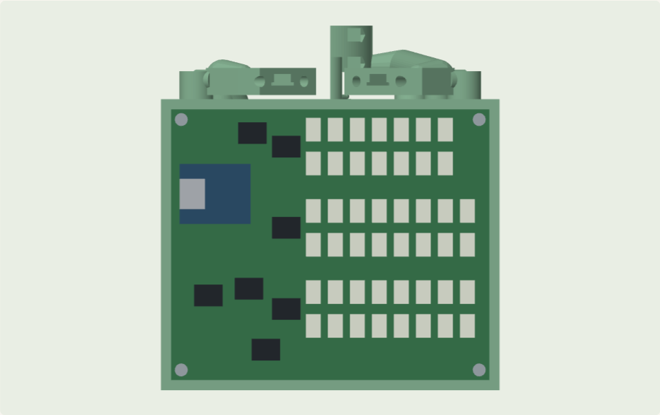

1. 让工厂按中央板焊接位置装 XIAO：USB 端口朝板上边缘，两排针间距 15.24 mm，PCB 之间净距 4.0 mm。插入 P242 量规定位后焊接，冷却并检查焊点，再取出量规。J2.7 的 XIAO 5V 不接传感供电，不能拉跨接线去 J3。
2. 把已完成台面电测的中央板放到胸架背盒四根柱上，旋转整块板使 USB-C 对准背盒专用 USB 开口，元件面朝盒外 / 盖板。四角孔对正后用 **4 枚塑料自攻 M2×6、头径≤4 mm** 交替拧入；不用金属 M2 螺母，也不用普通机牙螺钉强行攻塑料。
3. 从预留进线开口引入各身体分束，先按端口表插上短的躯干线，再接手臂、腿部线。端口多而密，捏塑壳插拔，不拉导线。留出电源、USB 插头和拆盖的维护余量。
4. 背盖先放在一旁。先完成单路、单组、左臂和全部通道检查，再收好余线、装背盖，用两条 2.5 mm 扎带穿现有固定槽固定；这两条计入 65 根，不增加盖板螺钉。盖上后再确认没有压住 U 环或线端。

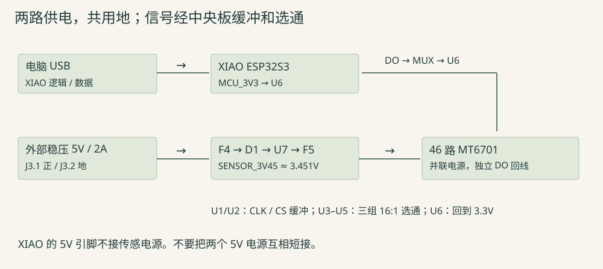

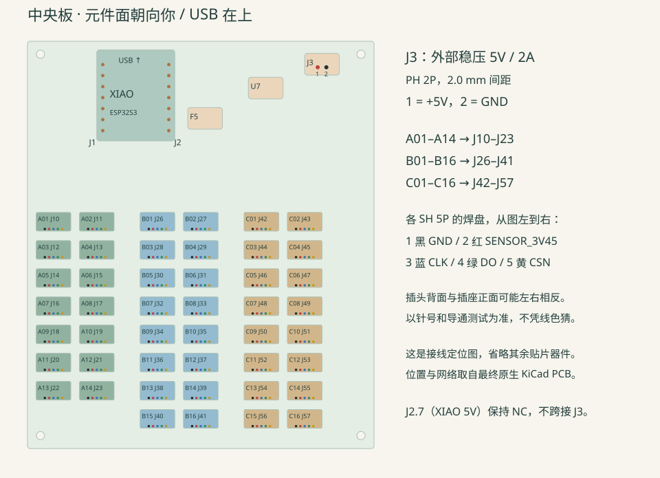

<a id="pinout"></a>

### 五芯线的针序与供电边界

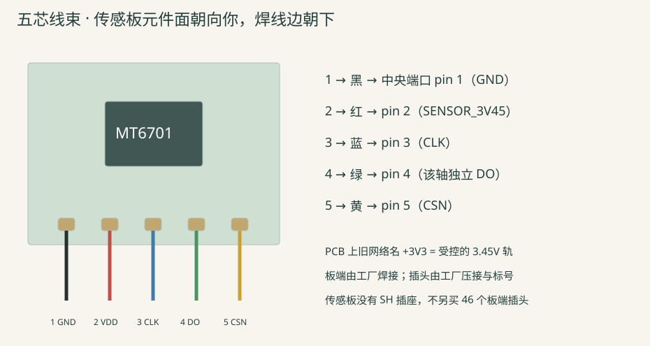

| 针号 | 颜色 | 传感板网络 | 中央板网络 / 功能 |
| --- | --- | --- | --- |
| 1 | 黑 | GND | 共同地 |
| 2 | 红 | +3V3（旧网络名称） | 实际接 SENSOR_3V45，标称约 3.451V |
| 3 | 蓝 | CLK | 本组 SSI 时钟 |
| 4 | 绿 | DO | 该轴独立返回，经对应 MUX 通道选通 |
| 5 | 黄 | CS_N | 本组片选 |

五根线逐根直通同号针，不交叉。板上叫 +3V3 不表示你应外加 3.3V；它由中央板统一受控供电。46 路都是独立回线，DO 不能并在一起，也不是上一块板出线接下一块板的串链。

<a id="xiao"></a>

### XIAO 引脚核对表（供工厂与排错使用）

| 中央板焊盘 | XIAO 引脚 | GPIO / 电源 | 最终板网络 |
| --- | --- | --- | --- |
| J1.1 | D0 | GPIO1 | EN_MCU |
| J1.2 | D1 | GPIO2 | A0_MCU |
| J1.3 | D2 | GPIO3，未用 | NC |
| J1.4 | D3 | GPIO4 | A1_MCU |
| J1.5 | D4 | GPIO5 | A2_MCU |
| J1.6 | D5 | GPIO6 | A3_MCU |
| J1.7 | D6 | GPIO43 | CS_MCU |
| J2.1 | D7 | GPIO44 | DO_C_MCU |
| J2.2 | D8 | GPIO7 | CLK_MCU |
| J2.3 | D9 | GPIO8 | DO_A_MCU |
| J2.4 | D10 | GPIO9 | DO_B_MCU |
| J2.5 | 3V3 | MCU 3.3V | MCU_3V3 |
| J2.6 | GND | 地 | GND |
| J2.7 | 5V | NC，保持不连接 | NC |

引脚命名依据 [Seeed XIAO ESP32S3 官方文档](https://wiki.seeedstudio.com/xiao_esp32s3_getting_started/)。表中的 J1/J2 是中央板位号；不是传感小板的 J1 五线焊盘。两排针方向按最终原生 PCB 核对，不能按左右两排都从上往下编号来猜。

<a id="wiring"></a>

## 06 · 46 路逐根接线与跨关节走线

下面的长度是**每一根**线的下料候选长度，每路需要黑红蓝绿黄各一根。沿用当前 routing_plan 的运动余量；必须先试装确认，不能按旧 wiring.json 的短报价估计裁线。尽量先做 1 根完整的左臂代表线束，再让工厂定批量长度。

1. 线从传感器出口先随所属刚性骨段固定，再跨关节形成 U 环，然后沿表中路径依次走到胸部中央板。支点扎带落在骨架实体上，不能跨旋转接缝。
2. 名义活动环半径 8 mm，装配最小弯曲半径 7 mm（可绕直径 14 mm 的光滑圆棒成形后取下）。线不绷直，也不让多余环卷进齿形止挡、叉耳或垫片。
3. 每动一个关节，看近端和远端线都没有拉动 PCB、压住相邻件或抽紧插头；再调整局部扎带。远处肢体碰撞可以通过姿势规避，但不能借此忽略相邻关节的夹线。
4. 线两端都标“电路端口 + raw_id”，例如“B05 / elbow_l.flex/r0”；打印件另外标“盘 A04-03”。在两个体系都叫 A01 的地方始终保留“盘”或“端口”前缀。

| 端口 / 位号 | 步骤 / 测量轴 | 传感板固定件 | 磁铁固定件 | 五色各一根 | 沿骨架到背盒 |
| --- | --- | --- | --- | --- | --- |
| A01 / J10 | [S01](#S01) 腰部 / `waist/r0` | 盘 A02-11 · X035（腰部/P_板夹_-14） + 盘 A02-10 · X036（腰部/P_板夹_+14） | 盘 A03-10 · P013（腰部/P_磁铁端盖） | 450 mm | 骨盆 → 腰部 → 胸部 |
| A02 / J11 | [S01](#S01) 腰部 / `waist/r1` | 盘 A03-06 · X001（腰部/下叉_传感板托夹） | 盘 A03-12 · N003（腰部/下叉_侧装磁铁座盖） | 450 mm | 腰部 → 骨盆 → 胸部 |
| A03 / J12 | [S01](#S01) 腰部 / `waist/r2` | 盘 A03-08 · X002（腰部/上叉_传感板托夹） | 盘 A03-13 · N003（腰部/上叉_侧装磁铁座盖） | 450 mm | 腰部 → 骨盆 → 胸部 |
| A04 / J13 | [S02](#S02) 胸部 / `chest/r0` | 盘 A02-09 · X039（胸部/P_板夹_-14） + 盘 A02-08 · X040（胸部/P_板夹_+14） | 盘 A03-11 · P029（胸部/P_磁铁端盖） | 450 mm | 腰部 → 骨盆 → 胸部 |
| A05 / J14 | [S02](#S02) 胸部 / `chest/r1` | 盘 A03-07 · X003（胸部/下叉_传感板托夹） | 盘 A03-14 · N003（胸部/下叉_侧装磁铁座盖） | 275 mm | 胸部 |
| A06 / J15 | [S02](#S02) 胸部 / `chest/r2` | 盘 A03-05 · X004（胸部/上叉_传感板托夹） | 盘 A03-15 · N003（胸部/上叉_侧装磁铁座盖） | 275 mm | 胸部 |
| A07 / J16 | [S03](#S03) 头颈 / `head/r0` | 盘 A01-15 · X043（头颈/P_板夹_-14） + 盘 A01-16 · X044（头颈/P_板夹_+14） | 盘 A01-11 · P040（头颈/P_磁铁端盖） | 225 mm | 胸部 |
| A08 / J17 | [S03](#S03) 头颈 / `head/r1` | 盘 A01-09 · X005（头颈/下叉_传感板托夹） | 盘 A01-13 · N003（头颈/下叉_侧装磁铁座盖） | 350 mm | 头颈 → 胸部 |
| A09 / J18 | [S03](#S03) 头颈 / `head/r2` | 盘 A01-10 · X006（头颈/上叉_传感板托夹） | 盘 A01-14 · N003（头颈/上叉_侧装磁铁座盖） | 350 mm | 头颈 → 胸部 |
| A10 / J19 | [S03](#S03) 头颈 / `head/r3` | 盘 A01-17 · X047（头颈/D_板夹_-14） + 盘 A01-18 · X048（头颈/D_板夹_+14） | 盘 A01-12 · P045（头颈/D_磁铁端盖） | 325 mm | 头颈 → 胸部 |
| A11 / J20 | [S04](#S04) 左锁骨前后 / `clavicle_l.protract/r0` | 盘 A05-22 · X019（左锁骨前后/传感板托夹） | 盘 A05-19 · N004（左锁骨前后/侧装磁铁座盖） | 200 mm | 胸部 |
| A12 / J21 | [S05](#S05) 左锁骨升降 / `clavicle_l.elevate/r0` | 盘 A05-10 · X020（左锁骨升降/传感板托夹） | 盘 A05-05 · N004（左锁骨升降/侧装磁铁座盖） | 325 mm | 左锁骨前后中间架 → 胸部 |
| A13 / J22 | [S11](#S11) 右锁骨前后 / `clavicle_r.protract/r0` | 盘 A07-02 · X027（右锁骨前后/传感板托夹） | 盘 A07-08 · N004（右锁骨前后/侧装磁铁座盖） | 200 mm | 胸部 |
| A14 / J23 | [S12](#S12) 右锁骨升降 / `clavicle_r.elevate/r0` | 盘 A06-12 · X028（右锁骨升降/传感板托夹） | 盘 A07-11 · N004（右锁骨升降/侧装磁铁座盖） | 275 mm | 右锁骨前后中间架 → 胸部 |
| B01 / J26 | [S06](#S06) 左肩／上臂 / `upperarm_l/r0` | 盘 A04-06 · X051（左肩／上臂/P_板夹_-14） + 盘 A04-09 · X052（左肩／上臂/P_板夹_+14） | 盘 A05-24 · P062（左肩／上臂/P_磁铁端盖） | 375 mm | 左锁骨 → 左锁骨前后中间架 → 胸部 |
| B02 / J27 | [S06](#S06) 左肩／上臂 / `upperarm_l/r1` | 盘 A05-07 · X007（左肩／上臂/下叉_传感板托夹） | 盘 A05-25 · N003（左肩／上臂/下叉_侧装磁铁座盖） | 550 mm | 左肩／上臂 → 左锁骨 → 左锁骨前后中间架 → 胸部 |
| B03 / J28 | [S06](#S06) 左肩／上臂 / `upperarm_l/r2` | 盘 A05-06 · X008（左肩／上臂/上叉_传感板托夹） | 盘 A05-26 · N003（左肩／上臂/上叉_侧装磁铁座盖） | 500 mm | 左肩／上臂 → 左锁骨 → 左锁骨前后中间架 → 胸部 |
| B04 / J29 | [S06](#S06) 左肩／上臂 / `upperarm_l/r3` | 盘 A04-08 · X055（左肩／上臂/D_板夹_-14） + 盘 A04-07 · X056（左肩／上臂/D_板夹_+14） | 盘 A05-23 · P067（左肩／上臂/D_磁铁端盖） | 475 mm | 左肩／上臂 → 左锁骨 → 左锁骨前后中间架 → 胸部 |
| B05 / J30 | [S07](#S07) 左肘屈伸 / `elbow_l.flex/r0` | 盘 A05-18 · X021（左肘屈伸/传感板托夹） | 盘 A05-20 · N004（左肘屈伸/侧装磁铁座盖） | 500 mm | 左肩／上臂 → 左锁骨 → 左锁骨前后中间架 → 胸部 |
| B06 / J31 | [S08](#S08) 左前臂扭转 / `forearm_l.twist/r0` | 盘 A05-13 · X022（左前臂扭转/传感板托夹） | 盘 A05-12 · N004（左前臂扭转/侧装磁铁座盖） | 550 mm | 左肘 → 左肩／上臂 → 左锁骨 → 左锁骨前后中间架 → 胸部 |
| B07 / J32 | [S09](#S09) 左手腕屈伸 / `hand_l.flex/r0` | 盘 A05-21 · X023（左手腕屈伸/传感板托夹） | 盘 A05-17 · N004（左手腕屈伸/侧装磁铁座盖） | 625 mm | 左前臂 → 左肘 → 左肩／上臂 → 左锁骨 → 左锁骨前后中间架 → 胸部 |
| B08 / J33 | [S10](#S10) 左手腕侧摆 / `hand_l.deviate/r0` | 盘 A05-15 · X024（左手腕侧摆/传感板托夹） | 盘 A05-11 · N004（左手腕侧摆/侧装磁铁座盖） | 675 mm | 左腕屈伸中间架 → 左前臂 → 左肘 → 左肩／上臂 → 左锁骨 → 左锁骨前后中间架 → 胸部 |
| B09 / J34 | [S13](#S13) 右肩／上臂 / `upperarm_r/r0` | 盘 A07-19 · X059（右肩／上臂/P_板夹_-14） + 盘 A07-21 · X060（右肩／上臂/P_板夹_+14） | 盘 A07-13 · P084（右肩／上臂/P_磁铁端盖） | 350 mm | 右锁骨 → 右锁骨前后中间架 → 胸部 |
| B10 / J35 | [S13](#S13) 右肩／上臂 / `upperarm_r/r1` | 盘 A06-13 · X009（右肩／上臂/下叉_传感板托夹） | 盘 A07-16 · N003（右肩／上臂/下叉_侧装磁铁座盖） | 550 mm | 右肩／上臂 → 右锁骨 → 右锁骨前后中间架 → 胸部 |
| B11 / J36 | [S13](#S13) 右肩／上臂 / `upperarm_r/r2` | 盘 A07-05 · X010（右肩／上臂/上叉_传感板托夹） | 盘 A07-17 · N003（右肩／上臂/上叉_侧装磁铁座盖） | 525 mm | 右肩／上臂 → 右锁骨 → 右锁骨前后中间架 → 胸部 |
| B12 / J37 | [S13](#S13) 右肩／上臂 / `upperarm_r/r3` | 盘 A07-18 · X063（右肩／上臂/D_板夹_-14） + 盘 A07-20 · X064（右肩／上臂/D_板夹_+14） | 盘 A07-15 · P089（右肩／上臂/D_磁铁端盖） | 500 mm | 右肩／上臂 → 右锁骨 → 右锁骨前后中间架 → 胸部 |
| B13 / J38 | [S14](#S14) 右肘屈伸 / `elbow_r.flex/r0` | 盘 A07-03 · X029（右肘屈伸/传感板托夹） | 盘 A07-06 · N004（右肘屈伸/侧装磁铁座盖） | 500 mm | 右肩／上臂 → 右锁骨 → 右锁骨前后中间架 → 胸部 |
| B14 / J39 | [S15](#S15) 右前臂扭转 / `forearm_r.twist/r0` | 盘 A06-11 · X030（右前臂扭转/传感板托夹） | 盘 A07-04 · N004（右前臂扭转/侧装磁铁座盖） | 550 mm | 右肘 → 右肩／上臂 → 右锁骨 → 右锁骨前后中间架 → 胸部 |
| B15 / J40 | [S16](#S16) 右手腕屈伸 / `hand_r.flex/r0` | 盘 A06-14 · X031（右手腕屈伸/传感板托夹） | 盘 A07-10 · N004（右手腕屈伸/侧装磁铁座盖） | 625 mm | 右前臂 → 右肘 → 右肩／上臂 → 右锁骨 → 右锁骨前后中间架 → 胸部 |
| B16 / J41 | [S17](#S17) 右手腕侧摆 / `hand_r.deviate/r0` | 盘 A06-10 · X032（右手腕侧摆/传感板托夹） | 盘 A07-12 · N004（右手腕侧摆/侧装磁铁座盖） | 675 mm | 右腕屈伸中间架 → 右前臂 → 右肘 → 右肩／上臂 → 右锁骨 → 右锁骨前后中间架 → 胸部 |
| C01 / J42 | [S18](#S18) 左髋／大腿 / `thigh_l/r0` | 盘 A08-23 · X067（左髋／大腿/P_板夹_-14） + 盘 A08-22 · X068（左髋／大腿/P_板夹_+14） | 盘 A08-16 · P106（左髋／大腿/P_磁铁端盖） | 425 mm | 骨盆 → 腰部 → 胸部 |
| C02 / J43 | [S18](#S18) 左髋／大腿 / `thigh_l/r1` | 盘 A08-12 · X011（左髋／大腿/下叉_传感板托夹） | 盘 A08-18 · N003（左髋／大腿/下叉_侧装磁铁座盖） | 625 mm | 左髋／大腿 → 骨盆 → 腰部 → 胸部 |
| C03 / J44 | [S18](#S18) 左髋／大腿 / `thigh_l/r2` | 盘 A08-08 · X012（左髋／大腿/上叉_传感板托夹） | 盘 A08-19 · N003（左髋／大腿/上叉_侧装磁铁座盖） | 575 mm | 左髋／大腿 → 骨盆 → 腰部 → 胸部 |
| C04 / J45 | [S18](#S18) 左髋／大腿 / `thigh_l/r3` | 盘 A08-25 · X070（左髋／大腿/D_板夹_-14） + 盘 A08-24 · X071（左髋／大腿/D_板夹_+14） | 盘 A08-17 · P111（左髋／大腿/D_磁铁端盖） | 550 mm | 左髋／大腿 → 骨盆 → 腰部 → 胸部 |
| C05 / J46 | [S19](#S19) 左膝／小腿屈伸 / `calf_l.flex/r0` | 盘 A08-10 · X025（左膝／小腿屈伸/传感板托夹） | 盘 A08-14 · N004（左膝／小腿屈伸/侧装磁铁座盖） | 525 mm | 左髋／大腿 → 骨盆 → 腰部 → 胸部 |
| C06 / J47 | [S20](#S20) 左踝／脚掌 / `foot_l/r0` | 盘 A08-11 · X015（左踝／脚掌/下叉_传感板托夹） | 盘 A08-20 · N003（左踝／脚掌/下叉_侧装磁铁座盖） | 725 mm | 左踝／脚掌 → 左膝／小腿 → 左髋／大腿 → 骨盆 → 腰部 → 胸部 |
| C07 / J48 | [S20](#S20) 左踝／脚掌 / `foot_l/r1` | 盘 A08-09 · X016（左踝／脚掌/上叉_传感板托夹） | 盘 A08-21 · N003（左踝／脚掌/上叉_侧装磁铁座盖） | 725 mm | 左踝／脚掌 → 左膝／小腿 → 左髋／大腿 → 骨盆 → 腰部 → 胸部 |
| C08 / J49 | [S21](#S21) 左脚趾屈伸 / `ball_l.flex/r0` | 盘 A08-13 · X026（左脚趾屈伸/传感板托夹） | 盘 A08-15 · N004（左脚趾屈伸/侧装磁铁座盖） | 750 mm | 左踝／脚掌 → 左膝／小腿 → 左髋／大腿 → 骨盆 → 腰部 → 胸部 |
| C09 / J50 | [S22](#S22) 右髋／大腿 / `thigh_r/r0` | 盘 A09-22 · X074（右髋／大腿/P_板夹_-14） + 盘 A09-23 · X075（右髋／大腿/P_板夹_+14） | 盘 A09-16 · P013（右髋／大腿/P_磁铁端盖） | 400 mm | 骨盆 → 腰部 → 胸部 |
| C10 / J51 | [S22](#S22) 右髋／大腿 / `thigh_r/r1` | 盘 A09-08 · X013（右髋／大腿/下叉_传感板托夹） | 盘 A09-18 · N003（右髋／大腿/下叉_侧装磁铁座盖） | 600 mm | 右髋／大腿 → 骨盆 → 腰部 → 胸部 |
| C11 / J52 | [S22](#S22) 右髋／大腿 / `thigh_r/r2` | 盘 A09-09 · X014（右髋／大腿/上叉_传感板托夹） | 盘 A09-19 · N003（右髋／大腿/上叉_侧装磁铁座盖） | 550 mm | 右髋／大腿 → 骨盆 → 腰部 → 胸部 |
| C12 / J53 | [S22](#S22) 右髋／大腿 / `thigh_r/r3` | 盘 A09-24 · X077（右髋／大腿/D_板夹_-14） + 盘 A09-25 · X078（右髋／大腿/D_板夹_+14） | 盘 A09-17 · P126（右髋／大腿/D_磁铁端盖） | 525 mm | 右髋／大腿 → 骨盆 → 腰部 → 胸部 |
| C13 / J54 | [S23](#S23) 右膝／小腿屈伸 / `calf_r.flex/r0` | 盘 A09-12 · X033（右膝／小腿屈伸/传感板托夹） | 盘 A09-14 · N004（右膝／小腿屈伸/侧装磁铁座盖） | 525 mm | 右髋／大腿 → 骨盆 → 腰部 → 胸部 |
| C14 / J55 | [S24](#S24) 右踝／脚掌 / `foot_r/r0` | 盘 A09-10 · X017（右踝／脚掌/下叉_传感板托夹） | 盘 A09-20 · N003（右踝／脚掌/下叉_侧装磁铁座盖） | 700 mm | 右踝／脚掌 → 右膝／小腿 → 右髋／大腿 → 骨盆 → 腰部 → 胸部 |
| C15 / J56 | [S24](#S24) 右踝／脚掌 / `foot_r/r1` | 盘 A09-11 · X018（右踝／脚掌/上叉_传感板托夹） | 盘 A09-21 · N003（右踝／脚掌/上叉_侧装磁铁座盖） | 700 mm | 右踝／脚掌 → 右膝／小腿 → 右髋／大腿 → 骨盆 → 腰部 → 胸部 |
| C16 / J57 | [S25](#S25) 右脚趾屈伸 / `ball_r.flex/r0` | 盘 A09-13 · X034（右脚趾屈伸/传感板托夹） | 盘 A09-15 · N004（右脚趾屈伸/侧装磁铁座盖） | 725 mm | 右踝／脚掌 → 右膝／小腿 → 右髋／大腿 → 骨盆 → 腰部 → 胸部 |

A 组只使用 A01–A14（J10–J23）；B、C 组各 16 路。没有需要补装的 A15 / A16，J24 / J25 不在本版 46 个传感插座中。对应路径的三维坐标和余量记录见 [当前线束规划](../../bench/revO22/harness/routing_plan.json)。

<a id="power"></a>

## 07 · 分段上电、固件与装配检查

先在台面检查中央板与一只传感器，再在关节上检查，最后才连接全部 46 路。插拔、改线和测导通时先断开 USB 与外部 5V。正常串口收到的是二进制帧，不会连续打印可读角度。

| 阶段 | 操作 | 通过标准 / 异常时处理 |
| --- | --- | --- |
| 断电检查 | 核对 J3 的 1 脚 +5V / 2 脚 GND；XIAO 5V 不接 J3；每根五线对号导通 | 万用表查错接、邻针短接及焊点。电容充电可能让蜂鸣器短暂响，不能只凭一次蜂鸣判定短路或通过。 |
| 中央板空载 | 先不插传感器；供应方以受控电源完成电源首件；再分别接 USB 与外部 5V | 确认 MCU_3V3 与 SENSOR_3V45 是不同电压域，后者约 3.451V；没有异常发热、反向送电。 |
| 单路传感器 | 断电后接 A01 / J10，安装或对准磁铁；上电读取原始诊断 | 只要求所装这一轴有有效 SSI 帧、CRC 正确、状态正常，缓慢转磁铁时未标定角度连续变化。其他 45 路未装会无效，这是预期的。 |
| 一组满载 | 先 B01–B16 或 C01–C16 接齐做 16 路检查，A 组只有 14 路 | 核对每路端口，不把共享 CLK / CS 误认为 DO 也能并联。采样稳定，转一轴只影响该轴的相对测量。 |
| 左臂样段 | 接 A11 / A12 + B01–B08，共 10 路；缓慢活动各相邻关节 | 检查焊线不受剥离力，U 环不抽紧，端子不松脱，各轴标号及传感板固定侧正确。首件后确认长度，再复制右臂。 |
| 全部 46 路 | 接齐 A01–A14、B01–B16、C01–C16 后再进入完整捕获 | 远端传感板供电 ≥3.10V 且不超过 3.6V；外部适配器带载出口 ≥4.9V、输入线压降 ≤0.08V、U7 VIN ≥4.05V；电源纹波 / 热态等按原首件表记录。由工厂在易短路的小焊盘处测量。 |
| 完成机械装配 | 逐关节看活动面、磁铁防转、固定螺母、板夹和走线，再盖背盒 | 非相邻身体部件的姿势碰撞可调整姿势规避；相邻件或线束夹住必须重新调整装配 / 行程，不能靠强扭通过。 |

<a id="firmware"></a>

### 固件烧录（新 XIAO 才需要）

已保存工程包内的固件文件名仍带 o21，这是 O22 继续使用的 USB RAW46 固件名称；本教程已把 3 个二进制与构建 flash_args 对照核验。先只接 XIAO USB，外部传感 5V 暂不接。工厂若已烧录，直接做诊断即可。

在已安装 Python / esptool 的电脑上，进入工程包的 `firmware_binaries` 目录，把下例 COM7 换成设备实际端口；用串口设备列表核对，不能照抄端口。需要时按住 BOOT 再插 USB 进入下载模式，烧录后复位。烧录会覆盖该 XIAO 上的原有程序。

```powershell
python -m esptool --chip esp32s3 --port COM7 --baud 460800 write-flash --flash-mode dio --flash-freq 80m --flash-size 8MB 0x0 bootloader.bin 0x8000 partition-table.bin 0x10000 posedoll_o21_usb_raw46.bin
```

教程不会自动访问或烧写连接到电脑的设备。需要换工具版本时，让工厂按其 esptool 版本采用等价 write_flash / write-flash 命令，地址和二进制保持不变。

<a id="diagnostic"></a>

### 部分安装时的原始读数诊断

附带 [usb_diagnostic.py](tools/usb_diagnostic.py)：只在你明确指定串口时打开设备，读取原始 SSI 状态；记录全部数据，但只检查你指定的已装端口。它不生成可用测量证书，也不把未装传感器补零后送入 UE。使用电脑上装有 pyserial 的 Python 环境。

在教程目录运行，串口 COM7 仅为示例：

```powershell
python tools/usb_diagnostic.py --port COM7 --ports A01 --seconds 1 --output single-A01.json
python tools/usb_diagnostic.py --port COM7 --ports A11 A12 B01 B02 B03 B04 B05 B06 B07 B08 --seconds 1 --output left-arm.json
```

看输出的 valid / CRC / SSI status / idle 与未标定角度范围。只移动一个机械轴，确认标签对应那一轴。遇到 invalid 时查供电、磁铁朝向 / 间隙、CLK / DO / CSN 针序和线束，不能把 invalid 当成 0°。原有 usb_capture.py 要求 46 路完整且已标定；在只接一块板时拒绝捕获是正常行为。

<a id="handover"></a>

### 标定与 UE 检查的交接

1. 装配完成后保存每轴的传感器身份、端口、零位、方向、标定版本与原始读数。模板不是已完成标定；A 字站姿中的数值也不代表所有传感器零度。
2. 依照 [O22 实物验收表](../../bench/revO22/physical_tests/ACCEPTANCE.zh-CN.md) 做角度精度、重复性、双向回差、线束与满载采集记录。未完成的字段保留未完成，不使用软件生成数据冒充实物测量。
3. 46 路原始轴经过明确的机械组合得到 41 个语义自由度。先用设备数字骨架确认左右、轴向、参考姿势和实测变化，再在 UE 的已配置角色上检查基础姿态转换；角色比例造成的接触和穿模仍由后期调整。
4. 用“只动左肘”“只转右前臂”“单侧抬臂”的不对称姿势验收，避免左右接反却在对称姿势下看不出来。保存可编辑的采集结果和原始记录，最后收束线材并盖上背盒。

<a id="troubleshooting"></a>

### 常见装配问题

| 现象 | 先查哪里 |
| --- | --- |
| M3 轴肩旋紧后完全不动 | 用户已确认松紧控制摩擦；先略松轴肩，检查碟簧 / 垫片层次和光杆长度，不额外加摩擦垫或轴承。 |
| 找不到 C02 或固定半壳 | 看对应步骤的“一体骨架”说明；它可能已经长在腰架、胸架、腿架上。不要从旧 O15/O16 文件补打一件。 |
| 磁铁能在座内打转 | 侧槽螺钉只挡滑出；检查防转胶固化。打滑会破坏角度零位，先修复再重做受影响轴的标定。 |
| 某一路不响应，别的轴却变化 | 断电后核对端口 / J 位号 / raw_id 与板夹安装位置；不可仅按 N003 / N004 的重复打印号识别。 |
| 单板有效，接满后掉数据 | 检查远端压降、插头接触、5V 适配器、CLK/DO 串扰及线束应力；按原首件检查表记录，不靠加滤波隐藏错误。 |
| 装一半时完整捕获被拒绝 | 使用部分通道诊断工具；等所有 46 路和真实标定完成后再使用完整捕获。 |
| 手臂摆动牵扯板子 | 局部应力释放和刚性骨段上的固定不足，或 U 环太短；解开对应扎带重排线，不把线拉直来省长度。 |

<a id="appendix"></a>

## 08 · 附录与文件对应

| 板 / 位号 | 值 / 封装 | 料号或要求 | 每板数量 | 装配总量 |
| --- | --- | --- | --- | --- |
| sensor / C1 | 100n X7R 16V / C_0603_1608Metric | 由供应方返回完整 AVL，遵守源 BOM 验收栏 | 1 | 48 |
| sensor / C2 | 1u X7R 16V / C_0603_1608Metric | 由供应方返回完整 AVL，遵守源 BOM 验收栏 | 1 | 48 |
| sensor / R1 | 33R / R_0603_1608Metric | 由供应方返回完整 AVL，遵守源 BOM 验收栏 | 1 | 48 |
| sensor / J1 | FACTORY_SOLDERED_5_CORE / WirePads_5P | 焊线焊盘，不采购插座 | 1 | 48 |
| sensor / R2 | 10k / R_0603_1608Metric | 由供应方返回完整 AVL，遵守源 BOM 验收栏 | 1 | 48 |
| sensor / U1 | MT6701CT-STD-R / SOIC-8_3.9x4.9mm_P1.27mm | MT6701CT-STD-R | 1 | 48 |
| carrier / J54, J29, J45, J32, J26, J10, J42, J51, J57, J33, J50, J30, J38, J41, J56, J11, J27, J20, J23, J21, J19, J36, J46, J40, J55, J49, J43, J14, J17, J39, J16, J37, J47, J28, J15, J22, J31, J34, J53, J13, J48, J44, J52, J35, J18, J12 | JST SH 5P top entry / JST_SH_BM05B-SRSS-TB_1x05-1MP_P1.00mm_Vertical | BM05B-SRSS-TB | 46 | 46 |
| carrier / R2 R40 R41 R42 | 10k / R_0603_1608Metric | 由供应方返回完整 AVL，遵守源 BOM 验收栏 | 4 | 4 |
| carrier / F4 | 1206L110THR / input 1.1A / Fuse_1206_3216Metric | 1206L110THR | 1 | 1 |
| carrier / R30 R31 R32 R33 R34 R35 | 33R candidate / R_0603_1608Metric | 由供应方返回完整 AVL，遵守源 BOM 验收栏 | 6 | 6 |
| carrier / C7 C8 C9 | 22u 10V X7R effective >=10u / C_0805_2012Metric | GRM21BR61A226ME51L (subject to DC-bias acceptance) | 3 | 3 |
| carrier / U7 | AP3429AW5-7 / TSOT-23-5 | AP3429AW5-7 | 1 | 1 |
| carrier / R1 R10 R11 R12 R13 R14 R15 | 100k / R_0603_1608Metric | 由供应方返回完整 AVL，遵守源 BOM 验收栏 | 7 | 7 |
| carrier / J1, J2 | 7P header / PinHeader_1x07_P2.54mm_Vertical | 2.54mm male header 1x7, 4.0mm PCB gap, rows 15.24mm | 2 | 2 |
| carrier / J3 | EXTERNAL REGULATED 5V ONLY; NO USB VBUS TIE / JST_PH_B2B-PH-SM4-TB_1x02-1MP_P2.00mm_Vertical | 由供应方返回完整 AVL，遵守源 BOM 验收栏 | 1 | 1 |
| carrier / U3 U4 U5 | CD74HC4067PW / TSSOP-24_4.4x7.8mm_P0.65mm | CD74HC4067PW | 3 | 3 |
| carrier / C1 C2 C3 C4 C5 C6 | 100n / C_0603_1608Metric | 由供应方返回完整 AVL，遵守源 BOM 验收栏 | 6 | 6 |
| carrier / F5 | 0467001.NR / 1A fast / Fuse_0603_1608Metric | 0467001.NR | 1 | 1 |
| carrier / U1 U2 | SN74LVC244APWR / TSSOP-20_4.4x6.5mm_P0.65mm | SN74LVC244APWR | 2 | 2 |
| carrier / R51 | 66.5k 0.1% / R_0603_1608Metric | TNPW060366K5BEEA | 1 | 1 |
| carrier / C10 | 22p C0G starting value / C_0603_1608Metric | 由供应方返回完整 AVL，遵守源 BOM 验收栏 | 1 | 1 |
| carrier / D1 | 1A Schottky / qualification Vf <=0.5V at full load / D_SMA | SS14 | 1 | 1 |
| carrier / R50 | 316k 0.1% / R_0603_1608Metric | TNPW0603316KBEEA | 1 | 1 |
| carrier / U6 | SN74LVC125APWR / TSSOP-14_4.4x5mm_P0.65mm | SN74LVC125APWR | 1 | 1 |
| carrier / Q1 | 2N7002 / SOT-23 | 2N7002 | 1 | 1 |
| carrier / L1 | 74438357022 / 2.2uH / L_Wuerth_MAPI-4030 | 74438357022 | 1 | 1 |

| 文件 | 用途 |
| --- | --- |
| [guide-data.json](guide-data.json) | 可机器核对的盘内零件 → 步骤 → 五金 → 电路映射 |
| [文字教程](ASSEMBLY.zh-CN.md) | 与网页相同的步骤和清单；保存或打印使用 |
| [核对结果](verification.json) | 186 件覆盖、958 件标准件分配、46 路端口 / 原生 PCB 针序核对 |
| [打印盘页面](../../bench/revO22/a1mini/index.html) | 原 10 盘 3MF、编号图和打印说明 |
| [完整设计页](../full-doll-o22/index.html) | 整机 CAD、原有验收与工程资料 |
| [最终中央板焊盘快照](evidence/carrier_native_pads.json) | 来自最终 KiCad PCB 的元件位置、针号、网络及源散列 |
| [最终传感板焊盘快照](evidence/sensor_native_pads.json) | 核对元件面、出线边及焊线针序 |
| [首件验收要求](../../bench/revO22/physical_tests/ACCEPTANCE.zh-CN.md) | 保持原有首件门槛与真实证据要求 |

版本：O22 / A1 mini 10 盘，2026-10-02。图示只展开零件帮助识别，不模拟真实插入轨迹；实际预装和穿装次序按文字步骤。教程包不重复包含全部打印模型和 KiCad 制造资料，请与已保存的两个原包一起使用。
